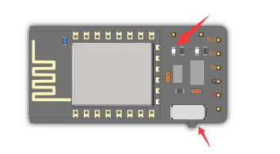
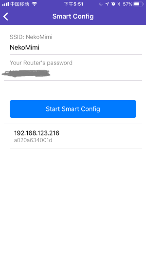

# App wifi使用

小喵家的套件都有各自的通信方式，其中Kittenbot和MiniLFR使用wifi模块进行通信。

使用Wifi模块进行通信的前提是要将wifi模块加入您家中或者教室的路由器，我们APP内提供了非常便捷的方式将Wifi模块连接到路由器的机制--SmartConfig。

## Kittenbot Wifi模块

首先我们看看wifi模块上的状态指示灯。

正常情况下Wifi上的波动开关应该摆在如图中的位置，请确认开关如图中在右侧位置再将其插到机器人上。

wifi上还有一个非常关键的蓝色状态指示灯，根据wifi模块的状态有两种闪烁规律：

1. AP模式, 状态指示灯**3秒常亮，之后闪烁一下**，这时候wifi模块没有加入任何路由器，并且自身热点打开。

2. STA模式，状态指示灯**3秒常灭，之后闪烁一下**，这时候wifi模块已经加入了路由器，并且关闭了自身热点。

## SmartConfig模式

**首先请确保您的手机当前连接的是路由器的2.4G热点**

很多现代路由器都有5G和2.4G双频点，但是wifi模块只能连接到2.4G的频段。

在APP中进入Smartconfig界面，并且坚持你的路由器名字是不是2.4G的热点，并且填入你的路由器密码。

将wifi模块上的开关拨到特殊模式，您可以看到连接指示灯进入**快速闪烁模式**

注意上面开关的位置。

稍等片刻后wifi模块如果成功连接路由器后，连接指示灯会**停止闪烁**

最后记得将wifi模块上的开关拨回正常模式，并建议将wifi模块拔下来再插回去以重启。

这是您可以在wifi连接列表中找到新加入的模块

## 注意事项

V2.3版本的APP支持同时将N个wifi模块连入局域网，也就是如果你的教室有N个wifi模块，将它们全部插在机器人身上并且使用SmartConfig加入局域网中，但是Wifi模块的名字还是需要您手动进行修改。

