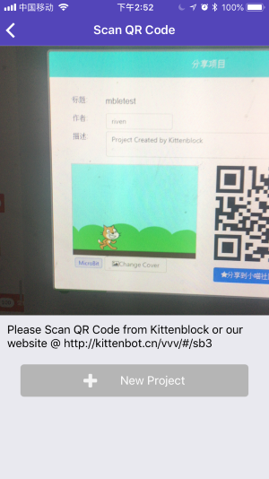
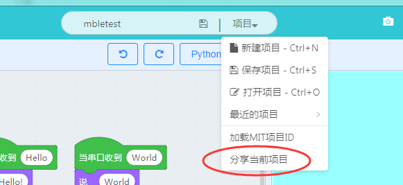
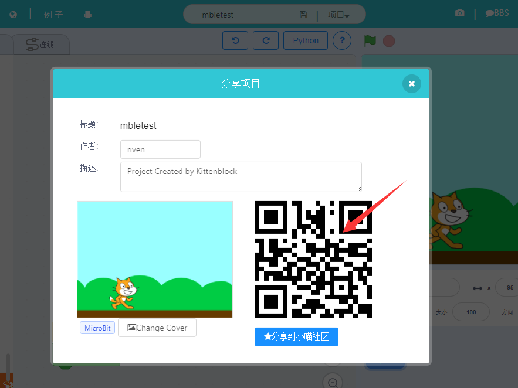
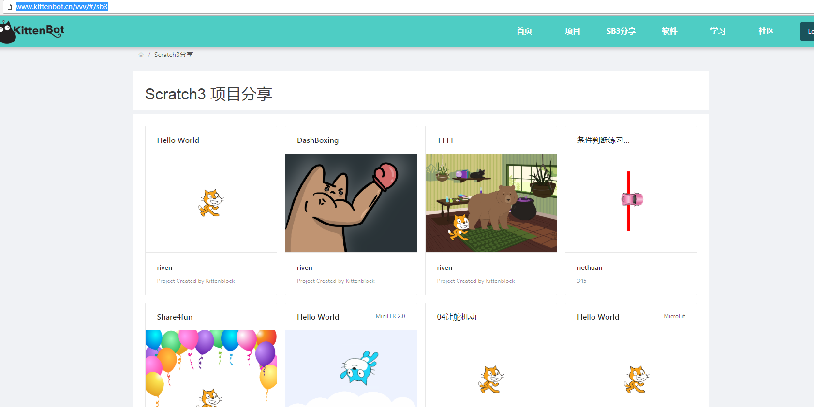
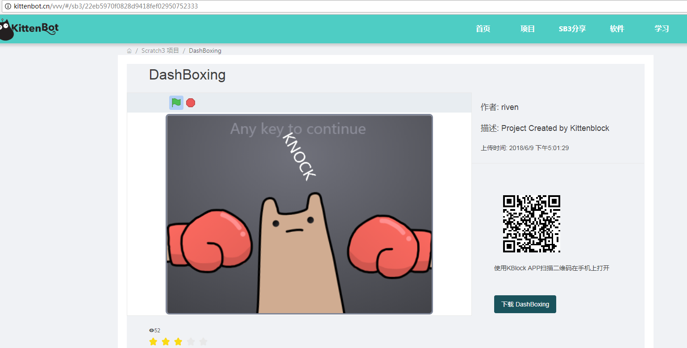
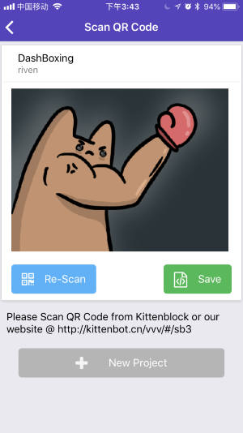
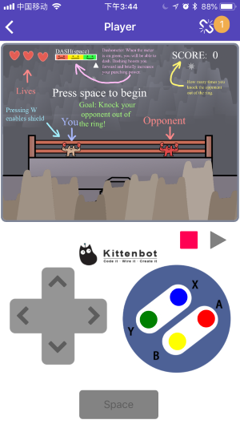
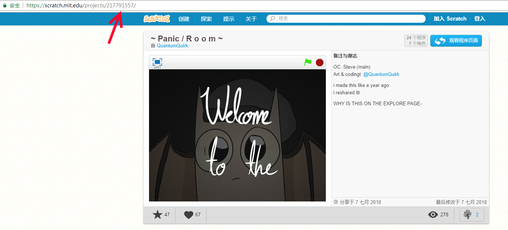
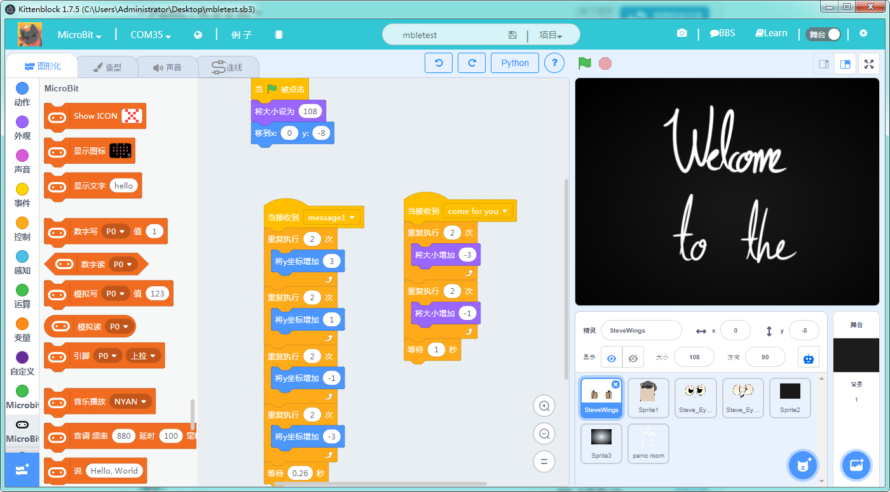
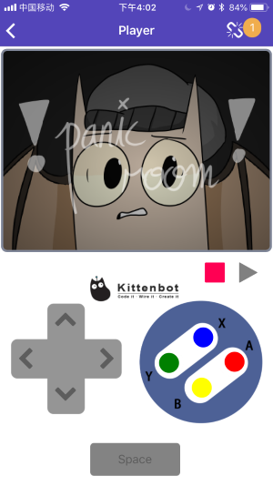

# 扫描Scratch3项目到APP中

我们的APP支持直接从Kittenblock或我们的网址上扫描项目并下载到手机中执行，您也可以借助该手段将scratch2的项目同步到手机中。

具体操作为：在手机app左侧右滑打开**导航菜单**，点击**本地项目**，点击顶部**新建项目**并扫描二维码。二维码可以是Kittenblock内置生成的，或者在我们网站上的分享的sb3项目二维码。

## 从Kittenblock下载到手机

请前往我们的[网站](http://kittenbot.cn)或[BBS](http://kittenbot.cn/bbs)安装和下载Kittenblock，在Kittenblock内建立并编写好项目后在菜单栏点击分享项目。

之后拿起你的手机扫描这个二维码就行了

**注意：这个二维码只能分享给同一个局域网内的手机，也就是当你的手机和kittenblock的电脑不在同一个局域网内是无法上传的。**

## 从Kittenbot网址扫描并下载到手机

前一节我们示范了如何将kittenblock同步到手机上，但是这种方法只能在自己家里玩，如果想将二维码分享给其他小伙伴们就需要将项目分享到我们的社区了。大家在Kittenblock内登陆后可以将项目分享到小喵社区，之后前往[http://www.kittenbot.cn/vvv/#/sb3](http://www.kittenbot.cn/vvv/#/sb3)就可以看到您刚刚分享的项目了。

点开某个项目后我们可以看到左侧的Scratch3引擎，右侧有对应的项目信息和二维码，用KBlock app扫描这个二维码就行了~

**注意：有些比较大的scratch3项目可能下载和启动时间都比较长，请耐心等待**

## 将Scratch2的项目下载到手机

我们也可以将Scratch2的项目上传到手机上，具体方法就是先用Kittenblock打开scratch2的项目。Kittenblock会自动将scratch2转换成scratch3兼容的格式，之后就跟前面两节讲的一样了。

## 将MIT网址的项目下载到手机

我们现在Scratch的官网随便找一个项目：

之后在地址栏找到项目的ID（这里是217791557），之后在Kittenblock内文件下拉菜单选择**打开MIT项目ID**

之后就跟前面第一节讲的一样了，用二维码分享到手机上。

