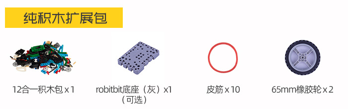
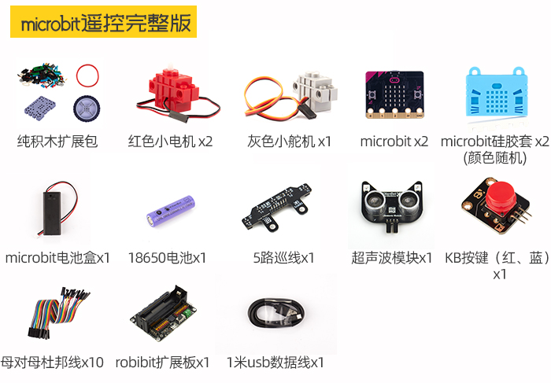
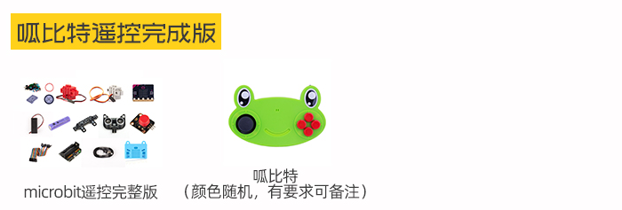

# 套件介绍&资料包

## 购买链接

__转到淘宝购买__----------→[格斗之星12in1竞技机器人套件](https://item.taobao.com/item.htm?spm=a1z10.3-c-s.w4002-21482550023.39.131d5d5fLx5nSa&id=606517763932)

## 产品名称

格斗之星12in1竞技机器人
  
## 配送清单   

 
 
## 产品介绍   

格斗之星12合1竞技套件是一款围绕microbit扩展的竞赛娱乐型套件，使用乐高巧妙的结构拼搭及程序的编写组成不同的玩法，让孩子能够在动手搭建，逻辑编程锻炼，兴趣培养3方面获得体验和收获。

## 产品特色   

- 主控扩展板含标准乐高孔，结构可扩展 
- 编程方式易上手
- 以娱乐为目的达成学习的目标
  
## 技术参数   

- 18650电池电压：3.7V   
- USB输入电压：5V   
- VM引脚最大：1A（在板载电池的支持下）   
- 绿色端子电压(外部电源输入)：5V（只支持5V输入，切勿接超5V的电压，最大电流支持3V）
- 遥控方式：2.4g双microbit遥控

## 支持包 

内容：形态搭建/接线(pdf) + 程序文件(makecode)

链接：[https://pan.baidu.com/s/1LryaCJoyQ7z-Cch6SyWRdg](https://pan.baidu.com/s/1LryaCJoyQ7z-Cch6SyWRdg) 
提取码：krnq 

