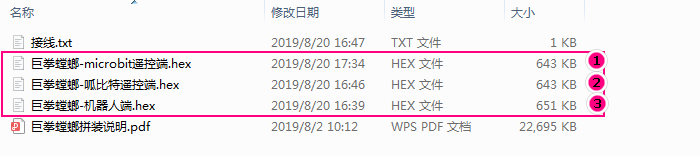
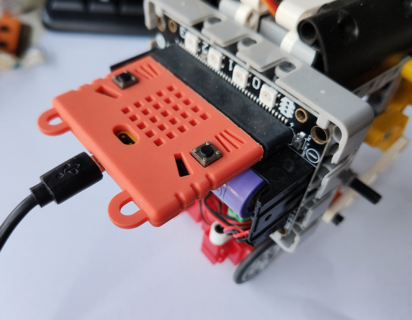
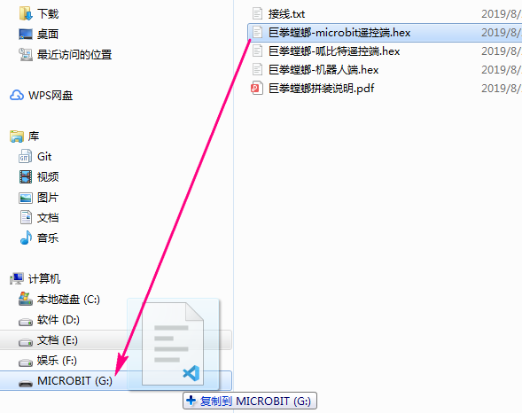
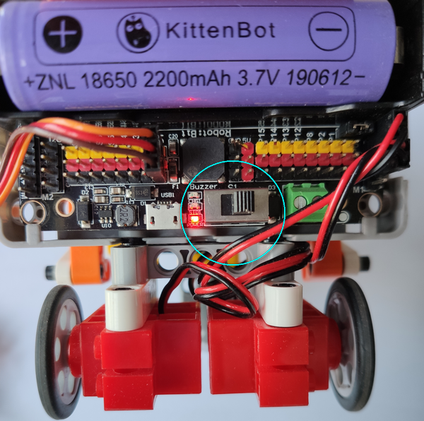
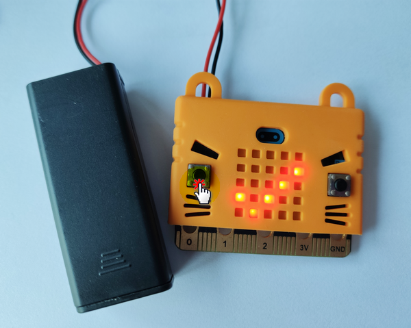
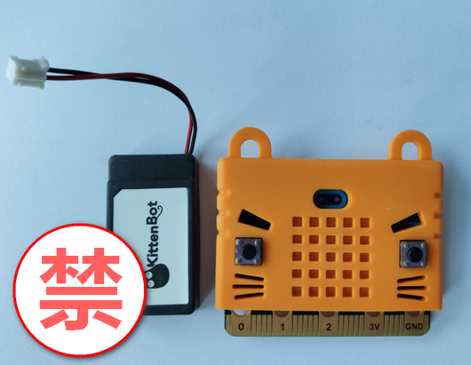

# 新手快速开始 

快速开始针对新手，拿到了搭建说明完成了基本造型的搭建及接线后，对于让机器人动起来无所下手的用户。 

## 程序准备

在上一篇末尾提供的`支持包`中已含有各个造型需要的程序文件，以**巨拳螳螂**为例,打开文件夹可见如下文件

 

我们给他3个序号。这里需要注意，你所购买的是哪款套件 

-  
我们只需要使用①、③这两个文件即可 


-  
我们只需要使用②、③这两个文件即可 


## 烧入程序

无论是**microbit遥控版**还是**呱比特遥控版**，程序的烧入流程都是一样的，我们就以前者为例

- step1: 首先烧入机器人端程序 

插上microbit，当然第一次插入新的microbit需要安装驱动，但无须担心，它会自动安装，等待即可，安装完毕我们电脑中会出现`MICROBIT`盘符

 

接着将③含有机器人端字样的.hex文件直接拖入`MICROBIT`盘符中

 

等待复制进度条走完，既程序下载成功，此时机器人端的microbit点阵显示笑脸图案 

 

```attention:: 程序下载完成显示表情是根据程序来定的，如果编程时没在开始编写点亮led的程序段，那么没有笑脸也并不代表程序下载失败，但一般情况为了确保程序下载成功还是点亮个图案最好
``` 

- step2: 烧入遥控端程序  

将①含有microbit遥控端字样的.hex文件拖入，流程一样就不累述 

成功下载后，可以看到microbit上出现`X`的图案。 

## 操作演示 

**开始操作前须知**

**机器人端**要将扩展板的电源打开 

 

**遥控端**需要接上2节7号电池的电池盒供电，按下按键A(左侧)，点阵显示√，同时机器人端的4颗RGB由红变绿，即打开和机器人的通讯，开始遥控。

 

```attention:: 注意这里绝对不能用3.7V那种锂电包给microbit的电池插槽供电，否则会烧
``` 
  


**巨拳螳螂操作演示** 

 

## 程序原理 

- 由控制端microbit将自身陀螺仪数值-1024~1024映射到电机可用的-255~255并通过2.4g发送给机器人端
- 机器人端将接收到的数值作为电机速度传入从而达到陀螺仪控制机器人的全方位行走
- 最后通过控制端按键改变机器人端的某些控制变量数值，达到机器人停止或出拳等效果。 


