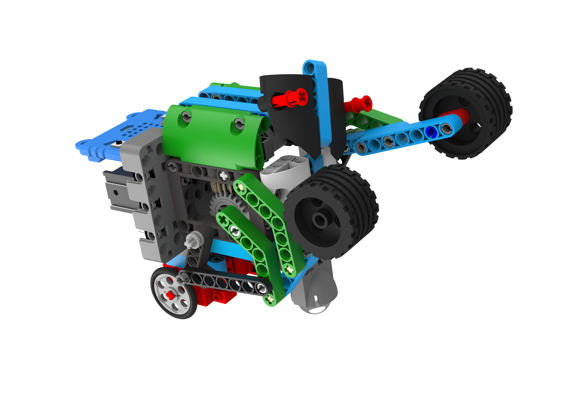
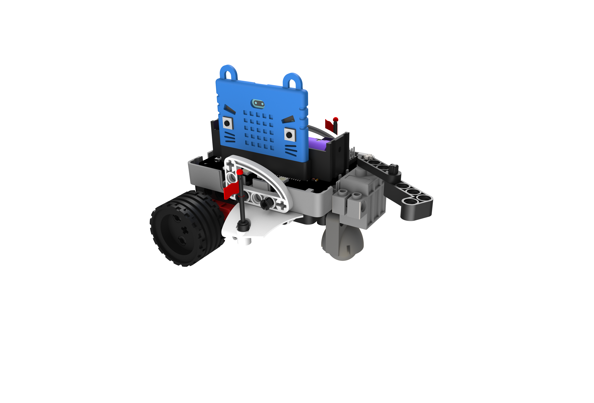
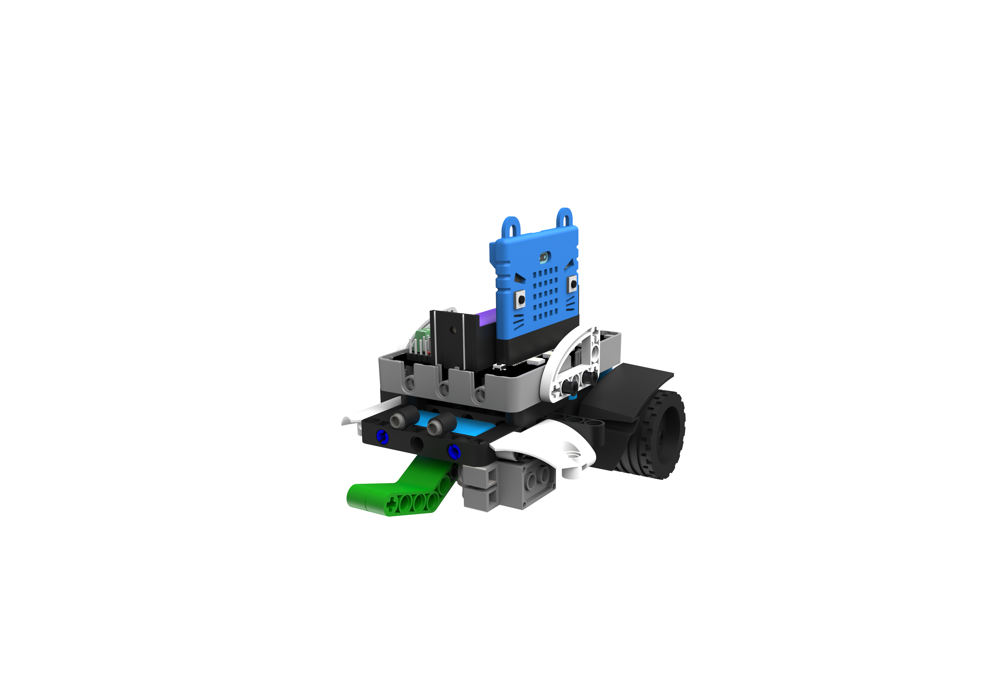
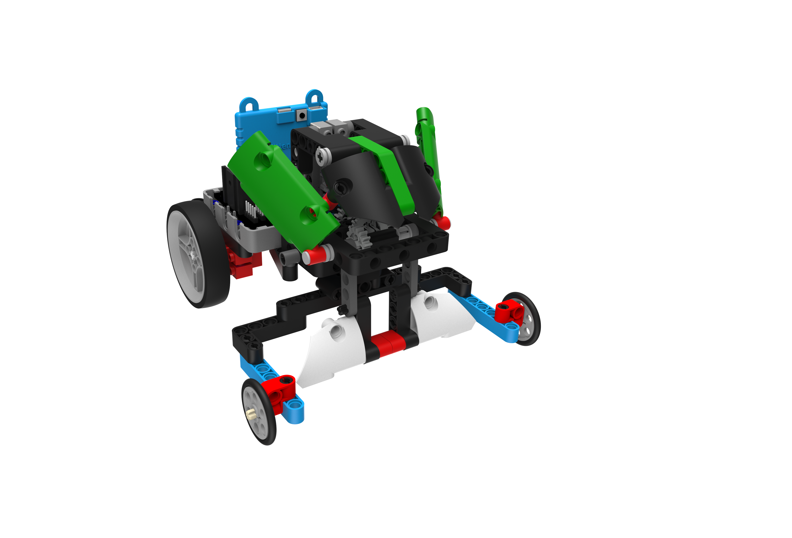
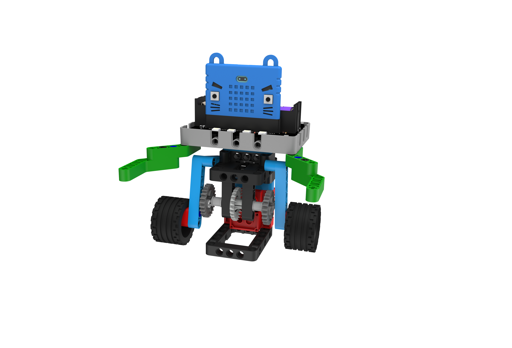
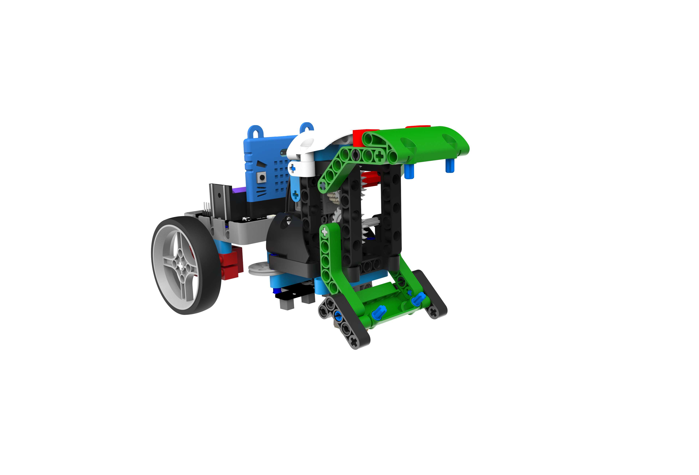
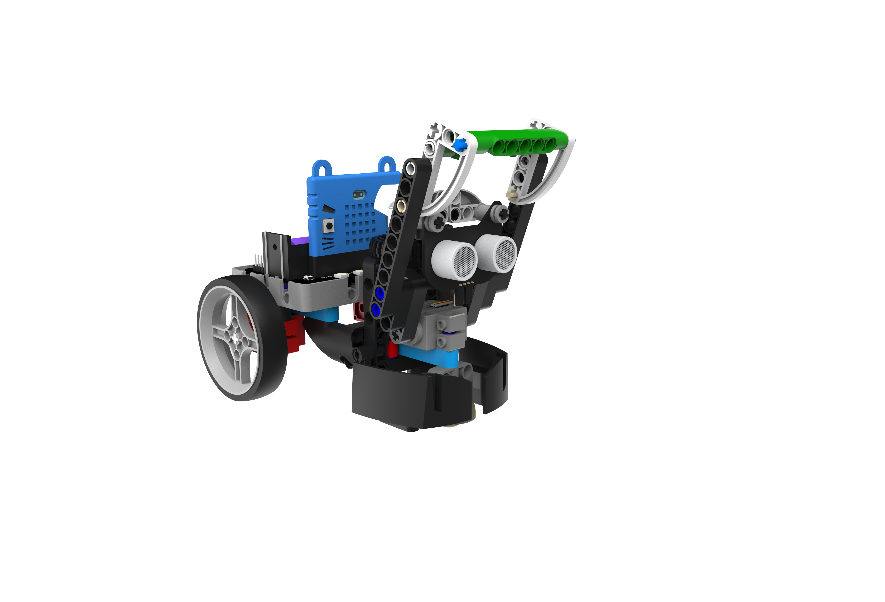
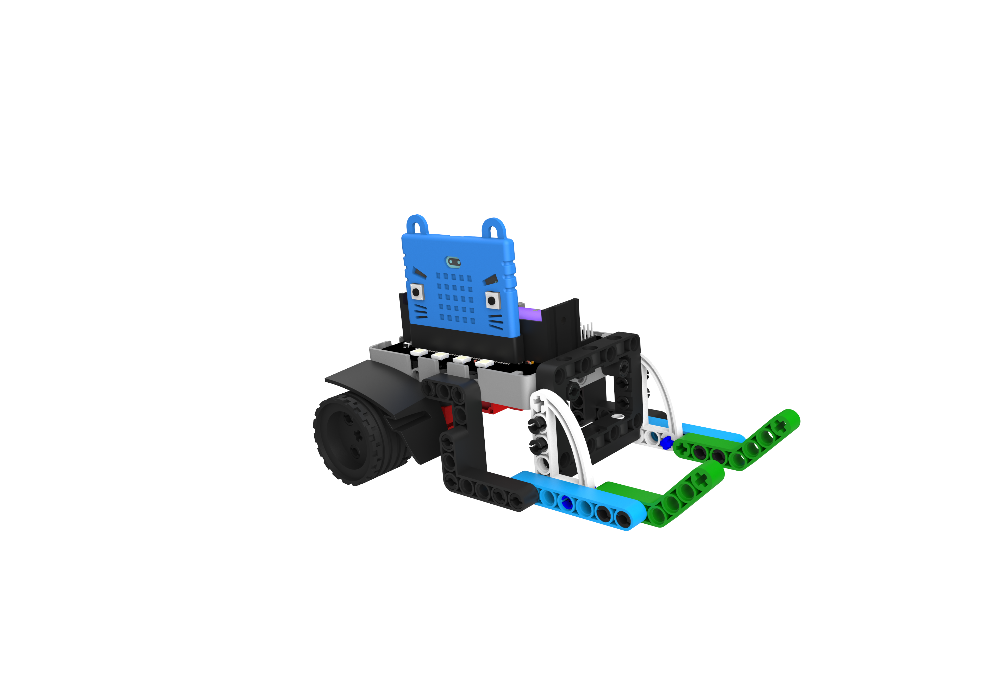
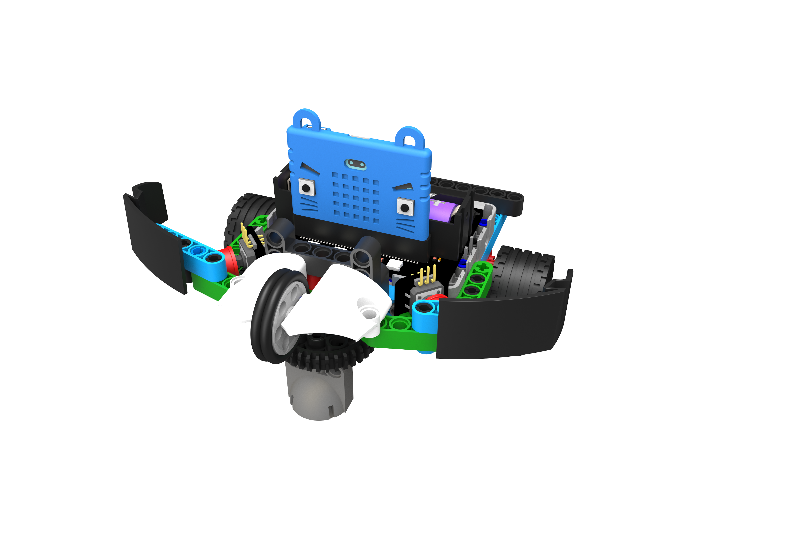
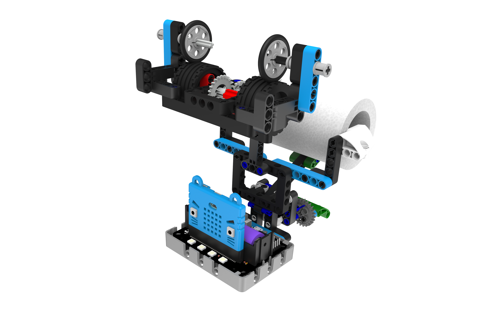

# 玩法汇总

## 巨拳螳螂

  

**巨拳螳螂应用于拳击竞赛，利用2个电机控制自身方向，同时使用1个舵机控制出拳，直拳打倒对手取得胜利**  

## 夺旗校尉

  

**夺旗校尉顾名思义，目的就是夺旗对方选手的旗子。每个小车开场2枚旗子架在小车左右两侧，双方通过小车前端的摆动装置，配合精妙的唯一，将对手旗子从其不意地起落。`最先失掉2枚旗子的一方败`**

## 雷暴犀牛

  

**小车前端的翘板是它的唯一武器，格斗方式是将利用好翘板和身位将对手翘翻或推出场外。其中翘板的攻击方式有2种分别是向上翘动1个来回，以及向下将自身顶起躲避对方的翘起攻击。**

## 足球小将 

 

**你可能需要一个小型却不可太小的模拟足球场地，足球小将的"吨位"不小，控制好车速，利用灵活的转动和前方的凹槽区域控制好足球，推进到适当角度`射门`**

## 相扑选手 

 

**相扑机器人十分笨拙，是个非常小的格斗擂台，大概就是前后左右都只有1个身位的场地。使用2枚电机分别控制缓慢的前进及转动调整方向。当双方互掐的时候，正确控制进退以及转向，将对手甩下擂台吧。**

## 路障克星 

 

**前方的大夹子是它的特点，它可以夹起有一定高度的物体，通常在夺取零件获得积分的比赛中充当一个重量级单位，没人可以从'我'的夹子中逃脱。作为一个干扰单位，就像战士一样耐抗粘人(拷牢对手阵营的敏捷型单位吧！)**

## 机灵捕手

  

**一旦被捕手套中的'猎物'将很难被夺取，在抢分比赛中发挥着关键的作用。**

## 疯狂掠夺者

  

**这属于一个敏捷型单位，虽然不快，但身位矮，十分小巧，不易被其他单位干扰，可以迅速的将积分零件纳入前方凹槽并运送会家(可它存在一定的操作难度，属于门槛级单位))**

## 风驰电掣

 

**风驰电掣如其名，速度就是它的特点，相对其他造型来说，它的速度和它的运作方式都十分符合现实的机动车(利用电机控制速度，舵机控制方向)，用于模拟赛车竞速会别有一番风趣**

## 狂暴角龙

  

**角龙说的便是它类似角一般的车头，使用其撞击对方左右两侧的薄弱单位(两侧各有1个按键模块，被撞击后会丢失血量)。以扩展板的4颗RGB灯代表初始血量。减少到全灭的一方被判定为败并断开连接。攻击对方的同时一定要保护好自己**

## 战争炮台 

 

**类似炮台的样子，能一次性架设10条左右皮筋，通过按键操控方向和开始射击吧**

## 智能纸巾机 

 

**这个功能比较单一，装上卷纸，它便是一台机械出纸机。似乎还能有更好的使用方式呢...**

