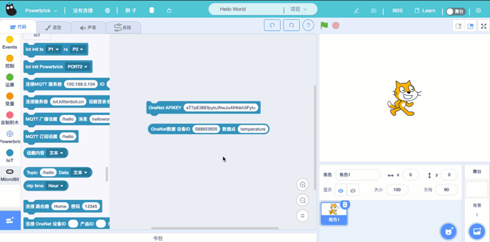
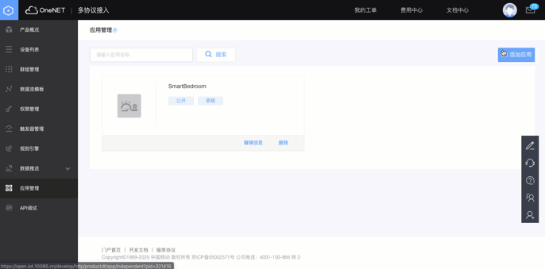
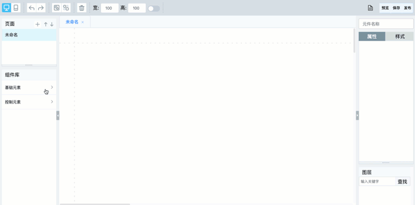
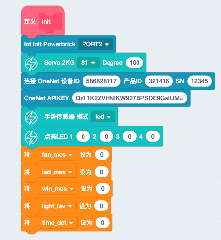
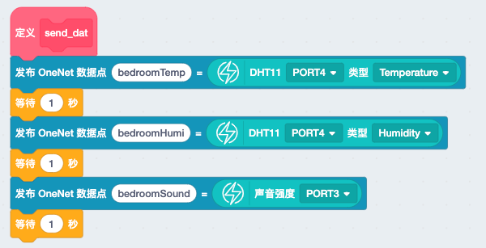
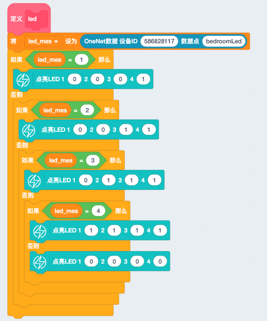
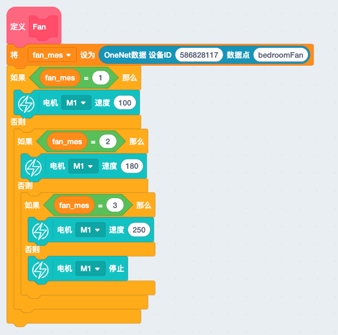
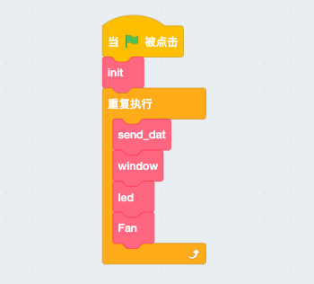

# 智能卧室  

智能家居系统是一种现代流行的智能管理方式，主要的构成有如室内温室控制，家电控制，安防系统等等。智能卧室的案例实现室内温湿度检测，外部噪声检测，以及卧室灯，窗，风扇设备的控制。

本节`智能卧室`将重点学习如下几个知识点： 

- OneNET远程控制
- 搭建应用界面

## 案例搭建 

[pdf案例搭建手册](http://kittenbot.oss-cn-shanghai.aliyuncs.com/AIoT/pdf/AIOT-%E6%99%BA%E8%83%BD%E5%8D%A7%E5%AE%A4.pdf) 

## OneNET远程控制 

之前的案例我们所接触的都是从设备上传数据到OneNET，而本本节我们将融入从OneNET接受数据，而接收数据的应用场景便是控制。 

1. 接收数据在Kittenblock中需要使用如下两个积木块 

 

2. 其次我们需要在OneNET端找到需要端几个信息 设备端 APIKey， 设备ID， 数据流（名称）。其中1个新建的设备它的APIKey是需要手动添加的，操作如下 

  

```tips:: APIKey可以随意设定，之后会生成一串字符，复制它粘贴使用
``` 

3. 使用模拟数据测试一下  

 


## 搭建应用界面 

如果一味的只看这些条条框框，难免十分晦涩。相比一下有形状，有描述，有变化的的东西才更具有实用性。于是OneNET平台的这个应用界面的功能现在就给大家介绍一下。 

1. 应用界面的新建在这个地方

  

2. 关联数据流到应用界面的控件上（模拟卧室湿度数值） 

   


## 实现流程图  

## 编程实现   

[点击下载完整程序]() 

1. 新建初始化函数，将一些需要用到的变量及设备进行配置 

  

2. 上传温湿度及噪声数据，期间+1s是为了方式数据太快造成某些莫名的问题

  

3. 接收服务器端控制数据，对风扇，灯，窗进行控制

  

  

  

4. 将所有函数整合

  


