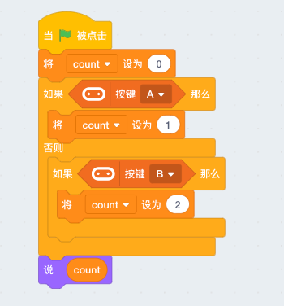
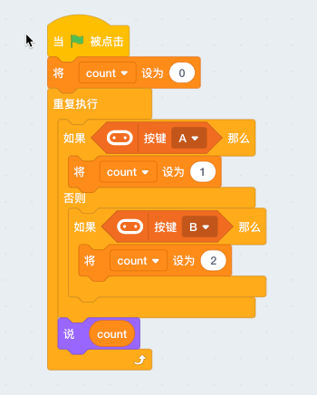
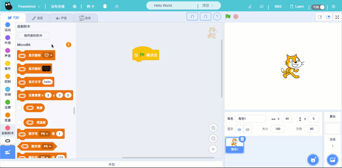
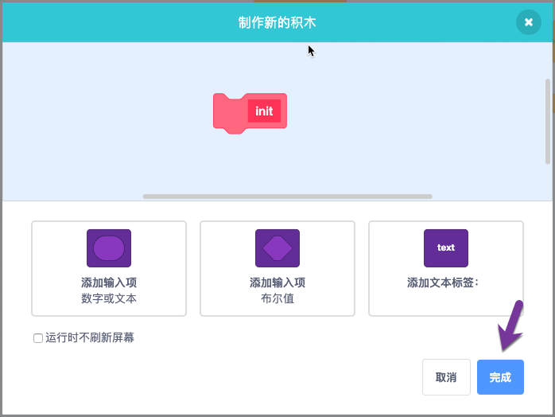
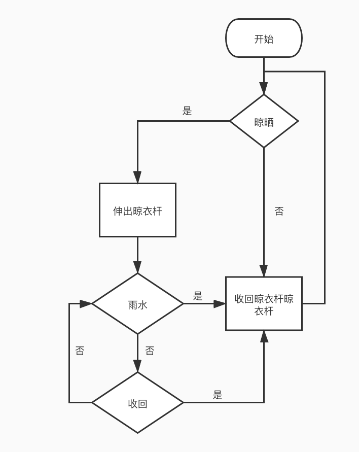
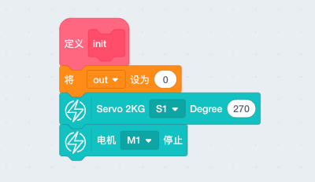
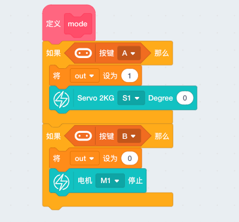
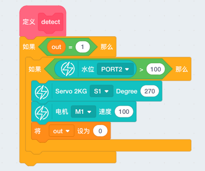
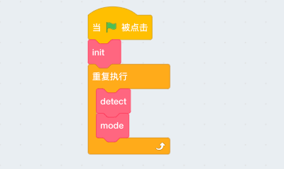

# 自动晾衣架

随着科技发展，自动化深入日常生活的方方面面，家庭自动化设备也属于智能家居的一个方面。为了更省心地实现衣物的充分晾晒，自动晾衣架解决突如其来的变天。

本节`自动晾衣架`将学习如下几个知识点： 

- 基础——逻辑语句
- 基础——自定义函数
- 雨滴水位传感器的原理及参考
 
## 案例搭建  

[pdf案例搭建手册](http://kittenbot.oss-cn-shanghai.aliyuncs.com/AIoT/pdf/AIOT-%E6%99%BA%E8%83%BD%E6%99%BE%E8%A1%A3%E6%9E%B6.pdf)

## 逻辑判断 

编程本身便是一种为实现某个目的而组成的逻辑，循环和判断则属于逻辑的基本组成之一，让我门稍微来稍微练习一下吧 

1. 首先明确目标为按下microbit的按键A或B时舞台小猫分别说1和2 



```tips:: 当我们点击小旗子，可见积木块亮一下即可熄灭，并且按下按键没有任何反应，那是由于程序只在点击瞬间执行了1次，而且一条命令的执行时间甚至可以达到微妙级别。
```  

2. 将程序放置在无限循环下不断执行 



```tips:: 可见，当开始运行程序后，无论什么时候我们按下按键都能看到小猫作出的反应，以此了解循环和逻辑的基本作用 
```  

## 自定义函数 

函数的本质作用是结束重复编写代码的冗余感，编写更容易理解、测试代码。函数可以从外部传参进来，同时也可以将数据传递出去。scratch目前只支持参数传入。我们来看看基本的函数如何使用的吧。

  

1. 首先找到自制积木分栏，点击制作新的积木

 

2. 填入便于程序理解的函数名，暂时不需要传参可以不用管其他的




## 雨滴水位传感器原理

雨滴水位传感器是一个模拟输入模块，通过暴露的平行导线测量水量从而判读水位，模拟输出电压随浸没液体越深而越大 
当传感器不接触水时返回值为0，完全浸没水大概数值为600。由于几乎不受空气湿度影响，本节我们就将它巧妙的运用在检测雨水。 

## 功能流程图  



## 编程实现 

1. 新建初始化函数 
    - 变量out：0（收回）；1（伸出），初始化为收回

 

2. 手动设置晾衣架的伸出或收回

  

3. 当晾衣架伸出后，将自动检测是否下雨

  

4. 功能函数加入主程序中

 

```note:: [完整程序](http://kittenbot.oss-cn-shanghai.aliyuncs.com/AIoT/program/clothes.sb3)
```


