# 智能化健身哑铃 

所谓智能化就是将原本人为操作的事情用某种方式转变为机器来代工。对于智能化健身器械来说，有如健身单车，通过使用它会将健身时间和卡路里消耗数据显示在屏幕上，免去了人为计算的功夫，甚至更准确。那么健身哑铃，我们将记录抬举的次数，上传到云端让每天的健身数据得以可视化，概念性提倡锻炼身体的重要性。 

本节`智能化健身哑铃 `将重点学习如下几个知识点： 

- microbit加速度计
- OneNET物联网平台 

## 案例搭建 

[pdf案例搭建手册](http://kittenbot.oss-cn-shanghai.aliyuncs.com/AIoT/pdf/AIOT-%E6%99%BA%E8%83%BD%E5%81%A5%E8%BA%AB%E5%93%91%E9%93%83.pdf) 

## microbit加速度计 

1. 我们通常讨论的三轴加速度，对应microbit的图解是这样的

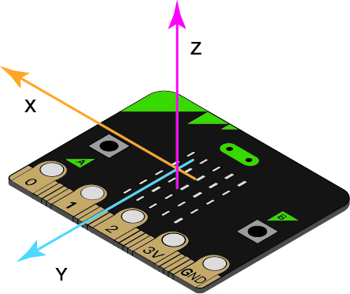 

2. 要理解加速度计，我们可以线简单将其理解成为：一个圆球在一个小方形盒子里。假设目前加速度计处于失重环境下（比如外太空），小球在盒子里的模型是这样的 

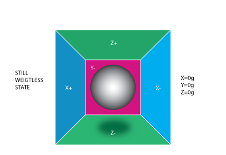  

3. 此时假设我们手动将盒子以一个1g（9.8m/s^2）的速度向左移动，那么小球会撞上x-这面墙，假设每面墙都能感测压力，我们检测墙面的压力，x轴输出值为-1g  

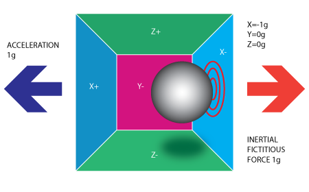   

4. 加速度计测得力的方向与它本身加速度的方向是相反的，这种力被称为惯性力或假想力。这个模型是为了通俗易懂的讲解加速度计是通过间接测量力对某个墙面的作用来计算加速度的。这个力可以是有加速度引起的，但却不仅仅因为加速度。下面这个例子，我们将盒子平放在地球表面，地球表面的重力加速度约等于1g（9.8m/s^2），球体会落到Z-但墙面上并施加1个1g的力

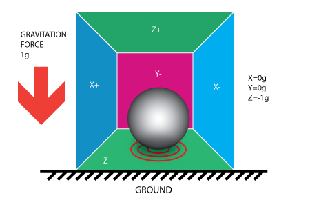   

5. 这个情况我们没有移动盒子，但仍然读到z轴-g但值，球体在墙壁上施加的压力是由引力造成的。加速度计的本质是检测力而非加速度，这是由于加速度引起的惯性力被加速度计捕获到。我们看一下下面这个例子，当这个和模型成45度放置时，此时我们球体的受力只有地球的引力。如图可见小球由X-和Z-两面墙支撑。使用平行四边法则计算分力，可得X=Z=-0.71g

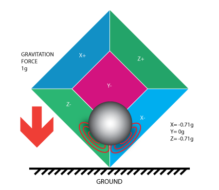    

```tips:: 根据上述得讲解我们应基本理解在应用层面，加速度计它所返回的x，y，z数值到底是怎么来的。需要注意的是，在编程中，无论你如何大力甩动，加速度返回值的范围均固定在-2g～2g
```  

## OneNET物联网平台  

OneNET是中国移动的物联网开放平台，该平台有更专业且直观直观的物联网功能及应用界面，能完成基本的数据交互传输，应用界面搭建，手机应用端，邮件提示等出色的功能。 

[OneNET地址：](https://open.iot.10086.cn/)

1. 注册并登陆个人OneNET账号  

2. 进入开发者中心，新建产品

  

设置随个人喜好随意填写

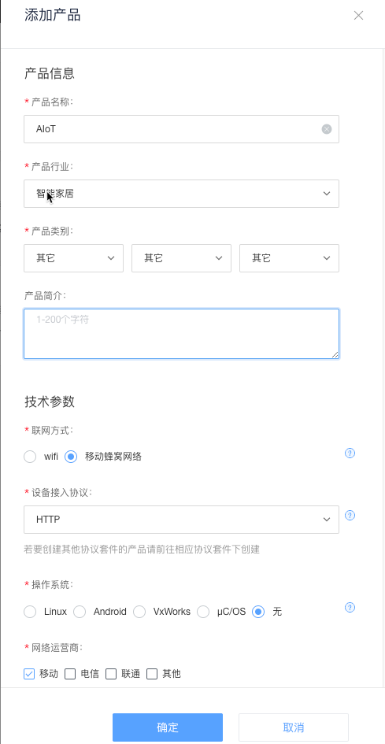   

3. 新建产品下的设备

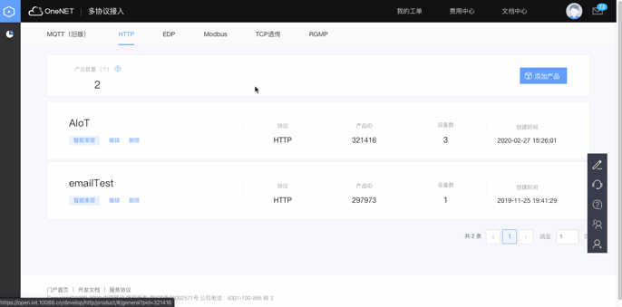   

设备名称自由填写，比如本案例，可以填写Dumbbell，另外设备编号对于同一个产品下面，设备编号需要唯一，比如这个设备是123，那么再新建一个就得用别的

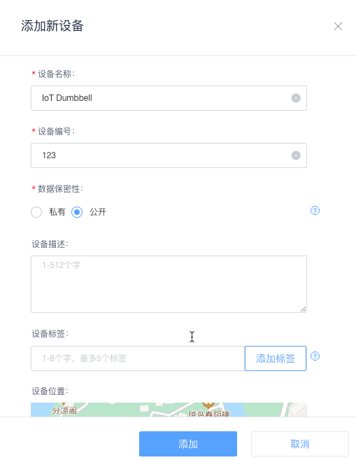   

4. 新建数据流  

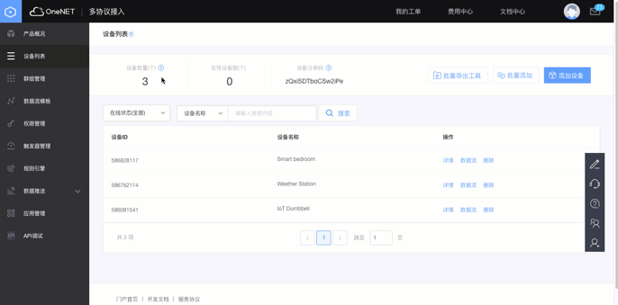  

名称自定义，比如我们哑铃计算抬举个数，那么名称可以定为number  

```note:: 完成到这一步位置，我们就已基本了完成了OneNET端的基本配置 
``` 

6. Kittenblock中关于OneNET的积木块

加载IoT插件，可以看到如下4个积木块是我们需要用到的

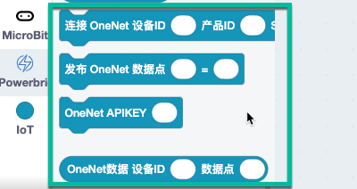    

7. 5个重要参数的位置

产品ID, 设备ID, 设备编号（SN）, 数据流（名称）, API KEY

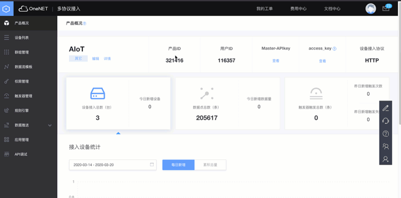  

8. Kittenblock中测试OneNET通信 

- 数据上传服务器

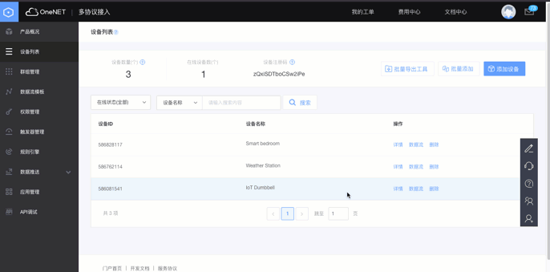  

- 数据接收  

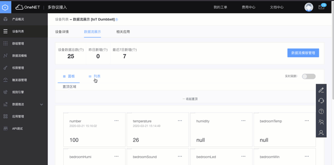  

```note:: 以上就是kittenblock结合OneNET的全部入门步骤，学会了我们便开始接下来的案例编程吧
``` 

## 实现流程图  

## 编程实现   

[点击下载完整程序]()
 
1. 新建初始化函数 
    - number：计数，单轮举哑铃的次数 
    - up，down：这两个为一组，分别是一次哑铃抬举的抬起的和放下的所预估的加速度值（之所以使用y轴是由于上升和落下，y轴的改变最有代表性）,其实也可以融合成1个变量，但2个变量思维更清晰 
    - start：单轮计数开始与否的控制变量

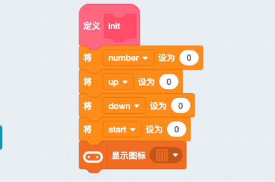  

2. 计数函数   

根据手握哑铃的方式如下，于是如此编程

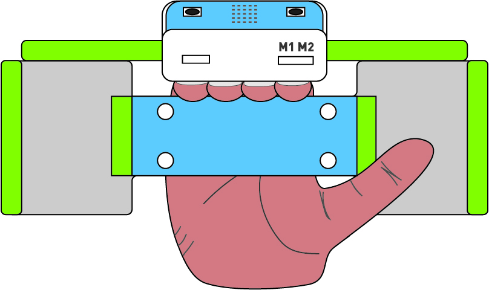  

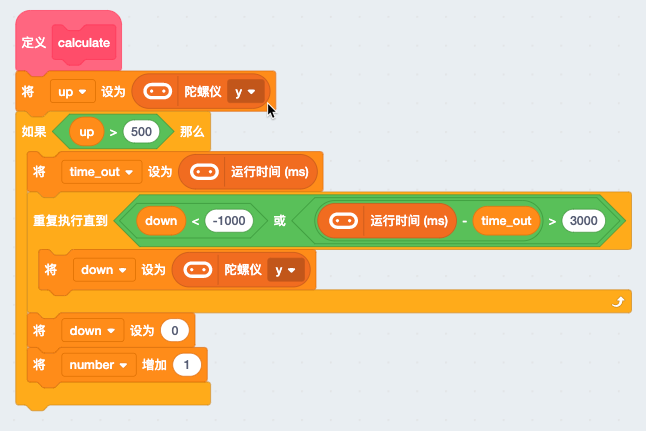  

3. wifi数据发送函数（发送到OneNET平台） 

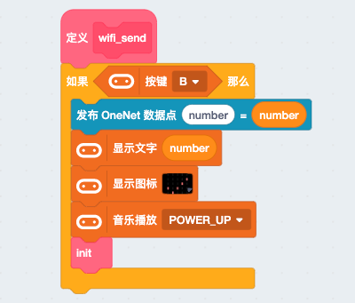  

4. 计数开始函数，每轮开始按下按键A听到滴滴两声才开始计数 

   

5. 程序主流程，将所有功能函数按逻辑整合。实现按键A开始计数，以按键B结束计数并上传数据 

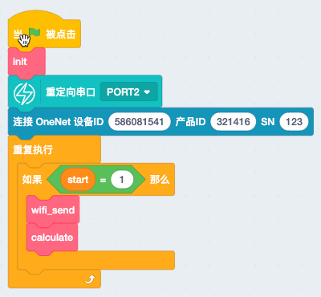 


```tips:: wifi已经加入路由器的情况下，无须反复加入路由器，所以该程序默认你已经按照之前案例的步骤连上了路由器（现象为串口可以搜到wifi） 
``` 
