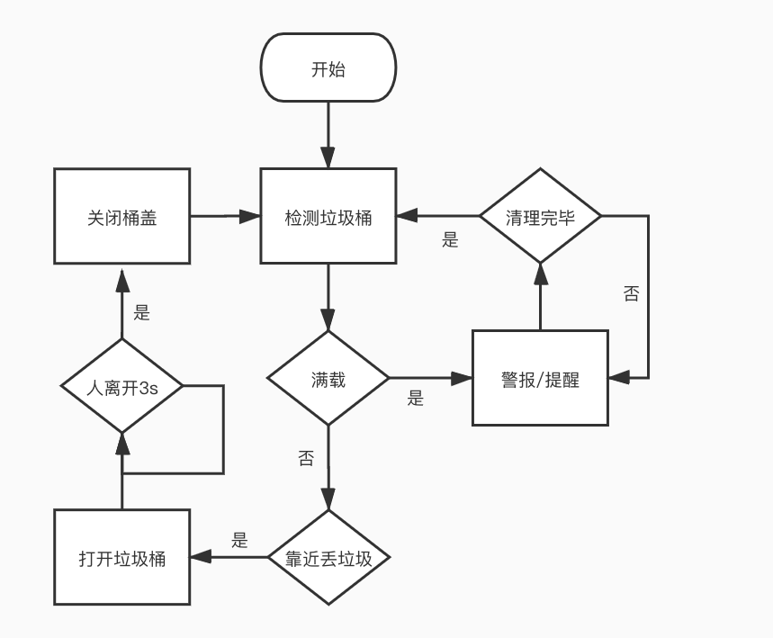

# 防溢垃圾桶 

每当夏天，垃圾桶无法及时得到清理将会造成一些列不良结果，有如异味大，细菌蚊虫滋生，影响市民正常的垃圾投放。环卫工人所管辖的地域相当广，得不到及时的信息反馈，无法作出准确的应对。所以智能垃圾桶的优势不仅在于他的自动开关，还实现垃圾溢出前的信号反馈。相信这样的信息化管理是未来城市的基本构成。 

本节`防溢垃圾桶`将重点学习如下几个知识点：  

- 距离传感器原理与应用 

## 案例搭建

[pdf案例搭建手册](http://kittenbot.oss-cn-shanghai.aliyuncs.com/AIoT/pdf/AIOT-%E6%99%BA%E8%83%BD%E5%9E%83%E5%9C%BE%E6%A1%B6.pdf)  

## 什么是距离传感器  

距离传感器也叫位移传感器，根据其工作原理的不同可分为光学距离传感器、红外距离传感器、超声波距离传感器等多种。而我们所应用的这一款则属于红外距离传感器，通过红外发射管发射特别短的光脉冲并由红外接收管接受从发射到被物体反射回来的光脉冲，通过测时间间隔来计算与物体之间的距离。最常见的就是手机的防误触，接听熄屏省电等应用。

## 实现流程图  

  
## 编程实现

### 开启内网IoT服务器 

### 上位机端 

`场景绘制` 

`角色绘制` 

`反馈信号处理`
 
### 硬件端  

`满载提示` 

