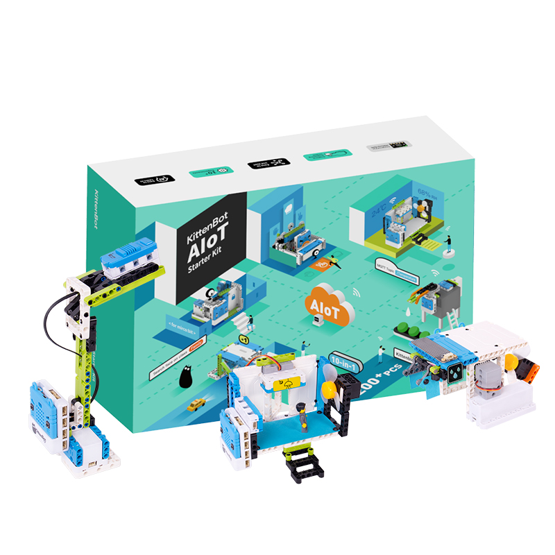
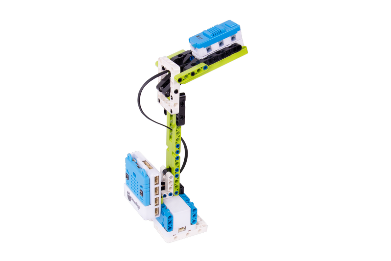

# AIoT教学套件

## 购买链接

__转到淘宝购买__----------→[AIoT电子积木教学套件](https://item.taobao.com/item.htm?spm=a1z10.3-c-s.w4002-21482550023.59.12db5d5fiTwdAk&id=609670117714)

## 产品名称

AIoT Starter Kit教学套件 

  

## 适用人群   

培训机构/学校教学  
 
## 产品简介   
 
AIoT套件是一款以microbit为主控的人工智能与物联网教学套件。基于kittenblock软件中丰富人工智能插件功能的具现化案例，结合wifi实现的智能化物联网项目，不但从现实意义出发具有科技感，重要的是人工智能的落地，让孩子一步步对这些高级技术的实现过程有一个大体认知，进而开阔思维和眼界。最后配合动手拼接造型，拟化现实场景，加强实操印象。   

## 产品特色  

- 真正人工智能初体验： 语音识别、摄像头视觉人脸、车牌识别、特征模型训练/识别
系统性物联网实战    
- 基于kittenblock的内网iot服务器，方便大班课堂教学无须外网    
- 喵家外网iot服务器，学习基本MQTT协议流程，制作简单应用    
- 课程式学习oneNET专业iot服务器，将物联网应用转化为技能    
- 10个精心案例教程与32节课程双体验    

## 配送清单   

- microbit	x1 (选配)
- Armourbit扩展板	x1
- 2KG舵机	x2
- wifi魔块	x1
- 颜色手势亮度魔块	x1
- 温湿度魔块    x1
- 超声波声音魔块	x1
- 土壤湿度魔块	x1
- 雨滴水位魔块	x1
- 18650电池盒+电池	x1
- 风扇魔块	x1
- 水泵+乐高水箱	x1
- 4PIN线	x4
- 3PIN线	x1
- USB数据线	x1
- 200 PCS积木包	x1
- 说明书    x1 
- 模块使用小册子    x1
- 摄像头	(选配)   

## 产品参数  

- 编程软件：Kittenblock  
- 主控：micro:bit  
- 供电：18650锂电池(3.7V~4.2V) 
- 模块接线：4Pin /3Pin 防呆端子头线  
- 包装盒尺寸：245.5*176*91mm  

## 涉及的完整AI功能初体验  

- 语音识别/播报 
- 人脸识别 
- 车牌识别  
- 机器学习(特征模型训练&识别) 

## 应用介绍 

- 无人车闸：车牌识别功能，通过列表记录车牌数据库，为在案的车牌号车辆放行 

  

- 人脸识别门禁：人脸识别，为家庭成员打开大门，若有陌生人徘徊超过一段时间则拍照传给屋主  

  

- 物联网路灯：根据天亮程度逐渐改变路灯的亮度，实现能源节俭的目的   

  

- 物联网垃圾桶系统：多个垃圾桶绘制在舞台上，丢垃圾满的一个垃圾桶报警，并在舞台上展示警报   

  

- 天气告示牌：根据网络天气预报数据映射到表盘温度湿度数值，并由指示牌告示今日天气   

  

- 智能卧室：智能化卧室，涵盖温湿度检测，噪声检测。温度比较高能自动开启风扇及窗户通风，当门外噪声过大窗户将自动关闭。同时可以改变自动模式为声控模式   

  

- 智能晾衣架：当雨滴传感器检测到有雨水，将自动收回晾晒衣物。若是夜间，则将自动开启风扇加速风干   

  

- 盆栽助手：远程查看盆栽干湿情况，可自动浇水，同时可以增加土壤湿度传感器，通过自带的舵机可以进行多盆栽浇水   

  

- 猜拳游戏箱：根据AI机器学习中的特征识别功能，训练石头剪刀3个手势模型，并和猜拳箱进行笔试，它将能认出你出的是什么并对比输赢，记录数据    

  

- 智能健身器材：设置训练目标数，通过陀螺仪传感器检测哑铃抬举次数并通过物联网记录到服务器，同时当达到目标时响蜂鸣器提示   

  

 

