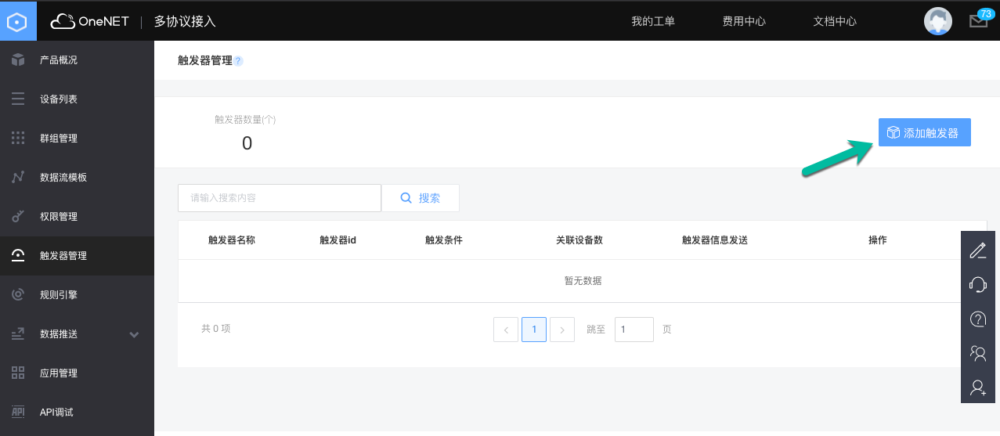
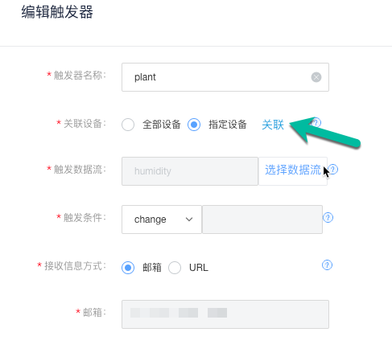
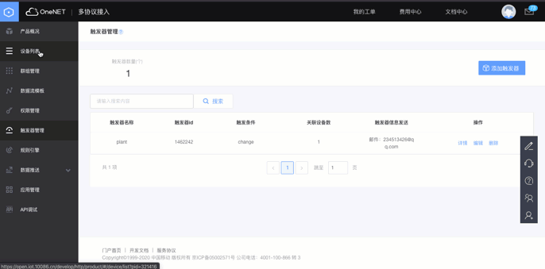
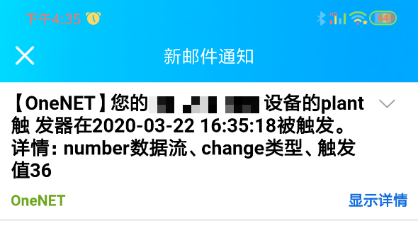
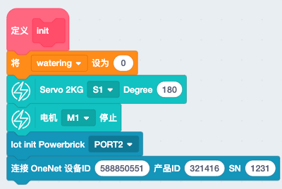
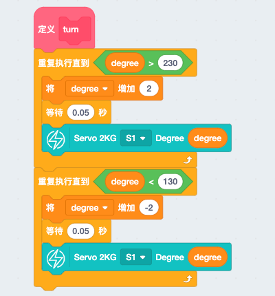
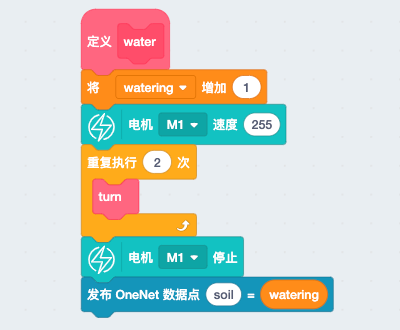
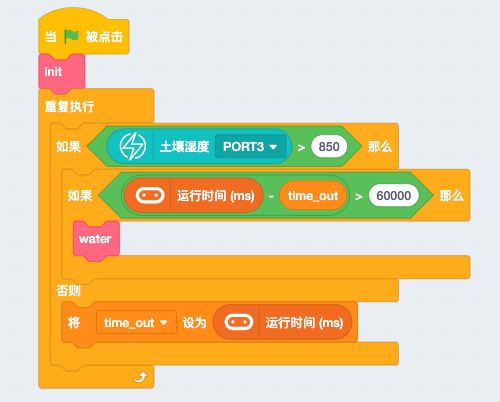

# 智能浇花装置 

大千世界，兴趣各异，爱花花草草之人不乏。但难得出一趟远门就不得不难为它们，时间长一点更是无法挽救。所以智能浇花装置是必不可少，另外还带有远程报信功能，浇花完成通过邮件方式告知，另你更安心。 

本节`智能浇花装置`将重点学习如下几个知识点：

- 土壤湿度传感器 
- OneNET邮件功能  

## 案例搭建  

[pdf案例搭建手册](http://kittenbot.oss-cn-shanghai.aliyuncs.com/AIoT/pdf/AIOT-%E6%99%BA%E8%83%BD%E6%B5%87%E8%8A%B1.pdf)   

## 土壤湿度传感器 

土壤湿度传感器检测土壤湿度是取决于土壤中水分含量，传感器返回值与水分含量成正比。其原理可以理解为水分含量与土壤阻止成反比，也就是阻值越小，导电能力越强，数值越大。 
。但是由于软件底层反了，目前是越湿，数值越小（即0～1023 大概对应 非常湿～非常干）  


```note:: 土壤中水分分布不均匀，测得数据仅能代表局部湿度，所以一般来说我们会将传感器插入靠近植物根部的位置；产考值为干燥土壤数值：约800+，比较湿润：500+。实际应用中的数值需要实测
``` 

## OneNET邮件功能 

经过智能哑铃案例的学习，我们已经对OneNET的重点基础功能做了详细解释，邮件功能属于基础之上的扩展，跟着步骤一起操作吧 

1. 邮件功能实际上是一个触发器，当某一个数据发生变化的时候，

  

根据你新建的设备和数据流进行关联，触发条件可以自己，但我们这里使用change（表示数值改变），最后填入自己的邮箱（绑定邮箱） 

   

2. 模拟数值改变测试邮箱触发器的功能  

   

于是我们手机收到了邮件（由于change是相对上一次数据而言，所以第一次使用时，我们需要模拟2次数值才能收到邮件）

   


```tips:: 邮件功能普通用户1天只有20次，测试需谨慎，切勿浪费次数
``` 

## 实现流程图   

## 编程实现   

[点击下载完整程序]()

1. 新建初始化函数，内容包括 
- watering：作为邮件触发功能的控制变量，每次浇花都会改变一次数值并发送到OneNET执行触发器 
- 舵机/电机：舵机用于控制水流路线，均匀浇灌土壤，给其一个初始位置。电机则是水泵，初始为关闭状态。
 
   

2. 建立舵机均匀摇头的函数，使得舵机在一定角度区间内匀速转动，具体数值可以根据实际情况修改

  

3. 浇灌函数，舵机摇头的函数嵌套在其中，触发将在浇水的同时舵机摇头，最后结束后给OneNET发送一个改变的变量触发邮件功能。

   

4. 将所有函数按照逻辑整合到程序运行流程，其中设定了1个60s内反复检测的保障功能，确保数值不会因为偶然性的突变导致本不该浇水却浇水的情况，同时也可以确保在浇水过后有一定的时间让土壤均匀湿润确保测量数据较为准确。(土壤湿度的阈值和时间可以根据实际情况自行设定) 

 


