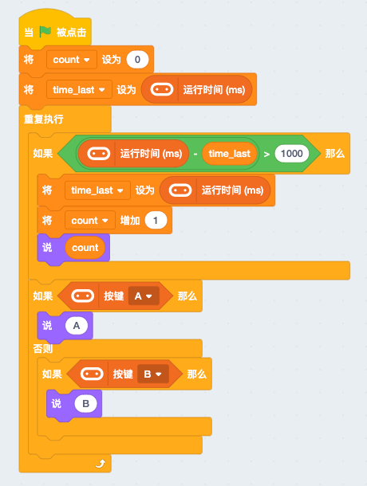
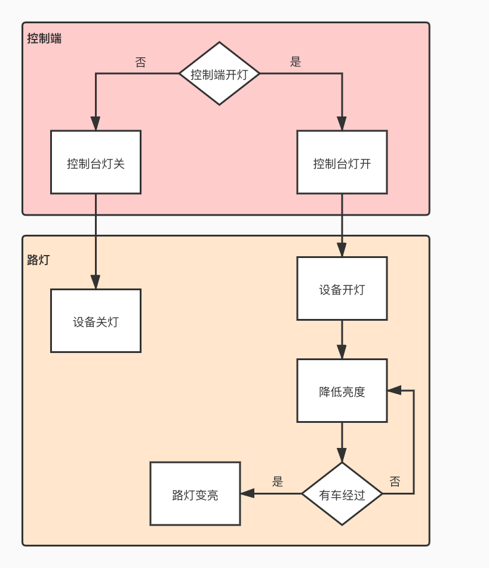

# 智慧节能路灯 

智慧路灯是智慧城市中的重要组成部分，常见于马路两端。路灯本身用以照明，功能单一，而今现代尤其是一线城市中，一个简单的路灯竟集成了物联网控制，车流检测，故障报警，远程抄表，自动亮度调节等。本案例将实现其中的2点：物联网控制与自动亮度调节。 

本节`智慧节能路灯`将重点学习如下几个知识点：

- Scratch——背景/角色
- 超声波原理
- 高效的硬件延时 
- 内网mqtt服务器的物联网应用

## 案例搭建  

[pdf案例搭建手册](http://kittenbot.oss-cn-shanghai.aliyuncs.com/AIoT/pdf/AIOT-%E6%99%BA%E8%83%BD%E8%B7%AF%E7%81%AF.pdf) 

## Scratch  

scratch之所以如此适合孩子或是编程初学者，首先在于它浅显易懂的图形化编程方式，再则就是它的角色和场景绘制功能，不仅能用它做出趣味性的游戏，对于解决实际问题而言，它显得更直观。

- 背景  

     

- 角色  

     

## 超声波原理 

- 超声波是什么：  
    声音是有振动产生的，由于人耳能够听到的声波振动频率范围在20hz～20khz，所以当声波的振动频率不在这个区间，我们便听不见，于是称超过20khz的振动频率为超声波。 
    
- 超声波测距原理： 
    超声波传感器的测距方法是回声测距法，超声波的两个头分别为声波发射和接收，声波通过发射端（定时器产生40khz脉冲信号，使内部压电晶片产生共振）向前方发射超声波并且同时开始计时。超声波在空气中传播，当碰到障碍物就会立刻反弹回来，，当超声波接收端接收到超声波，便会立刻停止计数。根据声波在空气中当传输速度为340m/s，再结合刚刚测得当时间t，就可以得到距离s。 

- 超声波测量时的影响因素：
    - 有时候会发现有些超声波测得当距离并不准确，这是由于超声波存在误差，误差来自于温度，声音当速度与温度有关(空气中温度越高,声速越快) 
    - 由于超声波是扩散的，如果在狭窄的地方测量，超声波很可能在到达前方障碍物前就被墙壁放射回来 

## 高效延时 

平常我们使用的延时delay或者sleep这类，是一种阻塞型延时,意味着在延时期间，本线程其他任何事情都做不了，常见于一般新手入门硬件编程时会存在都困惑  
举个例子，我们希望1s计数一次，并且让小猫说出来，同时我们也需要在任何时候我按下micro：bit的按键A或B都可以改变一次小猫说都内容，观察以下两种方式实现的区别 

- 阻塞型  

 

- 非阻塞型（高效型）（这同时也是我们接下来的项目所使用的）

 

## 本地mqtt服务器  

MQTT（Message Queuing Telemetry Protocol）全称消息队列遥感传输协议，是一种代理的发布/订阅模式的消息传输协议。

 

- MQTT是如何工作的：
    实现MQTT协议需要客户端和服务器端通讯完成，在通讯过程中，MQTT协议中有三种身份：发布者（Publish）、代理（Broker）（服务器）、订阅者（Subscribe），消息的发布者和订阅者都是客户端，消息代理是服务器，消息发布者可以同时是订阅者。

- 本地MQTT服务器如何使用：
    
    

## 功能流程图  

## 编程实现

### 上位机端 

`场景绘制` 

`角色绘制`  

`控制程序`
 
### 硬件端  

`过路检测`  

