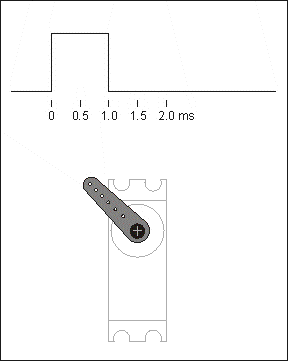

# 本地简易气象站 

气象站是物联网的基础，主要是将检测到的本地信息通过路由器上传到云端，从物联网平台对数据有直观显示。当然一般的气象站都带显示功能，介于我们手头没有显示器件，就用舵机与表盘来直观展示。

本节`地简易气象站`将重点学习如下几个知识点：

- 温湿度传感器知识 
- 舵机和与角度映射 
- 外网IoT实现

## 案例搭建 

[pdf案例搭建手册](http://kittenbot.oss-cn-shanghai.aliyuncs.com/AIoT/pdf/AIOT-%E6%99%BA%E8%83%BD%E5%A4%A9%E6%B0%94%E5%B9%BF%E5%91%8A%E7%89%8C.pdf) 

## 温湿度传感器 

本案例使用的温湿度传感器是dht11，是一种单总线数字信号传感器（所谓的单总线指的是不同与I2C和SPI这两种通信方式，使用单根线既传输时钟又传输数据，而且数据是双向的）

- 参数：
    - 测量范围：湿度20～90%RH，温度0～50℃
    - 测量精度：湿度±5%RH，温度±2℃ 
    - 分辨率：湿度1%RH， 温度1℃ 

## 舵机和与角度映射 

- 舵机工作方式：

舵机的控制一般需要一个20ms左右的时基脉冲，该脉冲的高电平部分一般为0.5ms-2.5ms范围，总间隔为2ms。脉冲的宽度将决定马达转动的距离。例如：1.5ms的脉冲，电机将转向90度的位置（通常称为中立位置，对于180°舵机来说，就是90°位置）。如果脉冲宽度小于1.5毫秒，那么电机轴向朝向0度方向。如果脉冲宽度大于1.5毫秒，轴向就朝向180度方向。以180度舵机为例，对应的控制关系是这样的 

 

本案例使用的舵机是一种宽角度舵机，同样的脉宽区间，角度区间却不同于一般普通9g舵机，可达到0～360区间 

- 数值映射 

数值映射是将某个范围变量的数值映射到另一个范围的算法 

```python
def valmap(x, in_min, in_max, out_min, out_max):
    return int((x-in_min) * (out_max-out_min) / (in_max-in_min) + out_min)
``` 

在本案例中，我们将温度和湿度的数值映射到舵机角度表盘。  

## 外网IoT 

经过来之前2个项目使用的内网IoT后，我们进阶尝试外网，本案例使用小喵科技的IoT服务器（标准MQTT协议） 



## 实现流程图  

## 编程实现 

### 温湿度传感器 

### 舵机工作原理及数值映射  

### IoT实现
