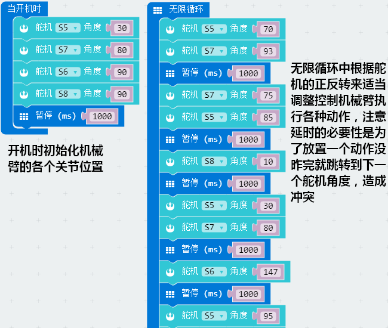
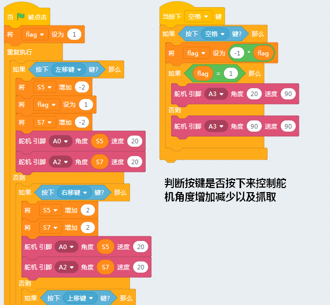
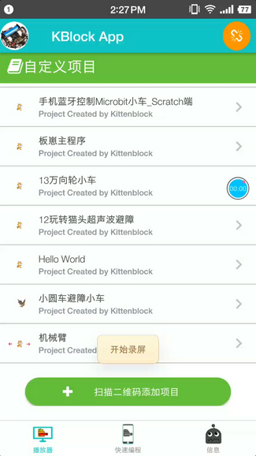
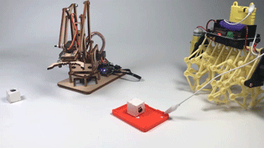

# Microbit-机械臂

## 购买链接

__转到淘宝购买__----------→[Microbit木头机械臂](https://item.taobao.com/item.htm?spm=a1z10.3-c-s.w4002-21482550023.71.59055d5fQ08H3Q&id=582997681447)

## 产品名称

Microbit木头机械臂

## 适用人群

适用于喜欢机械结构，对电控有兴趣的爱好者，同时适用于家庭编程教育启蒙

## 配件清单   
   
- 1米长USB数据线 X1   
- rosbot主控板 X1/robobit主控板及其他配件 X1   
- 机械臂结构组件套装 X1   
- 电动舵机 X4   
- M3×6塑料螺丝 X12   
- M3×10塑料单通螺柱 X4   
- M3×3螺母 X6   
- M3×3防松螺母 X13   
- M3×3螺丝 X4   
- M3×8平头螺丝 X14   
- M3×6自攻螺丝 X6   
- M3×12平头螺丝 X7   
- M3×20双通铜螺柱 X4    
- 18650锂电池 X1   
- 主控板保护套 X1   
- 旋转电位器电子模块 X1   
- 滑动变阻器电子模块 X2   
- 按键电子模块 X1   
- 喵家螺丝刀 X1  

## 产品介绍   

机械臂的结构件及底座都是木质材料，而且材料不会因错误操作或摔落产生断裂，结构简单，避免了结构件的碰撞而产生损坏。它模仿挖掘机吊臂的运动原理、操作，支持外接的变阻器、按钮控制，也支持用kittenbot进行图形化编程控制。它由4个舵机分别控制机械臂的旋转，夹钳的夹紧打开、前伸后缩、上升下降。   

   
## 产品特色  

- 基于图形化编程
-  适用者年龄趋向低龄化   
- 可操作性高   
- 零件可替换   
- 支持蓝牙、wifi控制   
   
   
## 产品参数 

- 长：17.5cm   
- 宽：9.3cm   
- 高：19cm   
- 净重：205g   
   
   
### robobit   

- 18650锂电池电压：3.7V   
- USB输入电压：5V   
- VM引脚最大：1A（在板载电池的支持下）   
- 绿色端子电压(外部电源输入)：5V（只支持5V输入，切勿接超5V的电压，最大电流支持3A）   

### rosbot

- 18650锂电池电压：7.4V   
- USB输入电压：5V   

## 装配说明书

跳到链接处下载:[click](https://bbs.kittenbot.cn/forum.php?mod=viewthread&tid=361 "含组装过程和程序示例")

## 使用方式    

- 可用外接变阻器、旋转电位器、按钮控制，也可用kittenbot图形化编程控制 
- 编程方式：Kittenblock(基于Scratch3.0)/Arduino/Makecode 
- 兼容硬件： 可配套钣金小车、全向轮小车   
- 小喵教程集合地址：learn.kittenbot.cn   
- 小喵论坛地址：bbs.kittenbot.cn 
- 网易云课堂：搜索小喵科技   
- 更多的实时讨论，请加入爱上小喵科技官方Q群 :568084773

### Robotbit版

__编程__

_使用makecode进行编程_

1.为在线版或离线版添加robotbit拓展包

2.找到舵机积木块

3.简单用例搭建

__效果展示__

### Rosbot版
_Rosbot版是使用了手机通过wifi进行控制，在kittenblock中进行编程，kblock app中使用。具体操作方法请参照_
[kblock使用教程](https://bbs.kittenbot.cn/forum.php?mod=viewthread&tid=242&highlight=app "论坛")

__编程__

1.在kittenblock中直接写手机控制所要实现的程序效果

2.这是手机端的操作界面，我们使用二维码将kittenblock的程序扫下来即可以使用

__效果展示__

## 注意事项

- 舵机接线请严格按照说明书进行，以免损坏机械臂   
- 尽量避免机械臂从高处掉落 
- 若使用给出的示例程序，接线请严格按照装配说明。

- 如果您的kblock手机控制程序无法运行，请确保您的程序逻辑正确的前提下重新参照上述kblock使用教程，注意扫二维码前手机和电脑在同一个wifi网络，并且确定Rosbot已经插上并按照kblock的wifi指引配置好了wifi模块。

- 机械臂的各个初始位置请确保是90度，如果不确定可以先使用软件复位为90度再进行安装使用。

如果上述提示都无法解决你的问题，请加入小喵科技QQ交流群：568084773咨询

  
__本产品只适用于14岁以上的儿童进行独立使用，8~14岁儿童请在家长或者老师的陪同下进行使用。 
如使用前请按照小喵官方资料指导下进行使用，不要随便接插电路，切勿外接大电流舵机，大电流电机，以免烧毁电路板。   
注意不要在金属表面，或者导电的物体上使用，以免短路   
请避免在潮湿和有水的地方使用，以免短路   
电路板或者机械上含有细小物件请不要吞食，请放在儿童接触不到的地方妥善保管   __
