# Microbit-多脚怪兽

## 购买链接

__转到淘宝购买__----------→[micro:bit多脚兽套件](https://item.taobao.com/item.htm?spm=a1z10.3-c-s.w4002-17001215033.83.6563762eRKK2LD&id=570252252150)

## 产品名称

Microbit & Robotbit多脚兽

## 适用人群 

适合家庭，家长带孩子一起玩，用于编程思维启蒙。同时适合趣味产品爱好者

## 配送清单

- 原装风能怪物一盒    
- 喵家风能怪物打印件一套   
- MICROBIT X 1    
- ROBOTBIT X1    
- 18650锂电池 X1  
- TT马达电机（焊接好线） X2  
- 乐高插销 X4  
- TT马达安装螺丝M3x25 X4  
- 自攻螺丝十字圆头带垫M2.3x8 X14  
- 喵家螺丝刀 X1  
 
## 产品简介

曾经荷兰人发明的风能怪兽携机械美和风能驱动的特色突然出现在人们的视野，但因其过于庞大的体型，仅仅在留下了惊叹和羡煞后便淡出了视线。直到如今我们认为这种创意的消逝实在可惜，它那完美的机械联动若能不受风能驱动所必要的体型要求拘束，而是配上电控的主流，再重回人们的视线，不仅传承这种美也一并结合编程的创客思维，让你能在体验到趣味的基础上培养编程逻辑，那这款全新的多脚兽产品是在适合不过了。

## 产品特色

- 图形化编程趣味编程
- 机械设计美学
- 自制diy锻炼动手能力
- 掌握齿轮联动原理

## 产品参数

- 长x宽x高： 225mm x 160mm x 180mm
- 净重： 262.6g
- 毛重： 根据包裹最终大小决定

## 技术参数

- 电压：5V
- 电流：1A
- 板载全彩可编程RGB灯
- 可编程蜂鸣器
- 18650:3.7V可充锂电池

## 组合过程

1.关键部分，此处原本相接固定，后期应剪掉凸出部分与图中保持一致  

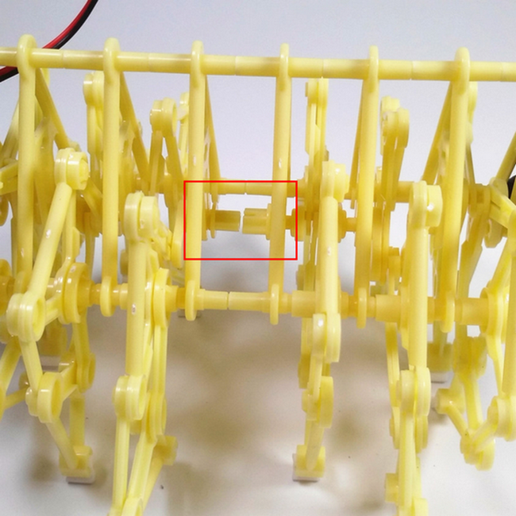   
  
2.按图组装喵家风能怪物打印件    

 
   
3.将组装好的打印件与机械支架组合并固定    

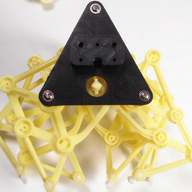   
 
4.给TT电机安装插销  

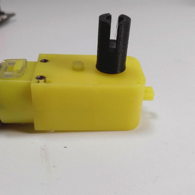   
 
5.TT电机固定到支架上  

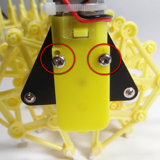    

6.LEGO插销固定到robotbit支撑台的平面一侧，支撑台卡主机械支架中心并固定  
 
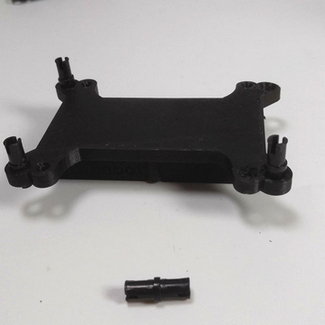
 
   
7.TT电机与Robotbit接线如图(红+ 黑-的原则均接在A)   

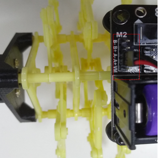
  
  
8.Robotbit和支撑台的组装如图  
   
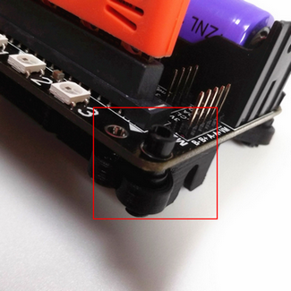  
    
9.完成——成品展示  
  
    

## 使用方法 

- 编程方式：Makecode/Kittenblock(基于Scratch3.0)/Mu
- 兼容硬件（配合硬件，或者配套什么使用）：可配合两块microbit通过2.4G通讯使用
- 小喵教程集合地址：learn.kittenbot.cn
- 小喵论坛地址：bbs.kittenbot.cn
- 网易云课堂：搜索小喵科技
- 更多的实时讨论，请加入爱上小喵科技官方Q群：568084773

以下使用的是小喵科技出品的离线版Makecode无需网络    
(Makecode+Robotbit扩展包)

**下载链接：**[点这里](http://kittenbot.cn/#/software)
    
要使用TT电机编程，需要先在Makecode上安装Robotbit插件，安装方法如下：
如图先在设置中找到添加包，找到robotbit单击即可    

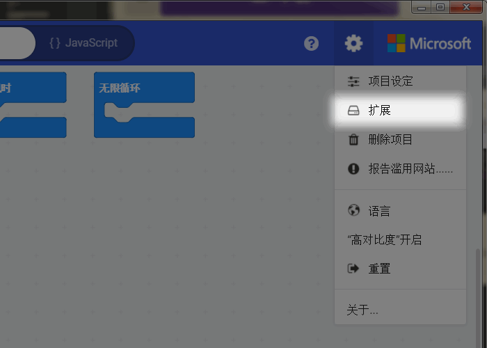 

  

加载完后我们可以看到2组新增的编程积木    

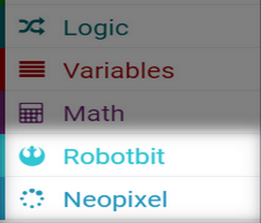    

## 简单的2.4G遥控向前向后走 ##

**遥控端microbit将搭建的程序**（无线组号可以自己定义，应避免其他设备干扰，这里取20） 

   
**多脚兽端microbit程序**  
使用2.4G的发送数值来控制，那么接收端也需要在无线中找到接收数值的积木块来接收信号。
放在这个积木块下的所有内容将在控制端发送了信息被接收端接收到后才进入执行。既然控制端发送的是0，1来分别作为前后的标志位，那么我们只需要判断接收到的值是0还是1来对应拉入电机积木块达到与控制目的一致的效果

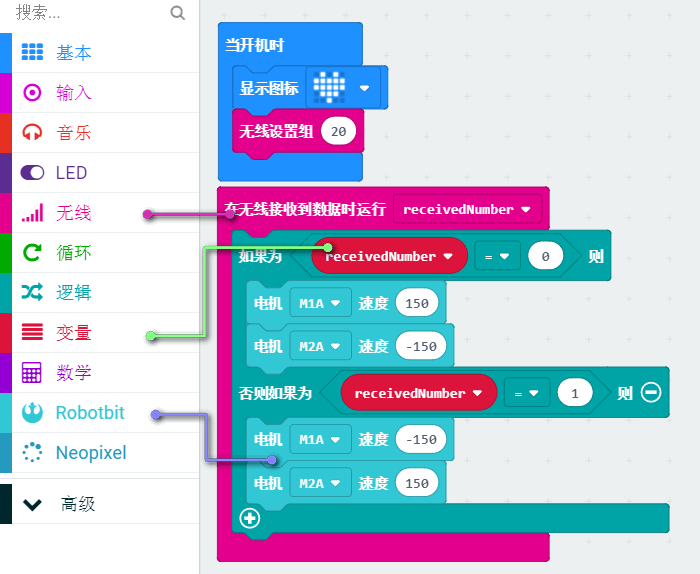
   
## 复杂的2.4G体感控制多脚兽 ##
  
**端microbit将搭建的程序**
  
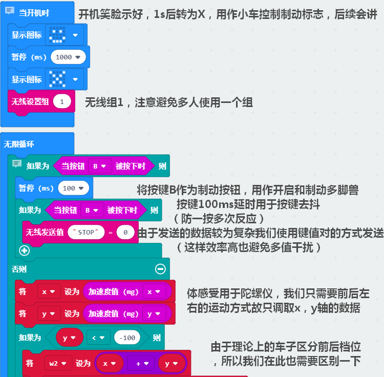

    

**多脚兽端程序搭建**

 

## 展示 
  
    

##2.4G体感程序下载##

[click here](https://bbs.kittenbot.cn/forum.php?mod=viewthread&tid=446)

## 注意事项

- 多脚兽机械零件拼装中一定要确保两部分合并时三脚架底边中间突出部分不相连  
- TT电机接线必须按照范例，如需更改自行修改程序，请确保使用同一组接口如A+/A-  
- 电机要运动起来speed绝对值最好在50-255间，且越大越快  
- 2.4G的玩法需要两个microbit实现  
- 有任何问题欢迎加入小喵科技QQ群：568084773

_本产品只适用于14岁以上的儿童进行独立使用，8~14岁儿童请在家长或者老师的陪同下进行使用。
如使用前请按照小喵官方资料指导下进行使用，不要随便接插电路，切勿外接大电流舵机，大电流电机，以免烧毁电路板。
注意不要在金属表面，或者导电的物体上使用，以免短路
请避免在潮湿和有水的地方使用，以免短路
电路板或者机械上含有细小物件请不要吞食，请放在儿童接触不到的地方妥善保管_