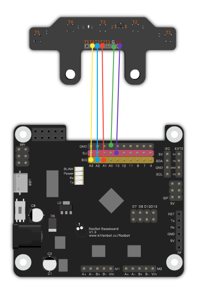
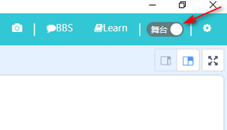
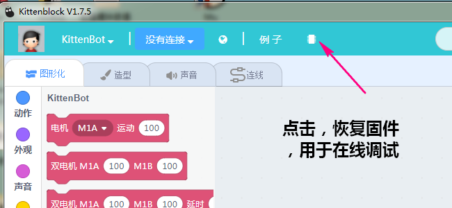
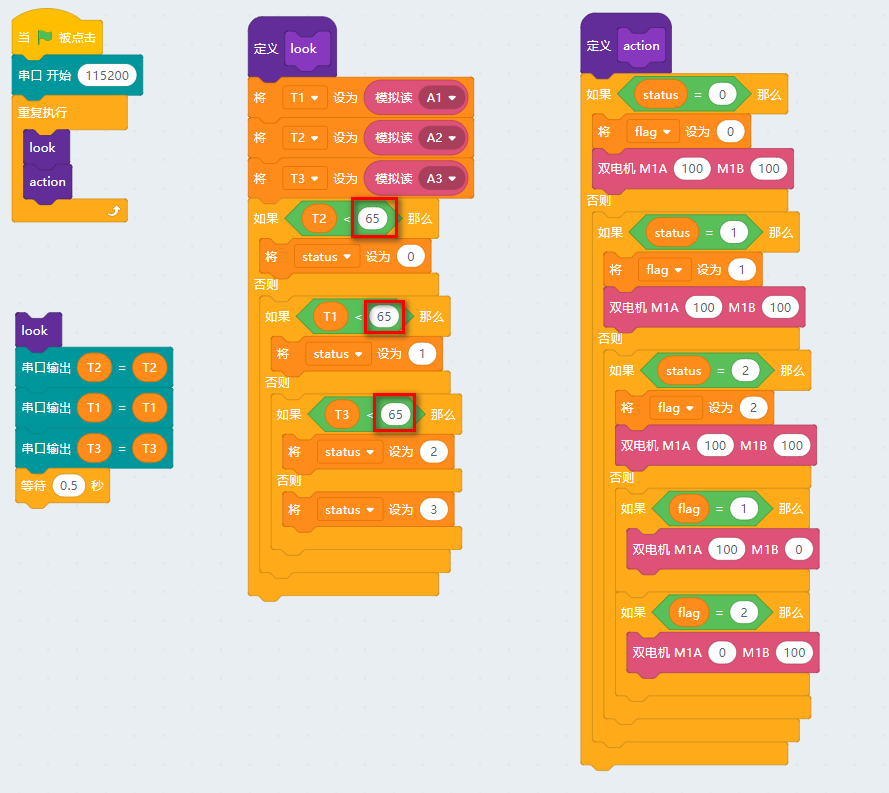

# 玩转五路巡线模块  
  
五路红外循迹传感器的寻线电路模块采用的是ITR20001反射式光电传感器（即模块背面的五颗黑色小传感器），采用了五颗ITR20001\T红外光探测器，灵敏度更高，检测范围更宽，抗干扰。五路模拟输出，精度更高，使小车循迹范围又宽又稳定  
  

## 五路巡线模块示意图  

  

## 尺寸数据  

- 工作电压：3.3V~5V  
- 产品尺寸：72mm x 28mm  
- 探头间距：11mm
- 固定孔尺寸：5mm
- 感应距离：1cm~5cm  

## 五路巡线模块接线  

Rosbot--五路巡线模块  
由于T2、T3、T4三个红外光探测器已经能基本满足需求，所以这里只介绍三个探测器的接线方法  

- 5V--5V  
- G--GND
- T2--A1
- T3--A2
- T4--A3  

##使用方法  

**①打开Kittenblock,选择硬件Kittenbot**  

**②选择串口**  

  

**③点击例子，在例子里面找到巡线小车**   

  
  

  

**④点击右上角舞台**  

  

**⑤点击翻译--上传，然后就能把程序下载到板子里**  

  

__注：__

**此时巡线模块里的T2、T3、T4传感器分别对应的是程序里的T1、T2、T3！**  

**此时巡线模块里的T2、T3、T4传感器分别对应的是程序里的T1、T2、T3！**  

**此时巡线模块里的T2、T3、T4传感器分别对应的是程序里的T1、T2、T3！**

## 调试程序  

在小车巡线过程中可能会出现跑出黑线的情况，这是因为五路巡线模块对黑线的感应强度在不同环境会有差异或者小车TT马达参数有差异。所以的程序还需要用户自己微调。  

__首先点击如图恢复固件，为了能够完成下面的在线调试__

**①连接USB，将巡线传感器放到黑胶带上方，点击look,右下角出现的值即为三个传感器遇到黑线返回的值**  

  

**②将巡线传感器放到白色区域上方，点击look,右下角出现的值即为三个传感器遇到白色区域返回的值**  

  

__总而言之传感器越靠近黑线，值越小__

__③然后在把图中区域的数值改成大于黑线小于白色区域的返回值（如黑线三个传感器的返回值的范围[30,50],白色区域是[130,150],则数值就在[50,130]的范围调整）__

  

**最后一定要注意TT电机接线，红正黑负**

### 如果操作不成功，请检查：  

- 检查接线是否严格按照上述接线图
- 如果同上点击无法串口返回数据，请检查是否回复固件
- 注意供电为5V 
  
如果以上都不能解决您的问题，请联系小喵科技，热诚为你服务

