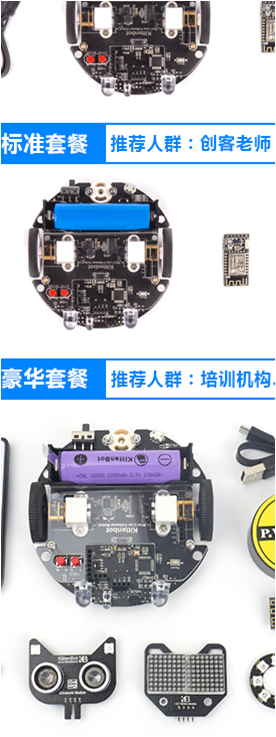
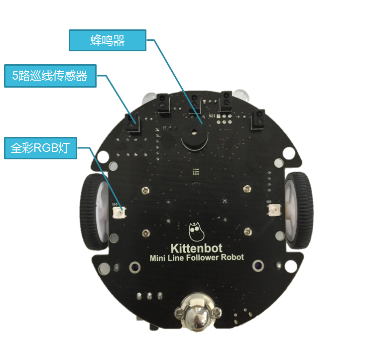
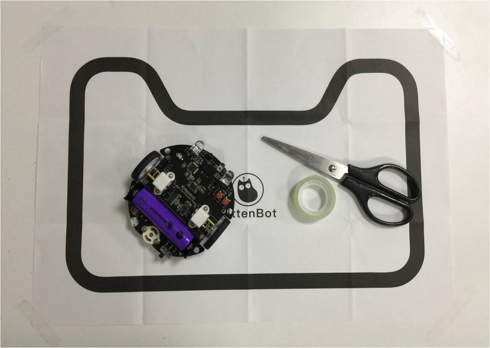
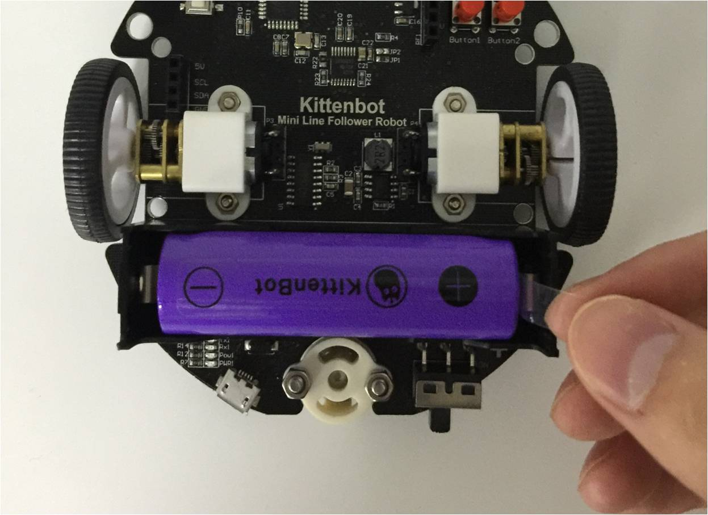
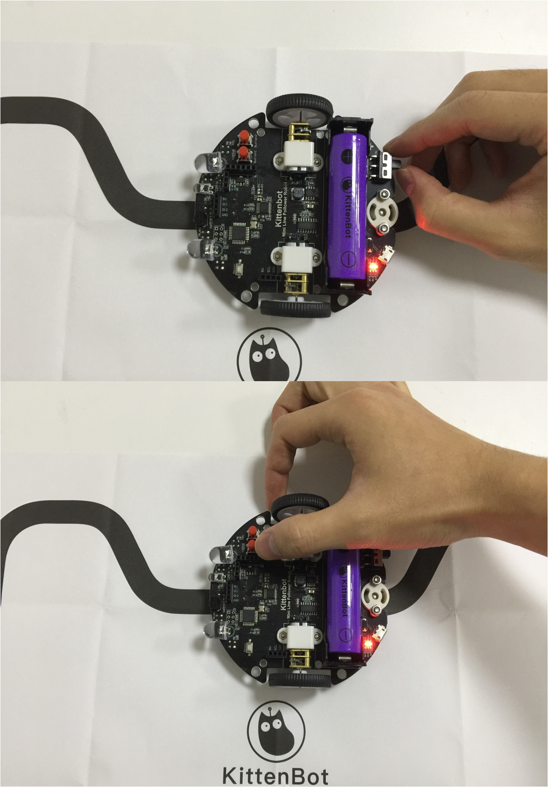
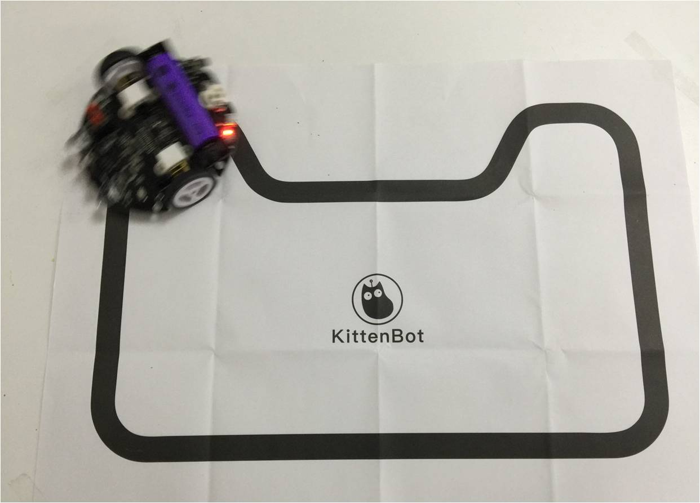

# 开箱试玩一键巡线模式

## 巡线小圆车介绍

恭喜您选择了小喵科技的巡线小圆车，后面的系列教程将带您打开图形化编程的大门。

小喵科技的Mini LFR巡线小圆车被誉为图形化编程小车界的Micro:bit，编程入门必备。被誉为图形化编程最快的巡线小车。
相比很多拼装式的编程教育机器人，小圆车拥有一体集成化的设计，可以快速上手进行编程。

对于孩子们，可以更加专注图形化编程，无需复杂的连线，增加编程学习的时间，同时也减少出错的概率，提高孩子们的编程自信心。把更多精力放在逻辑思维上的锻炼，而不是简单而重复的接线。

对于老师，无需像拼装类的编程机器人，课前要做大量的器材准备，课后也不需要画精力去整理归类零件。充分释放宝贵的教学资源。把老师的更多的精力集中在教育学生身上。

对于个人爱好者或者家庭小朋友。小圆车的一体集成化设计为你节省了理解传感器接线成本，到手即用，快速体验图形化编程的乐趣。大大降低学习门槛，让大家可以从一个简单的教育机器人，学习到各种各样典型传感器的使用方法。

## 巡线小圆车（基础套件）上的编程资源

- 单色LED灯
- 彩色RGB灯
- 红外发射管
- 红外接收管
- 编程按键
- 减速直流电机
- 红外巡线传感器
- 蜂鸣器
- 检测电压
- WIFI通讯等等

## 小圆车套餐分类

**如果到货发现有遗漏，可以联系客服寻求帮助**

## 小圆车详细介绍

### 正面

### 背面

## 一键巡线模式

LFR小圆车，内置一键巡线模式，助你快速玩转机器人。

### 操作步骤简述：

- 贴地图或者黑胶布
- 校准小车巡线传感器
- 按按键进入巡线模式

### 以下是具体操作

1. 用透明胶布把地图的四个角粘好，地图尽量摊平，否则巡线效果不好（也可以直接在桌面贴黑线胶布）

2. 把LFR小圆车的电池塑胶挡片拔了

3. 把小车中央放在黑线上打开电源开关
4. 长按按键1（如图），小车会播放一段短曲，然后有两声“滴滴”赶紧放手。小车进入自动校准模式，原地旋转，校准后停下来
5. 重新小车中央放在黑线上按一下按键1小车播放曲子后，就开始巡线了

6. 巡线小车run起来，是不是很简单停止只需要关闭电源开关即可

## 巡线小圆车使用FAQ

### 巡线模式总跑出线外，怎么办？

如果更换新环境，新地图，请重新进入校准模式。
环境应该亮度偏亮色调的桌面或者地面。

### 巡线模式需要插wifi模块吗？

不需要，可插可不插。

### 18650电池可以拔下来吗？

不建议拔下来，长期插拔会损坏电机

### 电池插反会烧坏小车吗？

旧版小圆车插反必烧，新版加了防反接，安装电池必须注意正负极！

### 小圆车没电怎么充电？

用普通的手机充电器或者电脑usb口给小车的micro口充电，充电电压5V，电流1A或者1A以上

### 充电需要充多久？

在5V1A的情况下，电池充满大概需要2个半小时

### 小圆车撞墙，电机长时间堵转会坏吗？

长时间堵转会坏，短时间不会，如果发现小圆车电机堵转，请关闭电源。

### 巡线小圆车容易摔坏吗？

小圆车用了微型金属齿轮箱，如果一旦从高地掉落在底面，很大可能会导致齿轮箱顺坏。因为在桌面上玩耍小圆车，请做好围栏保护措施。
如果摔坏了，请联系客服，小喵科技会以成本价给顾客进行维修

### 按键1和按键2的功能分别是什么？

在出厂固件设置下，按键1短按是进入巡线模式，按键1长按是进入巡线校准模式，按键2短按是进入超声波避障模式（你需要有猫头超声波）

### 如何控制其他传感器使用？

请在PC端下载小喵科技专门为小白打造的图形化编程软件

### 小车按按键1不能巡线，是不是坏了？

请检查是否打开开关？
小车的电源指示灯是否有亮？
小圆车里面是不是有出厂固件？

### 出厂固件会不会轻易丢失？

不会，除非你用编程软件下载过其他程序

### 如何恢复出厂固件？

使用小喵科技出品的kittenblock就能恢复出厂固件

 

