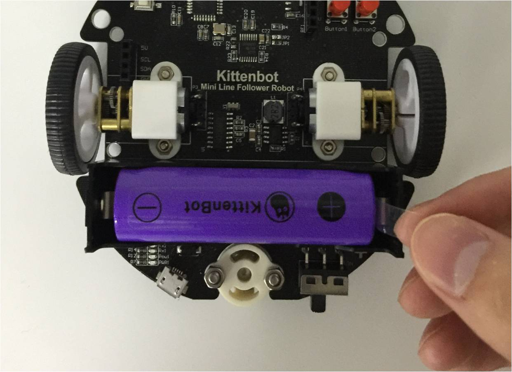
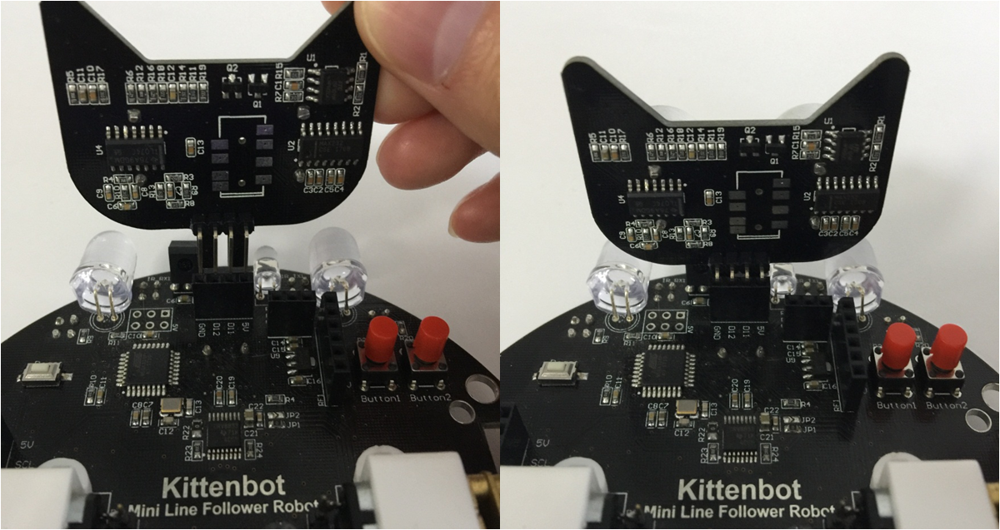
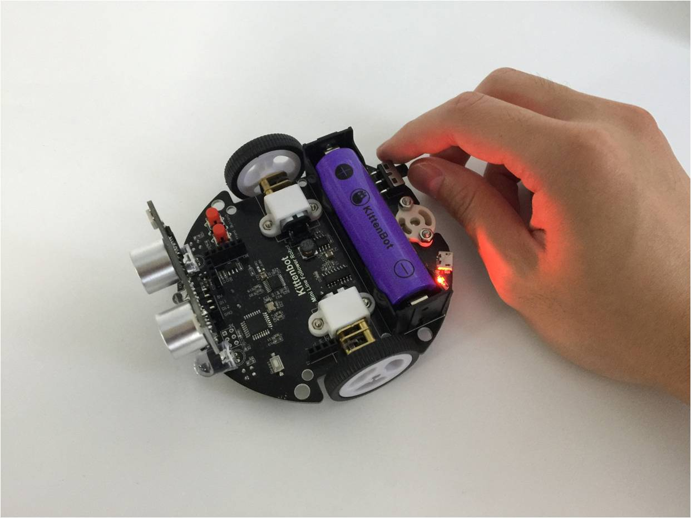

# 开箱试玩一键超声波避障模式

## 一键避障模式

LFR小圆车，内置一键避障模式，不过基础套装是没有猫头超声波，进入避障模式一定需要插上猫头超声波。

### 操作步骤简述：
- 插上猫头超声波
- 按按键2进入避障模式

### 以下是具体操作：

1. 准备好猫头超声波和巡线小车主体（标准套件和豪华套件才有猫头超声波）

2. 把LFR小圆车的电池塑胶挡片拔了（已经拔了请忽略）

 

3. 对齐引脚，插入猫头超声波

**以下的情况都是错的（插错有可能导致烧坏）**

4. 打开小车电源开关

5. 按一下按键2，“滴滴”后，小车就进入避障模式

6. 猫头超声波检测到前方有障碍物，就会后退如果前方没有障碍物，就会前进

