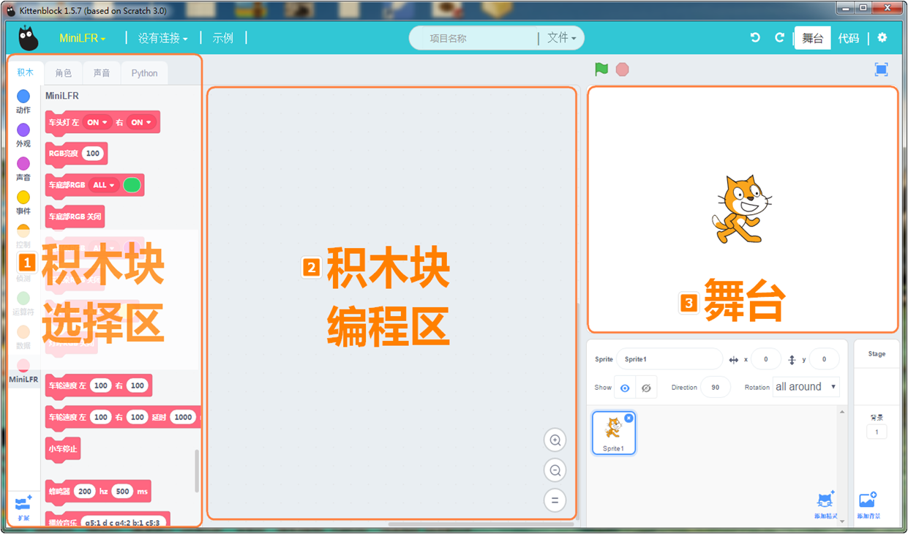
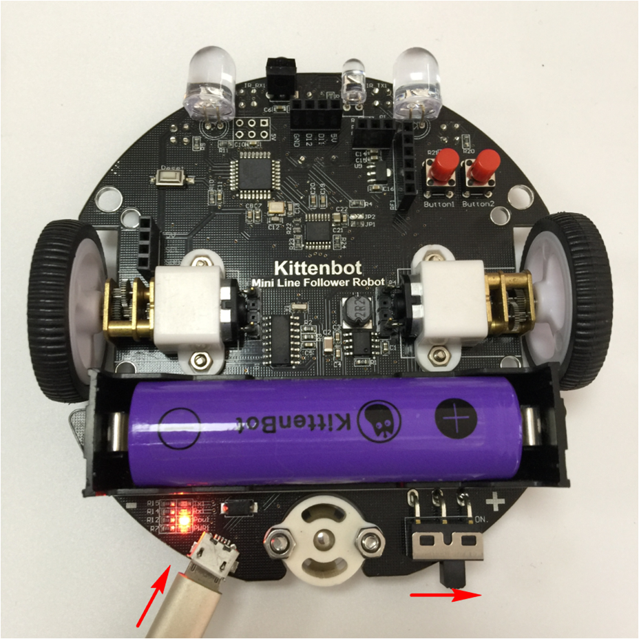
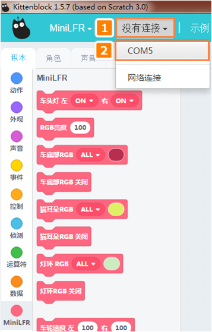
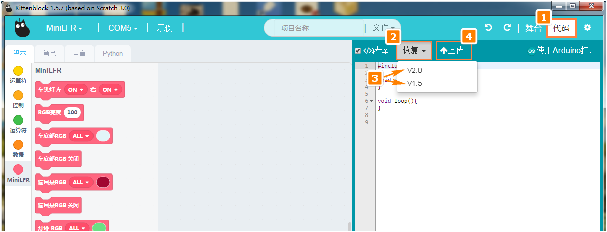
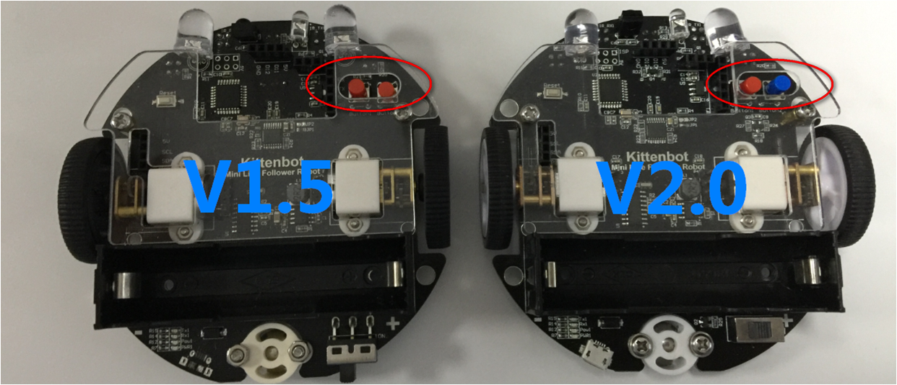

# 安装Kittenblock图形化编程软件和驱动及恢复固件

## MiniLFR巡线小圆车编程软件
如果您已经成功的尝试了小圆车的巡线模式和避障模式，恭喜您已经算入门了。

您的体验仅仅是小圆车功能的冰山一角。小圆车的功能不止于此。它区别与市面上的玩具小车。它的魅力在于通过自主的图形化编程可以控制小车的各种传感器。

小圆车可以通过Kittenblock进行图形化编程控制。Kittenblock是小喵科技基于美国麻省理工团队研发的Scratch3.0基础上二次开发，专门针对中小学编程教育和个人爱好者DIY制作，打通软硬件结合的图形化编程软件，特色：低门槛，上手快，易理解。

以下是Kittenblock的界面，Kittenblock是基于Scratch3.0，界面视觉上跟原来的Scratch2.0有很大区别，界面更加明亮，显得有活力，更加符合青少年学习的调性。它是市面上体验比较好，支持电子器件最多的一个图形化软件。

Kittenblock由小喵科技进行维护，每周六更新，免费开放给用户用。致力打造中国最好用的图形化编程软件。打破软硬件连接使用的高门槛。让大家轻松的进行DIY，把更多注意力放在作品的创意上

## 软件下载

每周六更新，由于更新比较频繁，可能会有不同情况的小bug，欢迎大家进行反馈报告。小喵这边会尽快修复bug，给大家满意的回复。

使用软件前需要安装：

### CH340下载驱动（支持小喵科技的硬件）
- Window用户点这里下载: [http://cdn.kittenbot.cn/CH341SER.EXE](http://cdn.kittenbot.cn/CH341SER.EXE)
- Mac用户点这里下载: [http://cdn.kittenbot.cn/CH341SER_MAC.ZIP](http://cdn.kittenbot.cn/CH341SER_MAC.ZIP)

**安装过程，一直点下一步——确认即可**

### Kittenblock软件

[http://kittenbot.cn/bbs/forum.php?mod=viewthread&tid=115&page=1&extra=#pid127](http://kittenbot.cn/bbs/forum.php?mod=viewthread&tid=115&page=1&extra=#pid127)

安装过程没什么难度，默认下一步下一步，安装即可，如果在安装过程中，360那些杀毒工具弹出，请允许其安装。小喵科技致力为中国图形化编程进程贡献一份力量，所以不会制造什么病毒的。大家请放心。

Window和Mac用户需要分别下载自己对应的驱动和软件。
如果安装过程中遇到任何问题，可以去我们论坛留言，我们有专门负责技术的同事维护论坛，看到后就会第一时间进行回复处理。

## 软件使用

现在默认大家已经成功安装好驱动和软件。
下面就教大家如何使用Kittenblock图形化编程软件

### 大概步骤

- 插上数据线，打开电源
- 软件里选择板子类型，串口COM口
- 恢复固件下载或者自行编写程序下载

**插上数据线，打开电源**

1. 打开软件

2. 设置机器人类型
 

3. 设置串口(不插上小车，是不会显示COM口)

4. 板子类型详解

5. 串口类型详解

6. 首次使用需要恢复出厂固件（确保固件最新）

**小圆车固件版本有两个V1.5和V2.0，要根据硬件对应选择固件下载。
硬件版本判断如下：**

**两个版本的积木编程控制是一样的。但必须下载对应的固件！否则编程得不到正确的结果。**

**下载中**

## 总结

成功操作上面的步骤，已经证明您已经成功入门了Kittenblock图形化编程软件，后面就是跟着我的教程对小圆车进行编程。

当您对小车的所有功能比较熟悉后，后面就可以按照您自己的想法进行编程。

再总结下小圆车操作过程：

- 插上数据线，打开电源
- 软件里选择板子类型，串口COM口
- 恢复固件下载或者自行编写程序下载

如果以上步骤您遇到问题，欢迎在帖子留言，小喵科技将为您持续服务！

