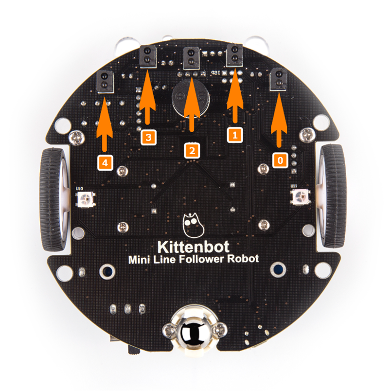
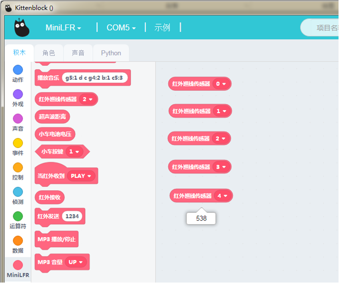

# 学习巡线传感器

## 红外巡线传感器硬件示意图

## 红外巡线传感器积木

这个积木块就是读取红外巡线传感器的值

## 红外巡线传感器积木详解

把积木块拖到积木块编程区中，可以读取红外巡线传感器反馈的值

小圆车上一共有5个红外巡线传感器，编号命名见首图，从0-4共5个传感器。

当遇到黑线的时候，数值会剧烈变小，不能手指去按住传感器这样接收的数据不对

## 在线模式测试

分别点积木块（保证小车已经恢复出厂固件!恢复出厂固件!）

可以看到当红外巡线传感器返回的数值

**在线模式：**

    软件是必须打开，只要关闭了这个程序就是失效了。在线模式一般是用来调试的，可以快速看到编程的结果。即点就可以即运行。

**离线模式：**

    当程序调试好了，这个时候就可以下载在电路板的芯片上，即使关闭电脑了，程序还是可以运行的。

大概测试了这个积木块的功能后，我们可以写控制红外巡线传感器运动的程序了

## 编写红外巡线传感器进行转动转译并下载程序

根据上图操作，把积木块拖出来，组成一个完整的程序。

(或者直接打开我提供的程序)

绿色旗子积木块是必须的！

**下载中**

**下载完成**

## 红外巡线小车就跑起来了

如果下载不成功，请检查：

- 板子类型是否选对？
- 是否连上COM口？
- USB线是否连接好？
- 程序是否正确？

如果以上都不能解决问题，请联系小喵科技，热诚为你服务

