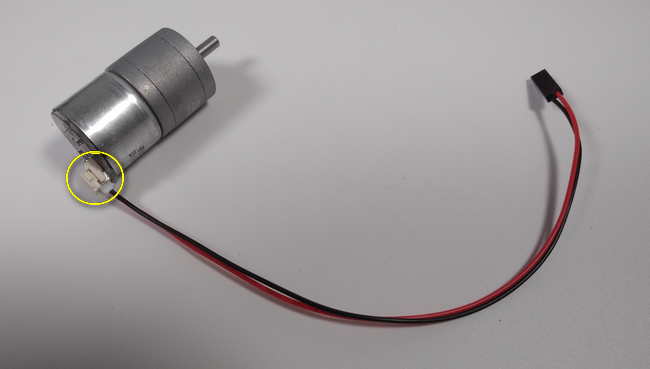
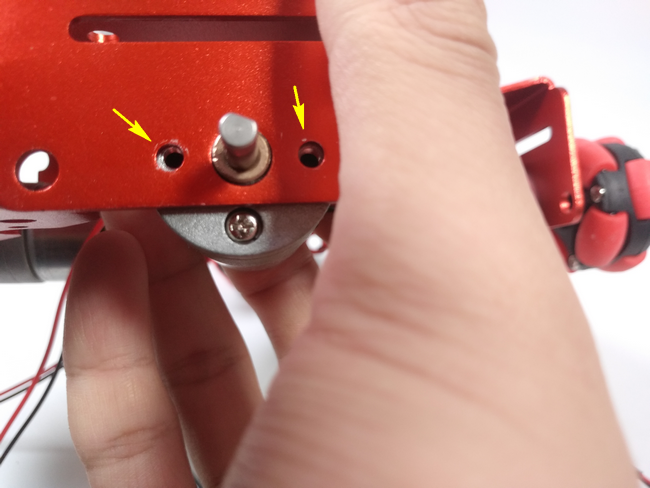
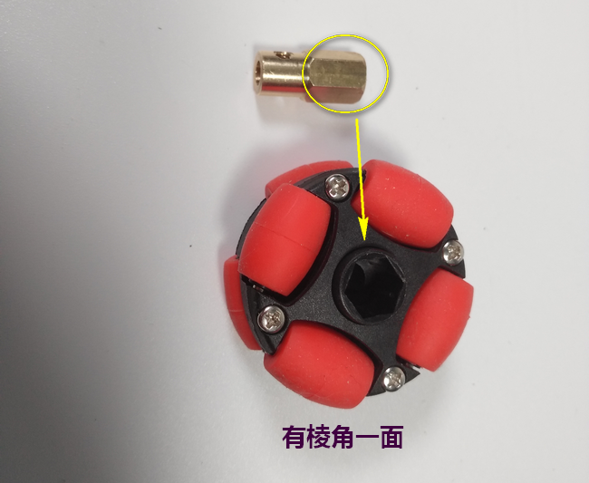
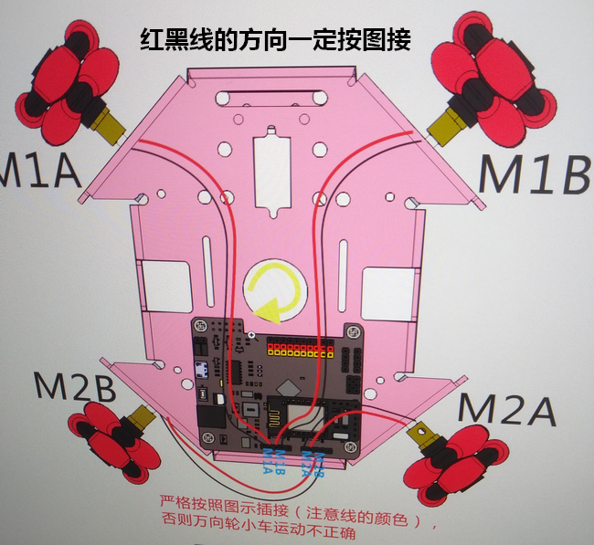
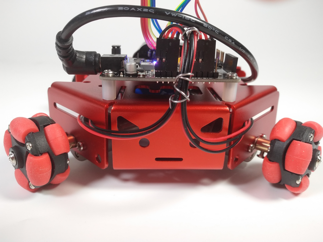
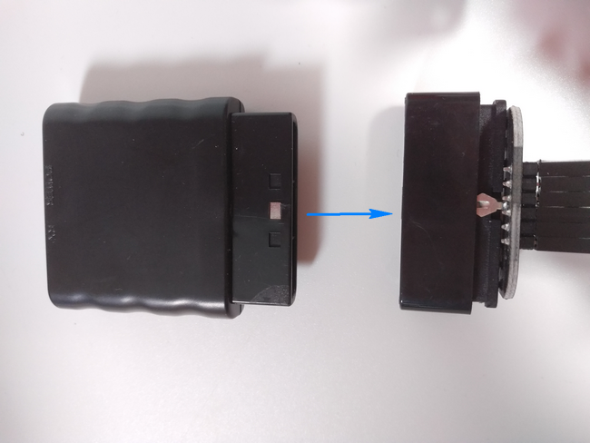
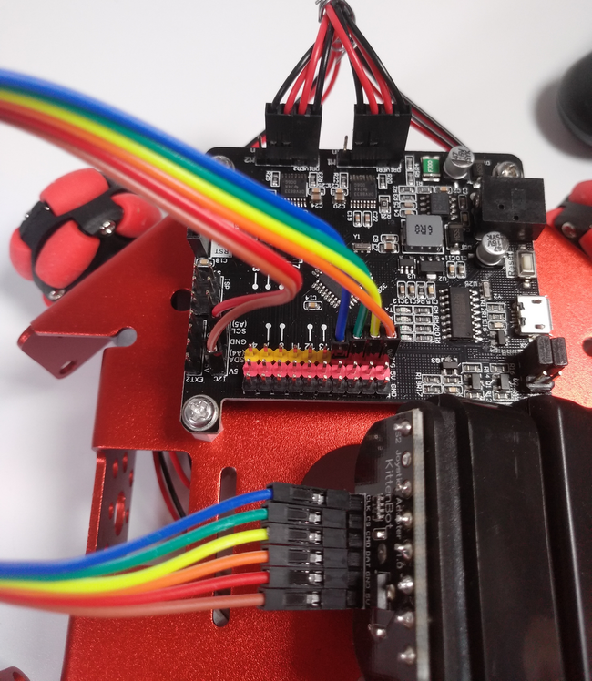
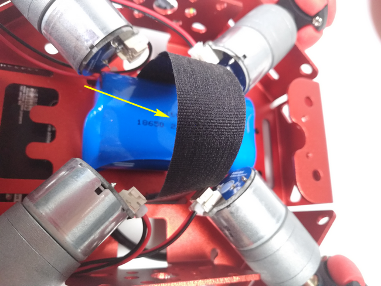
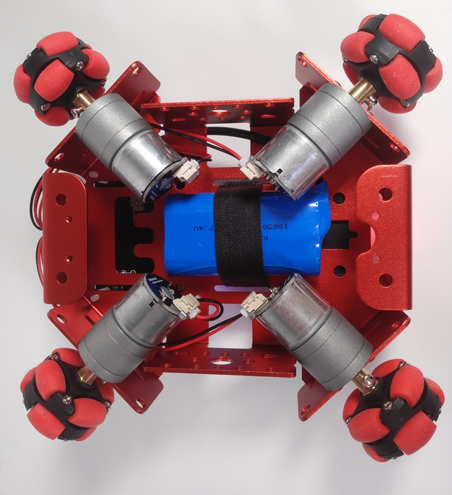
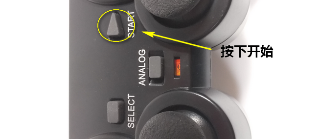

# Rosbot-全向轮小车

## 购买链接

__转到淘宝购买__----------→[全向轮小车套件](https://item.taobao.com/item.htm?spm=a1z10.3-c-s.w4002-17001215033.66.6e28762euyA1R2&id=553778182386)

## 产品名称

遥控全向轮小车

## 小述  

没错，多少个日夜我们曾向往速度，想自由驰骋，在无垠的旷野，在狭窄的人群，只要尽情释放我们小小心中大大的能量，就很满足。但过去恍若隔世，已不再是那个能肆无忌惮地操起遥控赛车一笑一天的孩子，我们的思绪可以快过风，但终究追不回时间。而编程却给了我们机会，这正是一款属于你的编程‘机车’，通过它你能感受的到编程的挑战，当一切准备就绪，拿起手柄一刻,一切都很值得 

 
 
    
 
好咯，让我们来认识一下这款Rosbot万向轮车吧  
 
  
## 配送清单   

### rosbot版   

- 钣金底盘 x1   
- 全向轮子 x4   
- Rosbot x1   
- 18650 2200mAh 7.4V锂电池 x1   
- 1Pin杜邦线 x6   
- 25电机 x4   
- 25电机2Pin杜邦线 x4   
- PS2手柄套件 x1   
- 电路板支撑柱 x4   
- 万向轮联轴器(含螺丝2颗) x4   
- 魔术贴绑带 x1   
- M3螺丝 x12   
- 喵家螺丝刀 x1   

### robobit版   

- 钣金底盘 x1   
- 全向轮子 x4  
- Robobit扩展板 x1  
- microbit X1  
- 18650 2200mAh 7.4V锂电池 x1    
- 25电机 x4   
- 25电机2Pin杜邦线 x4    
- 电路板支撑柱 x4   
- 万向轮联轴器(含螺丝2颗) x 4   
- 魔术贴绑带 x1   
- M3螺丝 x12   
- 喵家螺丝刀 x1     

  
 
## 产品介绍   

  它以钣金底座为基础，在钣金的4块斜板上装上25电机进而控制全向轮的全方位移动。rosbot版全向轮小车可使用PS2手柄控制，而robobit版全向轮小车则可用另外一块microbit主控板进行手势遥控 。还可以通过kittenblock进行图形化编程改变操作方式或直接编小车运动方式。   

## 产品特色   

- 基于图形化编程   
- 适用人群低龄化   
- 零件可替换   
- 操作多样化   
- 移动全方位   
- rosbot版可接受蓝牙、WiFi控制   
- robobit版可接受蓝牙、另一块microbit主控板控制   
   
   
## 产品参数   

- 长：150mm   
- 宽：140mm  
- 高: 60mm   
- 净重：673g
- 轮子直径：38mm
- 轮子宽度:23.4mm
- 轮子净重:20g   
   
   
## 技术参数   

- 18650电池电压：3.7V   
- USB输入电压：5V   
- VM引脚最大：1A（在板载电池的支持下）   
- 绿色端子电压(外部电源输入)：5V（只支持5V输入，切勿接超5V的电压，最大电流支持3V）  
- 滚轮材料：塑料
- 滚轮数量：8个
- 负载：2kg
- JGA25微型减速电机：空载转速211rpm，负载转速147rpm

## 组合过程  

1.25电机与专用杜邦线连接

  
  
2.将电机螺丝孔对准钣金控，推荐如图单手支撑并拧上螺丝

   

 

3.装配万向轮子，装好联动轴，先把侧边固定螺丝拧上一并按图中所示与电机轴相接并拧紧联动轴上螺丝

   
  
  

  

4.轮胎固定

   

5.电路板支撑柱子装配，建议按照图中Rosbot标注排针方向定位并上紧螺丝
  
    

   
  
 

6.接线请一定按照图中顺序，否则会跟给的程序配不上，操作会有问题。以及线过孔方式推荐

  
  

7.拼接PS2手柄件以及手柄接线

 

  
  
8.电池和手柄固定方式推荐
  
  
  

  
  
  
9.PS2手柄使用
  
  
  
  
  
  

## 使用方式 
 
- 编程方式：Kittenblock(基于Scratch3.0)/Arduino/Makecode   
- 兼容硬件：猫头避障电子模块   
- 小喵教程集合地址：learn.kittenbot.cn   
- 小喵论坛地址：bbs.kittenbot.cn  
- 网易云课堂：搜索小喵科技   
- 更多的实时讨论，请加入爱上小喵科技官方Q群:568084773

1.打开kittenblock软件，选好KittenBot硬件，插上usb线选好COM口，并点击例子  
  
    

2.找到序号13的万向轮小车，当然高手你可以自己编写其他功能，毕竟这是男人的浪漫
  

  
3.出来图中代码块后点击右上角舞台两字切换到代码

   

4.点击翻译，上传，收到下载完成后即完成下载

  
  
   
  
## 展示  
  

  
## 注意事项 

- 供电使用喵家7.4V锂电池即可，自己用电池盒接5V电池的话车子有点慢  
- 接线可别接错了，重点提醒  
- PS2手柄要打开还要按START键哦   
   
有什么疑问都留言哦~  
  
电池：[https://item.taobao.com/item.htm?spm=a1z10.3-c-s.w4002-17001215033.33.7abc762e6kNmYE&id=558582079064](https://item.taobao.com/item.htm?spm=a1z10.3-c-s.w4002-17001215033.33.7abc762e6kNmYE&id=558582079064)  
  
25电机：[https://item.taobao.com/item.htm?spm=a1z10.3-c-s.w4002-17001215033.23.25b8762e2ZXqKq&id=558632834609](https://item.taobao.com/item.htm?spm=a1z10.3-c-s.w4002-17001215033.23.25b8762e2ZXqKq&id=558632834609)   
   
RosBot：[https://item.taobao.com/item.htm?spm=a1z10.3-c-s.w4002-17001215033.44.3ede762eqchD6f&id=551011963085](https://item.taobao.com/item.htm?spm=a1z10.3-c-s.w4002-17001215033.44.3ede762eqchD6f&id=551011963085)    

兼容乐高的钣金底盘：[https://item.taobao.com/item.htm?spm=a1z10.3-c-s.w4002-17001215033.39.1b0f762e4Wtp1t&id=551190318152](https://item.taobao.com/item.htm?spm=a1z10.3-c-s.w4002-17001215033.39.1b0f762e4Wtp1t&id=551190318152)

_请按照说明书正确接线，接错线会造成小车没反应或运动错误   
摔、砸可能会导致小车故障，请尽量避免   
本产品只适用于14岁以上的儿童进行独立使用，8~14岁儿童请在家长或者老师的陪同下进行使用。 
如使用前请按照小喵官方资料指导下进行使用，不要随便接插电路，切勿外接大电流舵机，大电流电机，以免烧毁电路板。   
注意不要在金属表面，或者导电的物体上使用，以免短路   
请避免在潮湿和有水的地方使用，以免短路   
电路板或者机械上含有细小物件请不要吞食，请放在儿童接触不到的地方妥善保管 _