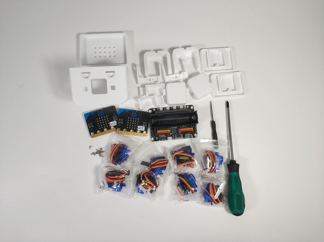
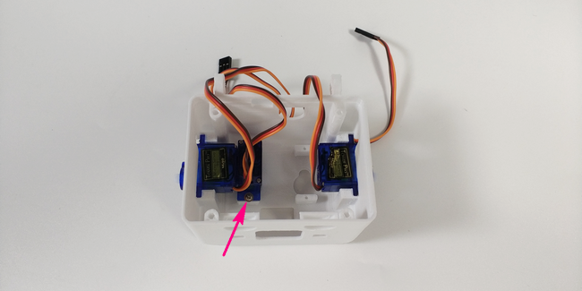
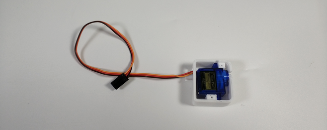
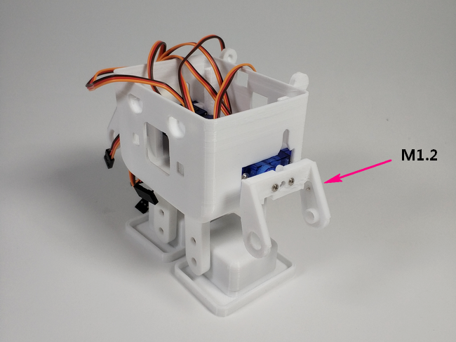
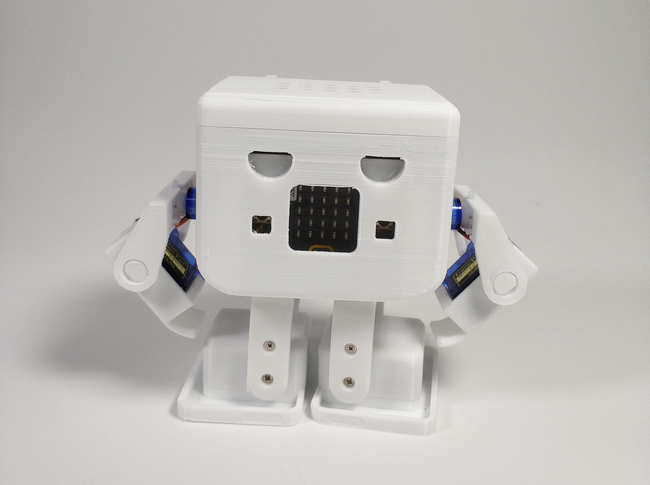
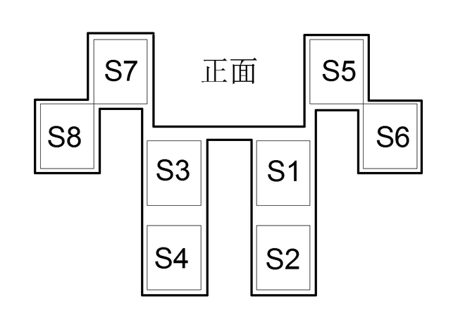
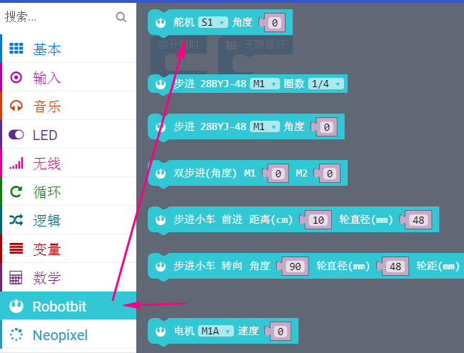

# Microbit-OTTO机器人

## 购买链接

__转到淘宝购买__----------→[OTTO机器人套件](https://item.taobao.com/item.htm?spm=a1z10.3-c-s.w4002-17001215033.53.59fc762e6Luvq6&id=564707487178)

## 产品名称

OTTO人形机器人

## 适用人群

舵机的配合控制有难度，适用于有一定编程基础及动手能力的爱好者

## 配送清单

- OTTO打印件一套
- 螺丝若干
- 9g小舵机 x 8
- microbit x 2
- robotbit x 1
- 螺丝刀（大、小） x 2
 

## 产品简介

OTTO机器人全身含8个舵机分别控制每个关节部位，其人形的特点使之更具亲和力及趣味性。通过图形化编程，让轻松控制机器人行走及摆出不同动作的目的成为现实，其中令OTTO搞怪跳舞也是极其有趣。另外在图形化编程过程中，避免了冗余复杂的底层代码加载，你可以仅仅通过拖动那些编程积木块便可跨越技术门槛去实现你的idea，熟话说把事情做专做精，没有了那些底层库的繁琐调用，已不仅是入门创客爱好者的福音也同样是学习编程思维的最好办法。

## 产品特色

- 图形化编程上手快
- 8舵机运动灵活
- 人形更符合机器人概念
- 可拼装注重动手能力
- 锻炼编程逻辑思维
- 可拓展性强

## 产品参数

- 长x宽x高： 135mm x 70mm x 111mm
- 净重： 245g
- 毛重：根据包裹最终大小决定

## 技术参数

- 电压：5V
- 电流：1A
- 板载全彩RGB灯
- 8舵机同时运动
- 可编程蜂鸣器
- 18650-3.7V可充锂电池

## 入门基础

可能很多友友第一次买到这样的套件，之前也没有接触过Microbit板子，也不知道什么是Robotbit。所以在后面的编程，对于大家来说可能跳跃太大了。

为了帮助新手尽快上手，小喵科技特意录了视频教程。有36个课时（每节平均大概5~10分钟，只讲干货）

所以避免后面的软件编程不知道如何上手。所以这里先提醒大家先看看视频。至少知道，你手上的电路板是干嘛的？有什么功能？如何下载程序？软件在哪里下载？

[网易云课堂视频教程，学习能力好的推荐2倍速观看](https://study.163.com/course/introduction.htm?courseId=1005485001#/courseDetail?tab=1)

推荐按顺序看，但是如果你只是想把这个套件驱动起来，可以先看一下我标注的章节。这样针对性比较强。

**Microbit板子的介绍和一些基础入门**

  

**Robotbit板子的介绍和一些基础入门**

 

## 组合过程

__首先写在前面的一个要点是，每个舵机的安装前应确保初始位置为90°__

1.先认识一下组装过程中需要的螺丝

2.先将舵机包里的零件取出，4个关节都按照如图剪切卡位

3.我们分别均给他们拧上M1.2自攻螺丝2颗固定

4.将4个舵机作为身体的4个主关节固定再壳子里，注意图中每个舵机均使用2颗带垫M2.3螺丝固定

5.每个舵机和支撑关节分别用1个M2 x 4的螺丝连接固定

6.脚掌的部位按照如图安装舵机

7.脚掌与腿部的连接卡位及螺丝选配如图所示

8.手臂部位的固定如图，背面固定舵机使用M1.2以及侧面积固定关节舵机也同样使用M1.2

9.手的固定跟脚的相似，最后直接卡进去就打工告成了~

10.一切准备就绪就按照就按照图中的标示接线吧

## 使用环境

编程方式：Kittenblock(基于Scratch3.0)/Makecode可连接硬件：Microbit

## 使用方法

- 兼容硬件（配合硬件，或者配套什么使用）：两块microbit互联2.4G通讯控制
- 小喵教程集合地址：learn.kittenbot.cn
- 小喵论坛地址：kittenbot.cn/bbs
- 网易云课堂：搜索小喵科技
- 更多的实时讨论，请加入爱上小喵科技官方Q群：568084773

使用makecode编程第一步按照需求导包

- 我们控制otto动起来所需要的积木块是这个

通过配合S1-S8的8个舵机按照不同角度和顺序运转最终实现OTTO的各种造型动作

这里给出一个现成的2.4G控制OTTO向前向后走的程序（针对不同的舵机安装误差角度，运动起来会稍有偏差，可以自行调整程序中数组中的数值）

[程序点这](https://bbs.kittenbot.cn/forum.php?mod=viewthread&tid=365)

## 注意事项

- 舵机初始角度确保90°（左右可旋角位移相等）
- 给出的程序是严格按照上述已给接线图
- 舵机角度有些偏差属于正常现象，可通过程序内稍作数值的调整

如果上述提示都无法解决你的问题，请加入小喵科技QQ交流群：568084773咨询

_本产品只适用于14岁以上的儿童进行独立使用，8~14岁儿童请在家长或者老师的陪同下进行使用。
如使用前请按照小喵官方资料指导下进行使用，不要随便接插电路，切勿外接大电流舵机，大电流电机，以免烧毁电路板。
注意控制板不要通电置于金属表面，或者导电的物体上使用，以免短路
请避免在潮湿和有水的地方使用，以免短路
电路板或者机械上含有细小物件请不要吞食，请放在儿童接触不到的地方妥善保管_

