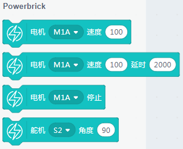

# Geekservo舵机电机

Geekservo是一款与乐高结合的9g舵机与电电机，灰色的为舵机（一般用作机器人的关节），红色的为减速直流电机（一般用作小车的轮子动力）

## 接线

- Geekservo灰色舵机-> 主控盒背后的舵机接口S1或者S8
- 
- Geekservo红色电机-> 主控盒下方的电机接口M1与M2

- 电池盒->主控盒 电源接口（如果没有特殊情况说明，一般电池盒都是要插上主控盒供电的）

实物接线如图所示：

## 恢复固件连上串口

如果忘记了如何恢复固件，可以回去看03教程帖子

## MP3魔块有对应的积木块

## 灰色舵机角度旋转

把S1和S8插上（注意舵机3根线是有线序之分，一般橙色线就是数据线）

## 红色电机正装反转

没有正负之分，红黑线调过来，电机就反转，这个正反转可以通过程序进行修改控制的

## 常见问题与解答

**1、为什么我点击积木块没有反应呢？**

首先确保操作已经按照前面帖子的操作，已经恢复固件，并且连上的串口

**2、我想像makecode那样的操作，把Microbit的程序下载到板子上可以吗？**

Microbit支持离线下载（把程序保存在电路板上，关掉电脑也能工作）和在线通讯，
> 能量魔块暂时只支持在线通讯（程序猿还在努力中做离线下载），所以程序只含Microbit的积木块，可以进行离线下载。

**3、什么时候需要点击恢复固件**

当你需要在线通讯的调试，就应该点击恢复固件。此固件实际为在线通讯固件，如果你用makecode下载过程序或者在Kittenblock中离线下载过程序，这个在线通讯固件就会被覆盖掉，这时候如果你想用在线调试就应该先恢复固件，再点击通讯连接。