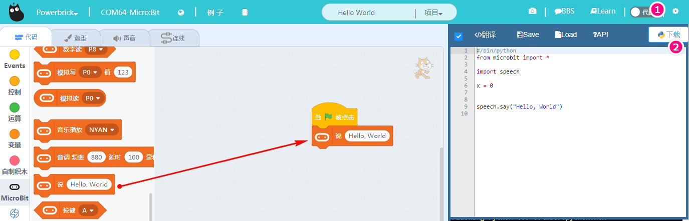

# Microbit相关编程

能量魔块的编程，本质上Microbit与特色传感器的编程，所以硬件选择powerbrick,microbit这个插件分栏也会自动加载进来。我们试一试在线模式控制Microbit的

假设前面帖子操作已经成功了，现在就对Microbit进行它的特色操作，如点阵屏显示，蜂鸣器发声，陀螺仪读取数据等。

## 点阵显示

### 自由编辑点阵屏图案

microbit 5x5可以进行自由编辑（编辑方式和makecode中是一样的），编辑完记得点击积木，这样才会对Microbit进行指令发送

现象：

### 选择内置图标

### 英文与数字字符串（不能显示中文）

这些操作跟microbit上的操作是类似的，只是界面不同而已。在线调试模式，所点即所得，非常方便，不用每改一次程序就下载一次。

## 蜂鸣器响声

点击积木块就可以进行播放了

播放英文语音？！是的，Kittenblock里面特有的，控制microbit说英文，但是前提，MicrobitP0口需要接一个比较好的音频音响或者耳机（用蜂鸣器听得不清），并且需要下载在Microbit上（说英文不支持在线固件）

备注：下载后，如果像用回在线调试的方式，记得恢复固件后再连接上串口

## 陀螺仪

点击陀螺仪可以实时返回陀螺仪的对应轴的返回值，这里写了一个陀螺仪x轴控制小猫左右移动，程序如下：

记得电机绿旗子进行运行，为什么要除以4？因为陀螺仪返回来的值是-1000多~1000多，而小猫在舞台移动范围是-255~255，所以除以4，就能控制小猫在舞台内进行运动了。

尝试左右滚动下Armourbit，观察舞台小猫的运动情况

## 其他积木块

按键和手势（Microbit陀螺仪状态），已经经常用在与Scratch舞台交互上的

----------

## 常见问题与解答

**1、为什么我点击积木块没有反应呢？**

首先确保操作已经按照前面帖子的操作，已经恢复固件，并且连上了串口

**2、我想像makecode那样的操作，把Microbit的程序下载到板子上可以吗？**

Microbit支持离线下载（把程序保存在电路板上，关掉电脑也能工作）和在线通讯，能量魔块暂时只支持在线通讯（程序猿还在努力中做离线下载），所以程序只含Microbit的积木块，可以进行离线下载。

**3、什么时候需要点击恢复固件**

当你需要在线通讯的调试，就应该点击恢复固件。此固件实际为在线通讯固件，如果你用makecode下载过程序或者在Kittenblock中离线下载过程序，这个在线通讯固件就会被覆盖掉，这时候如果你想用在线调试就应该先恢复固件，再点击通讯连接。