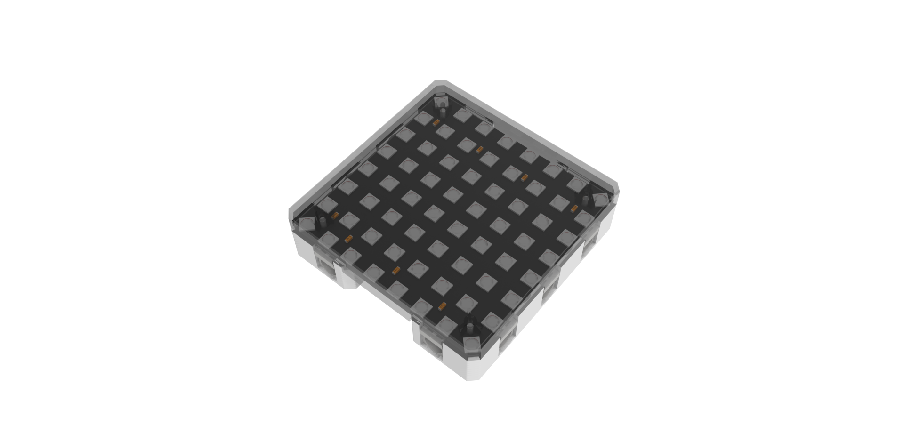
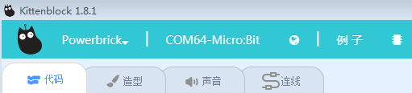
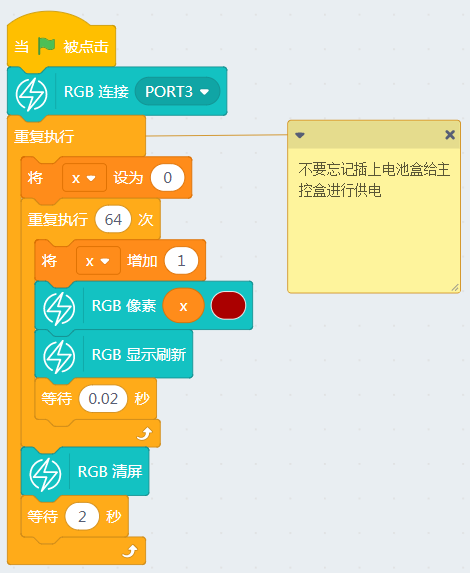

# 全彩点阵魔块

全彩点阵屏是一款8x8全彩点阵屏，兼容乐高尺寸，并且可两两通过乐高插销进行拼装。

全彩点阵屏魔块属于普通IO模块，可以插接Port1-7任意Port口上。使用全彩点阵屏必须插接电池盒，否则因为供电不足，导致工作异常。

## 接线

- 全彩点阵屏魔块-> 主控盒 Port2口

- 电池盒->主控盒 电源接口（如果没有特殊情况说明，一般电池盒都是要插上主控盒供电的）

实物接线如图所示：

## 恢复固件连上串口

如果忘记了如何恢复固件，可以回去看03教程帖子

## 全彩点阵屏魔块有对应的积木块

## 全彩点阵屏魔块LED逐个点亮

## 常见问题与解答

**1、为什么我点击积木块没有反应呢？**

首先确保操作已经按照前面帖子的操作，已经恢复固件，并且连上的串口

**2、我想像makecode那样的操作，把Microbit的程序下载到板子上可以吗？**

Microbit支持离线下载（把程序保存在电路板上，关掉电脑也能工作）和在线通讯，
> 能量魔块暂时只支持在线通讯（程序猿还在努力中做离线下载），所以程序只含Microbit的积木块，可以进行离线下载。

**3、什么时候需要点击恢复固件**

当你需要在线通讯的调试，就应该点击恢复固件。此固件实际为在线通讯固件，如果你用makecode下载过程序或者在Kittenblock中离线下载过程序，这个在线通讯固件就会被覆盖掉，这时候如果你想用在线调试就应该先恢复固件，再点击通讯连接。