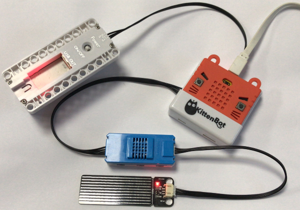
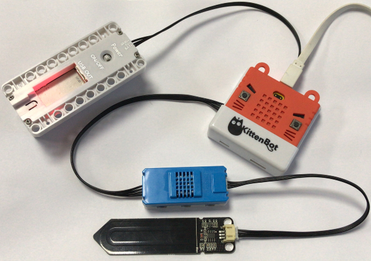
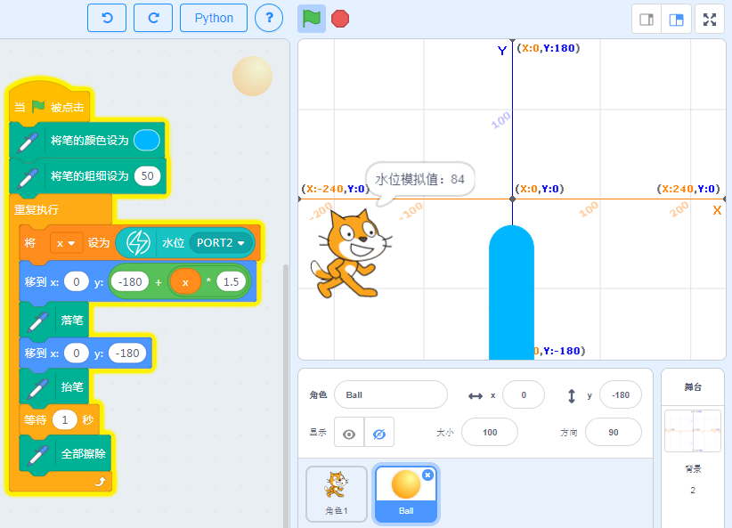

# 雨滴水位与电容式土壤魔块

雨滴水位:

用于检测是否有下雨，或者4cm左右高度的水位

电容式土壤:

电容式土壤相对市面上廉价的土壤传感器，电容式土壤耐腐蚀，线路都被电路板的油墨覆盖起来，特别长期插在土壤里使用必须使用这种电容式土壤才能保证正常工作。

以上两种传感器是配合插在温湿度魔块上使用的，水位与土壤传感器如果长期不使用，请擦拭干净，放在干燥的地方进行保存。

## 接线

- 水位传感器->温湿度模拟魔块-> 主控盒 Port2

- 或者土壤传感器->温湿度模拟魔块-> 主控盒 Port2（在某个时刻，只能选用水位或者土壤，因为接口只有一个）

电池盒->主控盒 电源接口（如果没有特殊情况说明，一般电池盒都是要插上主控盒供电的）

实物接线如图所示：

## 恢复固件连上串口

如果忘记了如何恢复固件，可以回去看03教程帖子

## 温湿度有对应的积木块

点击一下积木块，就会对应返回水位传感器模拟值、土壤传感器模拟值。

水位传感器没有水时，数值接近0，水位越高时，数值越大

土壤传感器土壤越干燥时，数值越大！（这里恰好和水位相反了）

## 水位传感器值与舞台画笔交互

画笔画出一个直方图，高度值就代表水位的情况，并用小猫将值说出来。

## 总结

上面的例子只利用的水位传感器读回来的模拟值与Scratch的画笔插件进行了交互。土壤传感器使用方法也是类似，自己可以改造下程序，尝试下

## 常见问题与解答

**1、为什么我点击积木块没有反应呢？**

首先确保操作已经按照前面帖子的操作，已经恢复固件，并且连上了串口

**2、我想像makecode那样的操作，把Microbit的程序下载到板子上可以吗？**

Microbit支持离线下载（把程序保存在电路板上，关掉电脑也能工作）和在线通讯，
> 能量魔块暂时只支持在线通讯（程序猿还在努力中做离线下载），所以程序只含Microbit的积木块，可以进行离线下载。

**3、什么时候需要点击恢复固件**

当你需要在线通讯的调试，就应该点击恢复固件。此固件实际为在线通讯固件，如果你用makecode下载过程序或者在Kittenblock中离线下载过程序，这个在线通讯固件就会被覆盖掉，这时候如果你想用在线调试就应该先恢复固件，再点击通讯连接。