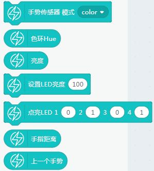
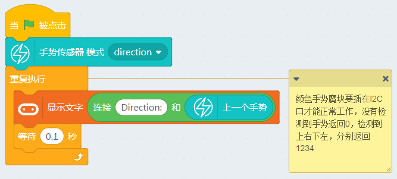
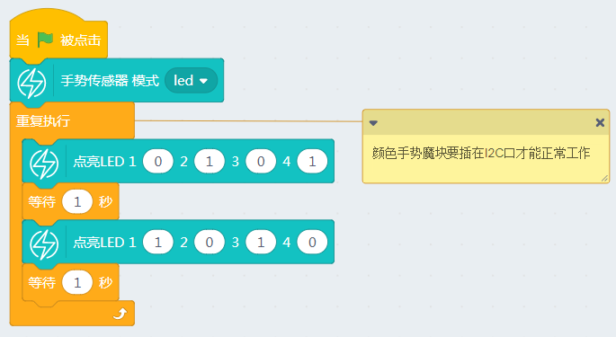

# 颜色手势魔块

颜色手势魔块在能量魔块套件中最具特色，在一个模块内集合了多种功能。

模块的功能切换要在初始化进行模式选择切换。

它有以下功能：

1. 颜色识别功能

2. 环境光亮度识别功能

3. 距离识别功能

4. 手势识别功能

5. LED单独控制模式

颜色手势魔块属于高级I2C通讯模块，所以只能接在Armourbit的I2C通讯接口上使用，**插到其他Port口使用无效**。

## 接线

- 按键魔块-> 主控盒 I2C口

- 电池盒->主控盒 电源接口（如果没有特殊情况说明，一般电池盒都是要插上主控盒供电的）

实物接线如图所示：

## 恢复固件连上串口

如果忘记了如何恢复固件，可以回去看03教程帖子

## 颜色手势魔块有对应的积木块

## 颜色识别功能

颜色在我们生活中一般用RGB这三个值进行标识，如果识别某种颜色，只能判断R、G、B三个值分别在某个范围内，比较麻烦。

所以小喵科技做了一个Hue色环值的模块，将全彩颜色转换为一个360度的色环。当模块进入颜色识别模式，4颗LED灯就会高亮起来，给

如下图所示：

通过这样的转化，我们通过判断Hue色环值（一般判断色环值处于某一个范围值判定是什么颜色），我们就可以判断出对应的颜色。

我们可以打开示例：

点击绿旗子在线运行，可以看到Microbit点阵屏返回色环值回来，这时候我们拿不同颜色的物体（不能太反光的）进行测试，最佳的测试距离大概1.5cm

## 环境光亮度识别功能

识别环境光强，也是在颜色模式下进行检测的。

我们可以打开示例：

点击绿旗子在线运行，尝试用手电筒去照射传感器，可以明显看到值上升，光敏传感器返回的数值为0-255

## 距离识别功能

颜色手势是一个多功能传感器，它也可以检测一定距离，大概3CM，跟超声波的距离检测不一样的是，它检测的距离不是一个实际的物理量，而是一个模拟值，并且这个模拟值不是线性的，所以只能用作物体靠近阈值检测。当模块进入了距离检测模式，当有物体靠近时，4颗LED灯越亮。

## 手势识别功能

手势识别是此模块的一大特色，它一共能识别4种手势，上左下右，可以识别4种手势。当进入手势识别模式，4颗LED灯会灭掉，当触发某个方向的手势，对应那个方向的手势，LED会亮一下。

识别手势，最好用一根手指，这样识别率比较高，需要直直的移动。距传感器大概1.5cm的识别效果为最好。

## LED单独控制模式

颜色手势模块上还有4颗LED灯，作为黑科技，我们也可以把它当成普通的LED模块进行使用。

数值0为关闭LED灯，数值1为点亮LED灯。

## 常见问题与解答

**1、为什么我点击积木块没有反应呢？**

首先确保操作已经按照前面帖子的操作，已经恢复固件，并且连上的串口

**2、我想像makecode那样的操作，把Microbit的程序下载到板子上可以吗？**

Microbit支持离线下载（把程序保存在电路板上，关掉电脑也能工作）和在线通讯，
> 能量魔块暂时只支持在线通讯（程序猿还在努力中做离线下载），所以程序只含Microbit的积木块，可以进行离线下载。

**3、什么时候需要点击恢复固件**

当你需要在线通讯的调试，就应该点击恢复固件。此固件实际为在线通讯固件，如果你用makecode下载过程序或者在Kittenblock中离线下载过程序，这个在线通讯固件就会被覆盖掉，这时候如果你想用在线调试就应该先恢复固件，再点击通讯连接。