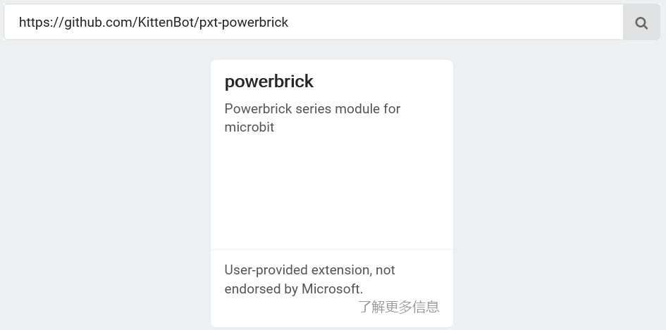

# Makecode编程环境

## 快速开始

能量魔块所用的编程环境是微软Makecode。

有两种选择：

一可以选择在线编程（微软官方）

二可以选择喵家离线版本（基于微软官方做的）。

离线版本的能量魔块的插件基本与在线的一样，而在一些高级模块上。离线版本整合了一些插件(如全彩屏点阵编辑器)，**更加方便更好用**。

## 在线编程快速开始

### 浏览器加载Makecode最新版本

这里的Makecode在线编程**必须是最新版**，旧版本是无法正确加载能量魔块插件。

建议将地址复制到浏览器中

https://makecode.microbit.org

### Powerbrick插件加载

https://github.com/KittenBot/pxt-powerbrick

建议将地址复制到makecode插件搜索栏中

加载成功：

## 离线版本快速开始

### 下载地址

Windows：

[http://cdn.kittenbot.cn/makecode/win/Makecode%20Setup%203.4.0.exe](http://cdn.kittenbot.cn/makecode/win/Makecode Setup 3.4.0.exe)

Mac：

http://cdn.kittenbot.cn/makecode/mac/Makecode-3.2.0.dmg

### 双击安装

### 串口驱动安装

## 编程方式推荐

长期使用建议下载离线版本

优点：

1、无需依靠网络 

2、带串口调试

3、全彩点阵编辑器

