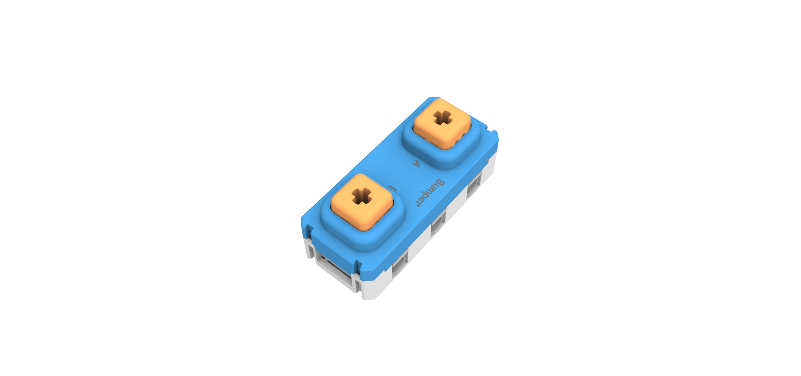
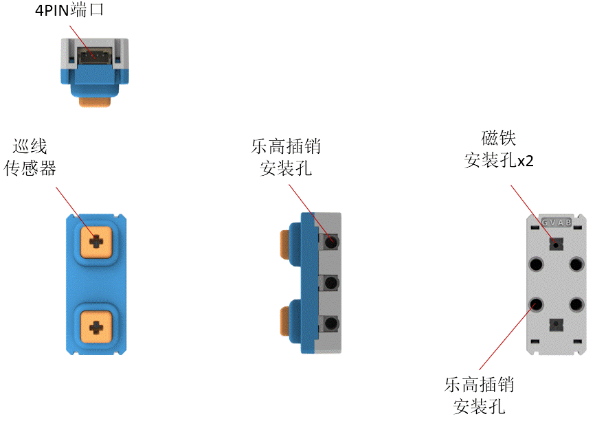
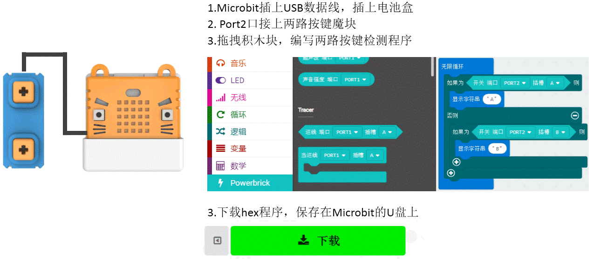

# 两路按键魔块

模块一共有两路硅胶按键，可以检测按键是否按下。当按键按下时，对应按键背后的红色LED会亮，并且返回触发信号，按键按下事件为真。另外按键键帽上可安装乐高十字插销。

## 详细介绍

## 参数介绍

- 支持电压： 3V-5V
- 尺寸：56mm X 24mm X 25mm
- 接口：PH2.0 4PIN端子 ，引脚服从GVAB排布
- 类型：数字传感器，按下按键，事件为真

对应Makecode编程界面：

Makecode在线地址：https://makecode.microbit.org/beta#editor

加载Powerbrick插件地址：https://github.com/KittenBot/pxt-powerbrick

## 按键魔块插接演示

## 编程介绍

### 按键检测编程

