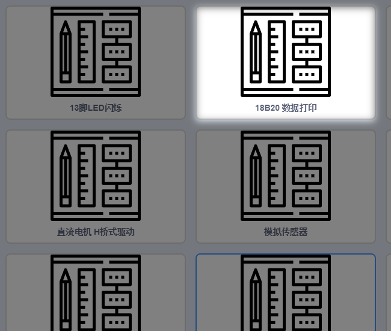

# 03Arduino快速上手  
  
## 操作步骤  
  
1.首先拖入程序主体积木块  

    
  

2.使用套件内的一般传感器，判断属于模拟还是数字并在对应种类下选择传感器种类，该积木块作为所选传感器的检测返回值传入到你所设置的变量中，之后通过逻辑判断变量的值来决定你想要的动作。
   

3.对于所给种类中没有的传感器，依然先判断数字还是模拟传感器，之后使用Arduino分栏中的数字读和模拟读来获取传感器的检测数值
 

4.对于复杂传感器如DS18B20，需要进行内部返回值的套公式运算，所以有别于一般传感器，需要进行配置，对此小喵也做好了内部工作，使用方法你可以点开例子作为参考。
  
  

  
## 示例使用
  
**为了方便大家在Kittenblock中对Arduino使用或学习，小喵家专门为大家准备了丰富的示例**  
当你连接上了Arudino并选择好串口，你就可以点击图中例子，根据需求使用这些例子哦，这样大部分的疑惑都能得到解决~
  
    

  
## 在线调试  
  
**这个在线调试的功能是Kittenblock的特点之一，在一定程度上节省了开发和学习者的时间**  
   
使用在线串口调试的方法，我们还是使用之前的18B20数据打印这个例子。
   

其实串口打印数据的要点就是串口输出后面跟上需要打印出来的传感器积木块
需要注意的是若在其他调试工具进行调试需要先初始化波特率，以及循环中一定一定要给一个0.5s左右的延时，否则，太快你的电脑可是会死掉的哦~

 
**注:**  

大部分的问题都能通过例子作为参考得到解决。实在不行的话请在小喵的Q群里大胆询问哦~