# 人工智能实战项目——垃圾分类（下篇）

本篇是垃圾分类的下篇，主要是软件的操作，机器学习，软件在线控制与整体项目的调试。项目的知识引入下篇不再赘述，请翻看上篇进行学习。

## 物品卡片分类

我们分类垃圾桶，配套有一百多张卡片。

首先我们自主按照垃圾的分类规则对着一百多张物品卡片进行分类，其中有两张卡片是用来说明物品的种类，一共是四个种类，我们按照说明进行分类，分这一百多张物品卡片大概花了半个小时（建议在课前分类好或者留小部分给学生自己进行分类），通过这次繁琐的分类，我们可以深深感受到人工智能背后是有很多非人工智能而繁琐的劳动。

完成分类后，将这四个种类的卡片装进小盒子进行备用。

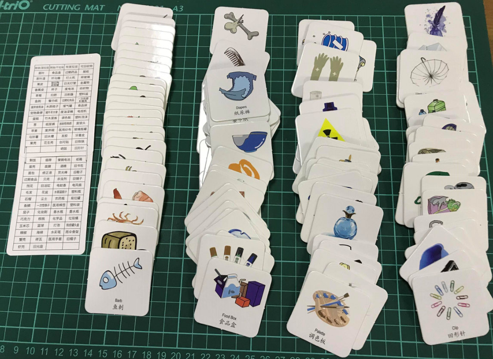

## 录入数据

分别将以上4组卡片录入记事本中，另存为csv格式。数据表的作用，当电脑摄像头把卡片的物体识别出来后，需要通过程序去检查，这个物体具体属于哪个种类，从而控制硬件做出反馈。表格的名字随意，我这里以湿垃圾、干垃圾、有害垃圾、可回收物进行进行命名。

以湿垃圾为例，内容情况：

新建一个空的txt文本。输入一个物品名称后，按回车键换行，再输入下一个物品的名称，直到这个种类的所有物品全部输入完，物品的排序不影响最终的识别结果。

更改后缀CSV，保存为UTF-8格式

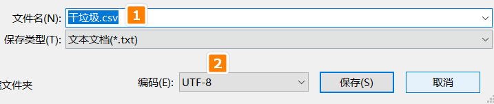

保存后，下次打开后，需要对其右键选择打开方法——记事本。如果你用excel或者写字板直接打开，打开会显示乱码，因为文本的编码不同。

经过一番努力，我们将所有卡片都分别录入以下四个表中，保存待用。（已经购买套件的用户，我们已经提供好现成的表格无需自己输入）

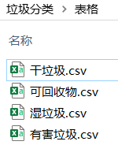

## 软件调试

在程序调试前，我们先理一理我们的思路。

本次的程序调试最终目的——实现垃圾分类智能识别。

上篇我们已经编写了简单的测试程序，可以对任意的垃圾桶控制垃圾盖的开合

本篇我们还需要完成的事情。

- 对垃圾桶控制程序进行优化
- 对录入的数据库进行测试，在没有摄像头的情况下，如果我直接输入物品的名称，看下对应的垃圾桶是否能开盖与闭合。
- 对分类好的卡片，一组一组进行机器学习录入。录入后进行测试，看下是否能识别正确，且能朗读出来。
- 最后将机器学习和垃圾桶控制进行合并联调，最终做出智能垃圾分类的装置。

机械和电子还是用上篇的装置，本篇主要教大家使用软件和进行机器学习训练。我们依然用usb数据线将Microbit和电脑连接。软件的必要操作还是一样，打开Kittenblock软件。

### 使用自制积木块进行调用

1. 恢复固件

   恢复固件后，Microbit点阵屏上是显示流动的英文字符串。

   
2. 连接串口

   成功恢复固件后，点击连接，就可以看到Microbit的板子（如果找不到Microbit板子，可能是串口驱动没有安装）

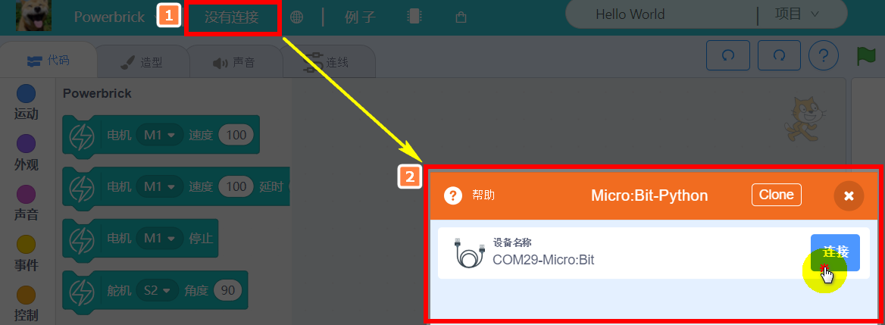

3. 根据上次的程序进行优化

首先我们写一个子函数，控制所有舵机进行关闭。在自制积木块，按照下图进行新建

填入名称

成功新建后，舞台就出现了“定义关闭垃圾桶”的帽子积木块

把帽子积木和4个舵机关闭结合在一起，点击下"关闭垃圾桶"积木块，对应的帽子模块下积木块就会立马执行。因此编程时，我们用上“关闭垃圾桶”的积木块进行调用即可。

同理，剩下的4个垃圾桶开盖的程序调用方式也是一样，只是名称不一样。

可以分别点击进行测试下，看下硬件实物是否有反应。

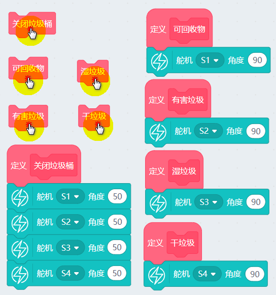

### 建立列表导入物品库

我们首先导入的是可回收物，列表名称我们命名为“可回收物”

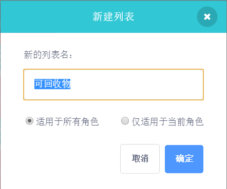

舞台的左上方就会出现一个空列表

我们按照同样的方式，把剩下的三个表也进行添加。

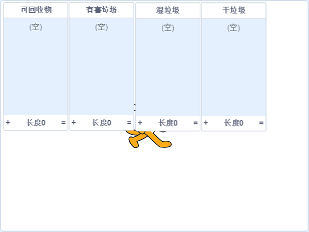

右键列表——导入

选择对应的数据表格，确定导入

按照同样的方式，剩下的三个列表也把数据导入进去了。如果你把所有的垃圾分类的卡片都分类对了，并且都录入了，每个列表应该是27项目，27x4=108个项。

### 编写一个询问垃圾分类的程序

我们用到Scratch很常用的侦测分栏中——询问与回答。

通过调用这个积木块，舞台会出现一个输入框，等待你的输入回答。

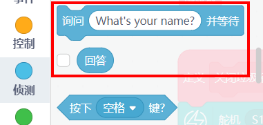

列表功能中，经常调用的积木块判断某个项是否在列表中，这时候返回真假值，这样我们可以判断物品到底属于具体的垃圾类型。

### 编写完整的测试程序

程序很简单，按下空格键发起询问，等待你的输入回答，再根据你的输入回答进行反馈。

实现过程：

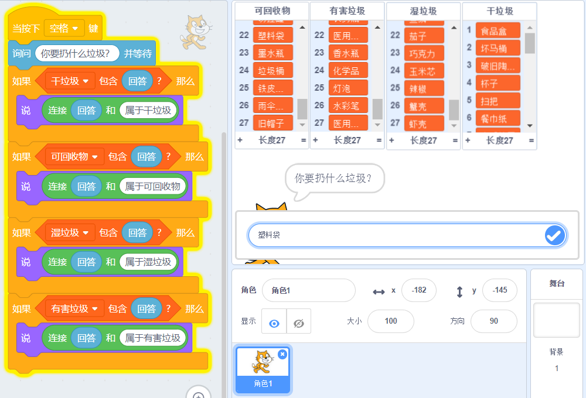

实验结果：

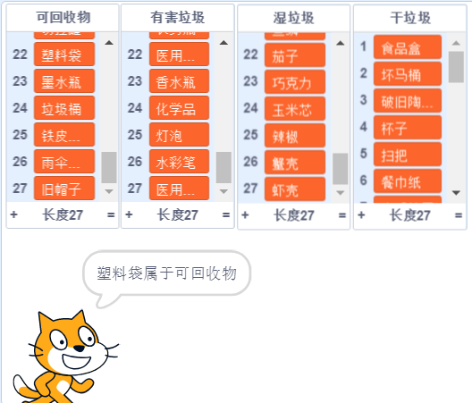

### 把垃圾桶开盖结合到程序中

确保上面的测试没问题后，我们把反馈的结果与垃圾桶实物结合。程序把分类结果给出时，对应的分类垃圾桶盖应该打开。

上面的程序只是把盖子打开，我们还需要进行补充下，打开盖子后，停留3秒后，再自动合上。

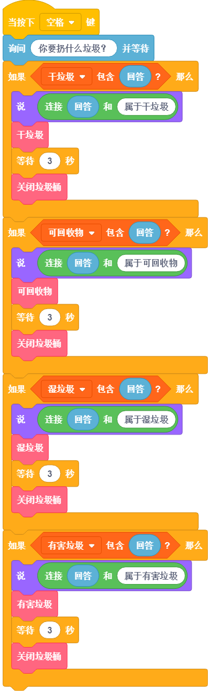

通过上面的程序，我们可发现“等待3秒”和“关闭垃圾桶”以同样的结构出现了四次，如果我们更改等待的秒数，我们需要更改4处地方，所以我们可以想办法优化下，最偷懒的方式，把“等待3秒”放入“定义关闭垃圾桶”。调用关闭垃圾桶时，就会等待3秒后，再关闭垃圾桶。

## 加入视频侦测与machinelearning5

在加入插件前，首先确保你的摄像头已经接好，你可以用电脑自带的摄像头，也可以用外接USB摄像头，一般推荐用外接USB摄像头，把外接USB摄像头放置成俯视状态，就会比较方便录入数据。

Kittenblock软件暂时不支持在软件中选着多个摄像头，所以在**开启Kittenblock前**，在系统的设备管理器，把笔记本自带的摄像头先**禁用**，如下图所示，我把笔记本自带的小米摄像头禁用了。Kittenblock开启时，就会启用外部的usb摄像头。

右键我的电脑图标——属性——设备管理器——图像设备，找到你笔记本自带的摄像头，对其禁用，如图。

如果你是台式机，本身没有摄像头，这个步骤可以跳过。

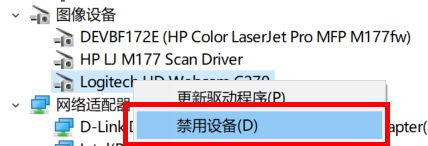

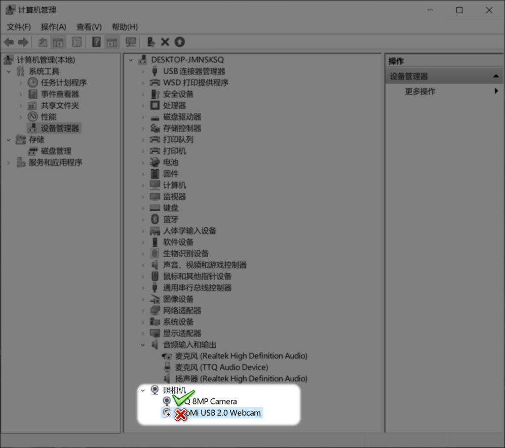

如果打开Kittenblock无法但无法启动摄像头，一般是由于杀毒软件禁止启动导致的，关闭杀毒软件即可。

一切准备就绪，我们把下面两个插件加载到软件中。

成功加载后，我们可以看到舞台已经变成摄像头的窗口了。

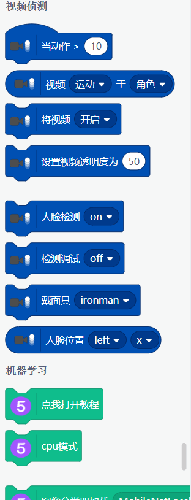

把列表的勾勾去掉，列表就会在舞台上被隐藏了。

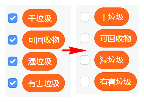

## 机器学习特征分类

### 数据录入

设置摄像头窗口的透明度为0与镜像开启（开启镜像后，摄像头才是和实物对应的）。

我们可以放张卡片进行测试下，确定镜头和方向没有问题。

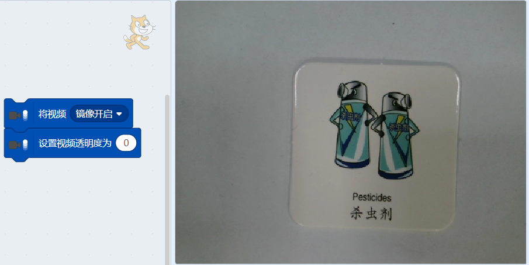

初始化特征提取器，点击一下，再把标签更改为“杀虫剂”点击下，这就录入了第一个数据

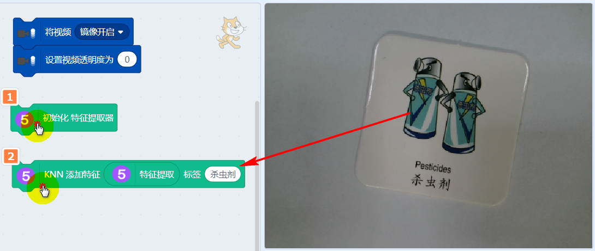

我们不断变换卡片的位置和角度，添加多个特征，机器学习才足够强壮。（各种情况数据量足够大），一般每一张卡片录入数据至少在十个数据以上，识别效果才会比较满意。

测试：录入完毕后，我们随便摆放卡片的位置和方向，点击识别积木块，可以看到已经正确识别出来了。

其他卡片数据也是按着方法进行录入。大家可以在每个垃圾分类的种类中分别挑几张卡片进行录入，后期有时间再把剩下的卡片全部录入（108张卡片我全部录入完毕大概花费2个多小时，已经购买套件的用户，我们已经提供好录入的模式，可以直接使用，详看后面的说明）

如果在录入过程中，录入错误了，我们可直接使用清除积木块，但这个清除积木块是把你之前录入的所有数据都清除了，使用一定要额外小心。

## 录入实物

喵家的垃圾只能识别卡片吗？不是的！因为作为一个教育套件，卡片比较通用，而且课堂上课也比较方便。所以就采用了卡片，如果你想录入真正的实物。也是可以的。

录入实物的操作与录入卡片的操作完全一致。把实物放在镜头下，点击添加特征。

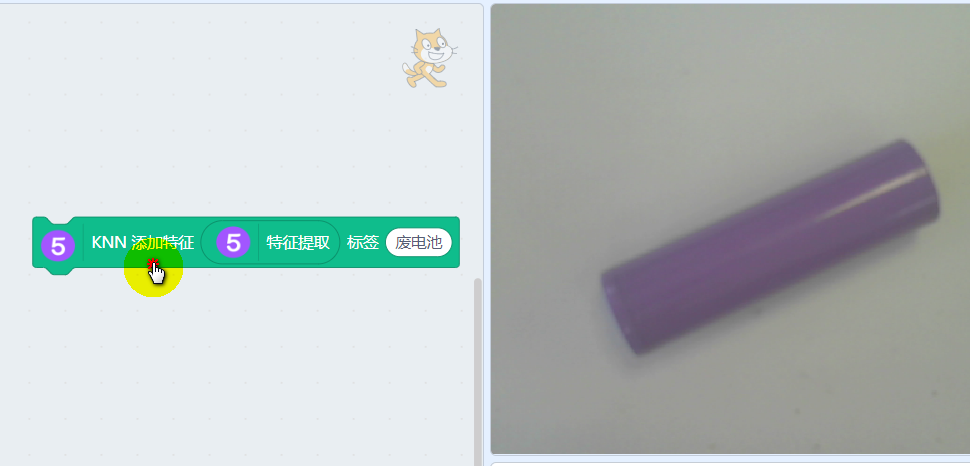

### 模型保存

因为涉及到机器学习，机器学习的数据一般是再内存中跑，所以我们如果只是保存sb3程序，机器学习的数据是**无法保存**的。所以我们需要额外的保存积木块和加载积木块。

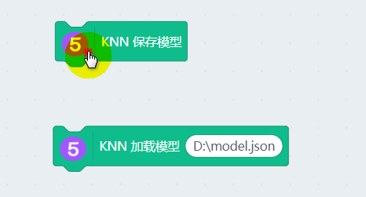

选择保存地址

建议你录入新的一个数据后，就另存为一个新的.json文件，这样就避免怕你录错数据后，又将原来的数据给覆盖了。

### 模型加载

当你下次再打开这个程序时。你需要做两件事，一个初始化特征提取器，再一个就是加载模型（xx.json）。每次打开都需要做这两件事。这样训练的模型和数据才能正确加载。（已经购买套件的用户，可以直接加载提供的程序包中的18.json，这个模型是喵家这边已经全部录入好数据了）

喵家中的18.json文件是已经将108种卡片已经录入进去了，你就无需再花费时间进行录入。

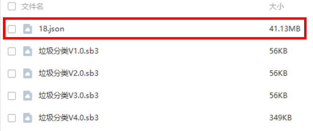

## 机器学习检测结构与硬件控制联调

我们更改下之前的程序，新建一个变量“识别结果”，把识别结果设为特征分类的反馈结果。

当按下空格后，摄像头就会进行识别，根据识别结果，对应控制不通的垃圾桶。

如果还想程序更好玩些，我们可以把语音朗读也加进去，这样会更加直观，识别后把识别结果朗读出来。

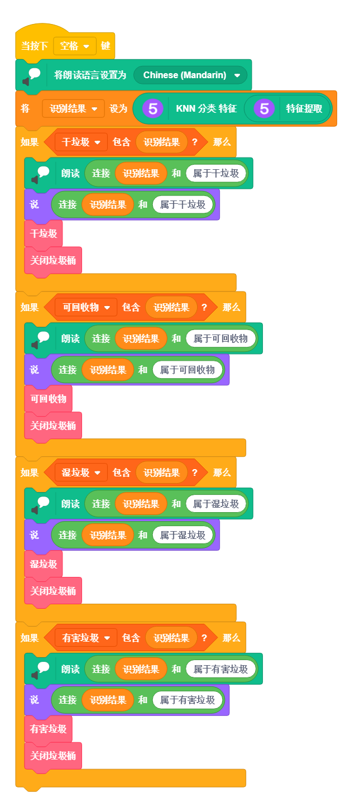

### 识别出错怎么办

识别出错，一般有两个原因。

一，摄像头的背景太复杂了。如果你是用喵家的18.json机器学习模型，尽量在卡片底下垫一张白色的纸，保持背景是白色的。训练模型与识别模型时，背景尽量保证一致能提高识别率。

二是数据样本不够。这时候我们只需要把这个情况再加入正确的标签中，如图所示，可以再变换多几个特殊的角度再进行录入。

录入后再次进行检测，看下是否能正确识别。以上都OK后，记得把模型的.json文件再次保存，这样的保存才能真正把机器学习的数据结果保存下来。

## 总结

程序编写与调试经验

明确你需要的功能，一项项列出来，评估自己实现的可行性

针对各个功能对应写个程序进行调试检查，检查硬件与软件上是否存在问题，切忌一股脑把所有功能堆砌上去一起进行调试，这样很难定位问题，这个是新手常犯的错误。

各个功能调试没有问题后，对各个程序进行优化，做成可被调用的函数，最后将所有功能合并在一个程序中进行联调，这个过程中肯定会遇到一些问题，程序越复杂，逻辑上就越容易出现问题，一般是函数之间的调度，冲突问题，与我们实际想要的效果不一致，这时候我们就要逐一进行排除和对程序进行优化。

编写程序过程中，一定一定记得保存！如果还没有学会使用github管理，就用点笨办法，每个版本的程序记得另存为保存，名字按照时间进行命名，切忌使用最新版，最最新版，打死不改版。这也是新手常掉的坑之一。程序调试过程中，经常会“开倒车”，所以前一个版本能用，显得尤为重要。

程序上根据需要做点适当的注释，会经常有这样的情况，当隔了好长时间，你重新打开这个程序，你发现找不到之前写这个程序的思路脉络，如果有了注释，可以帮助你快速了解程序各个部分的功能。

最终程序写好后，需要对本次程序进行总结，这次编程在哪里花时最长，掉到那个坑里面去，这个程序后期可以再怎么进行优化。这个程序如果进行迁移，还能用到哪个方面上。

