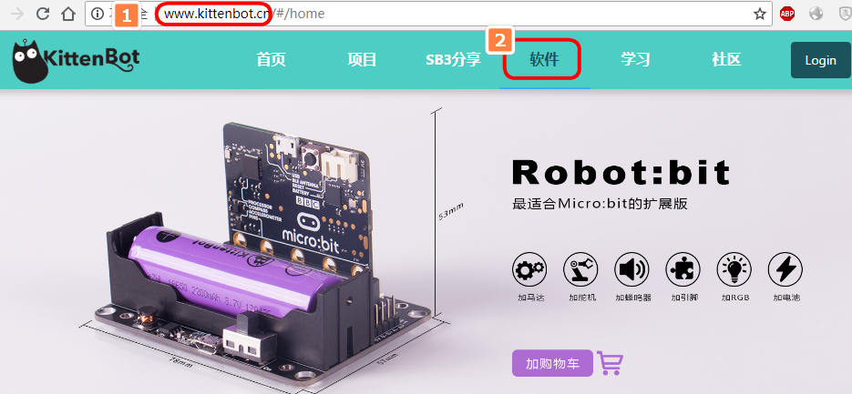
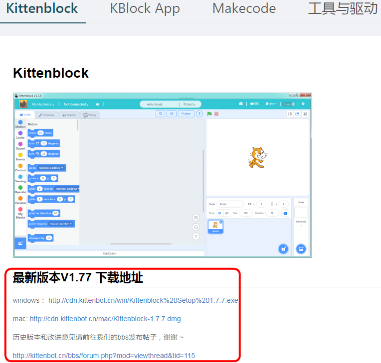
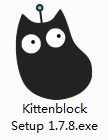

# Kittenblock安装

## 地址下载

浏览器地址输入 http://www.kittenbot.cn，点选软件

对应下载Kittenblock图形化编程软件，一般下载界面第一个版本，就是最新版本了。

对应下载windows版本或者Mac版本（不支持xp电脑，太老显卡的电脑也是不支持的，MIT的软件要求，喵家也没办法...）

## 双击安装

下载后双击图标进行安装

安装过程有杀毒软件，或者系统提示什么不安全，这个是正常，请放心，允许其安装即可

选择电脑一个默认的位置安装即可，尽可能安装在英文目录下，中文目录软件有时候会出现奇怪问题。

## 安装完成

打开界面

## 双击图标打开软件白屏？蓝屏？

有部分电脑会遇到这个问题，是因为管理员权限不够

解决办法，右键Kittenblock快捷方式：

更改下兼容性与权限

一般都能解决，如果解决不了，请到喵家Q群进行提问求助。

