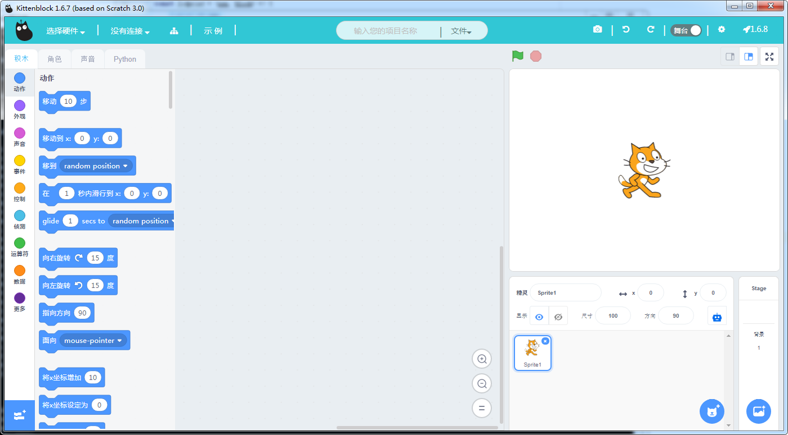
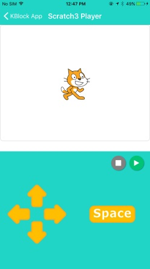
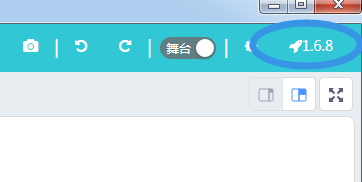

# Kittenblock

## 软件介绍

KittenBlock是基于MIT和Google团队共同开发的 Scratch3.0代码进行二次开发的图形化编程软件，帮助Scratch用户以更简单的方式学习机器人编程并以更好的方式与硬件交互。

小喵团队刚起步的时候得到行业前辈的指点方向，并于2016年底开始开发Kittenblock。我们是全球第一个打通scratch3.0与Arduino和Microbit硬件交互，也是第一个实现python整合和app端项目同步。

我们也同时开发了移动端的KBlock，可以将Kittenblock内编写的项目同步到手机，解锁更多有趣的玩法。

## 软件下载

[Kittenblock发布页面](http://kittenbot.cn/bbs/forum.php?mod=viewthread&tid=115&extra=page%3D1)

[KBlock App发布页面](http://kittenbot.cn/bbs/forum.php?mod=viewthread&tid=241&extra=page%3D1)

我们一般与每周六进行更新，请关注论坛的发布消息。

当有更新时也可以在软件内点击右上角的小火箭进行更新。

## 软件使用与交流

如果您在使用过程中碰到Bug或者有任何疑问或者改进建议都可以

- 在我们[论坛](http://kittenbot.cn/bbs)进行反馈
- 加入我们QQ群：[568084773](http://shang.qq.com/wpa/qunwpa?idkey=17b610a04baf9a269b500908e4ffb92ae46dfe75dacb5a51a19f62bfc29c21bf)

- 关注我们微信公众号 Kittenbot

- 给我们发邮件 [info@kittenbot.cc](info@kittenbot.cc)

 

