# 认识Kittenblock图形化编程软件

## 软件安装

### windows

windows下载回来是一个安装包，安装的时候只需要选择安装路径就行了。

### mac

Mac下是一个DMG包，双击加载dmg镜像后将Kittenblock拖入Application目录就行了。

## 界面介绍

打开KittenBlock，界面主要分为三部分，如下图所示

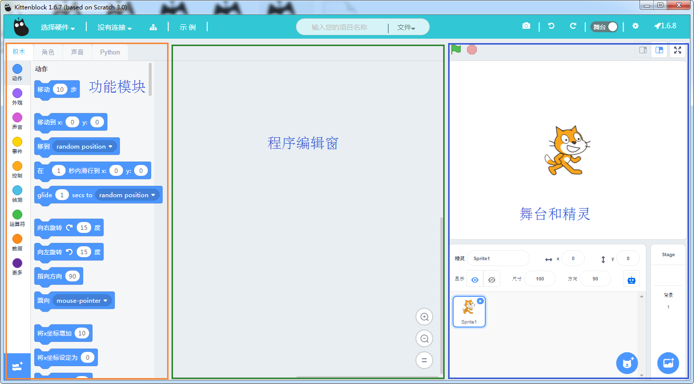

## 快速开始

接下来我们介绍如何快速编写一个程序

### 1. 选择硬件

根据所拥有的硬件，点击左上角的选择硬件选择对应的硬件对象。

*（这里以MiniLFR为例子）*

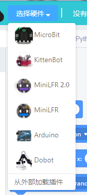

选择硬件后软件会自动加载硬件对应的插件，您可以点击最左下角的插件按钮查看当前可用的插件。

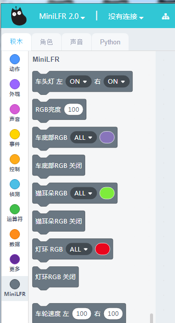

### 2. 连接串口

点击标题栏第二项通信方式选择，并在下拉菜单中找到对应的串口。

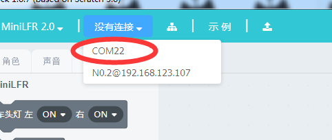

**如果您无法找到串口，极有可能是没有装串口驱动程序。**

这时候可用点击右上角小齿轮打开软件设置界面

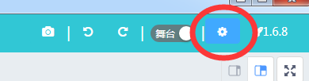

并且点击安装驱动按钮。

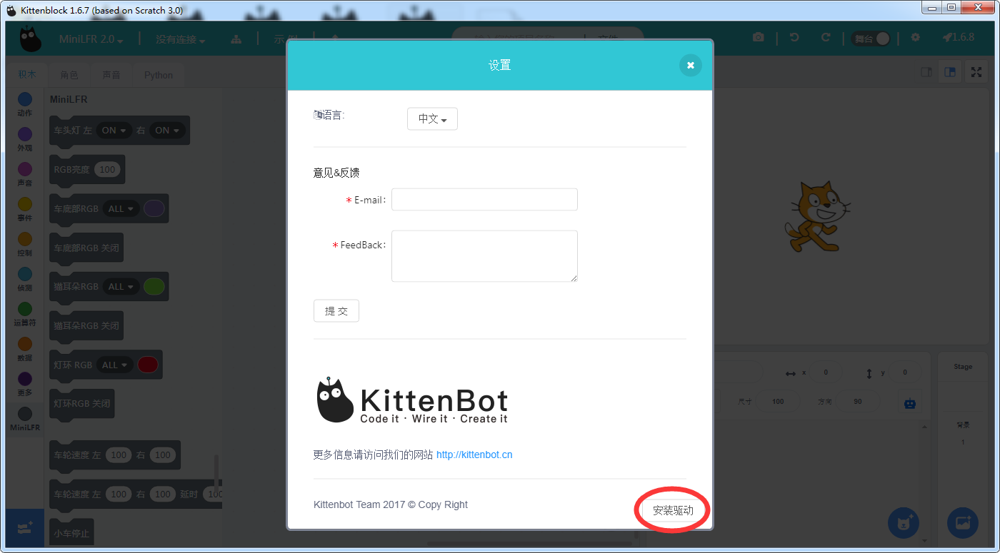

### 3. 恢复固件

由于我们软件迭代速度相当快，可能您拿到硬件的时候我们固件已经更新了。这时候可用点击标题栏的固件更新按钮进行更新固件。

如果您的机器人出现任何异常都可以尝试使用恢复固件进行复位。

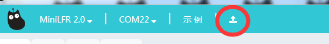

固件恢复中。。。

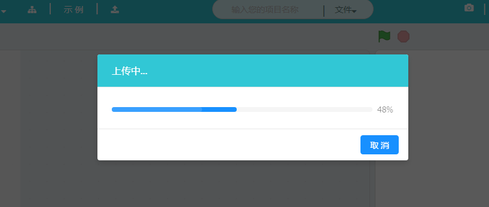

### 4. 打开示例程序

Kittenblock针对不同的硬件内置了一些简易上手的示例程序，方便开启您的机器人开发之旅。

在菜单栏找到**示例**按钮

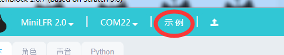

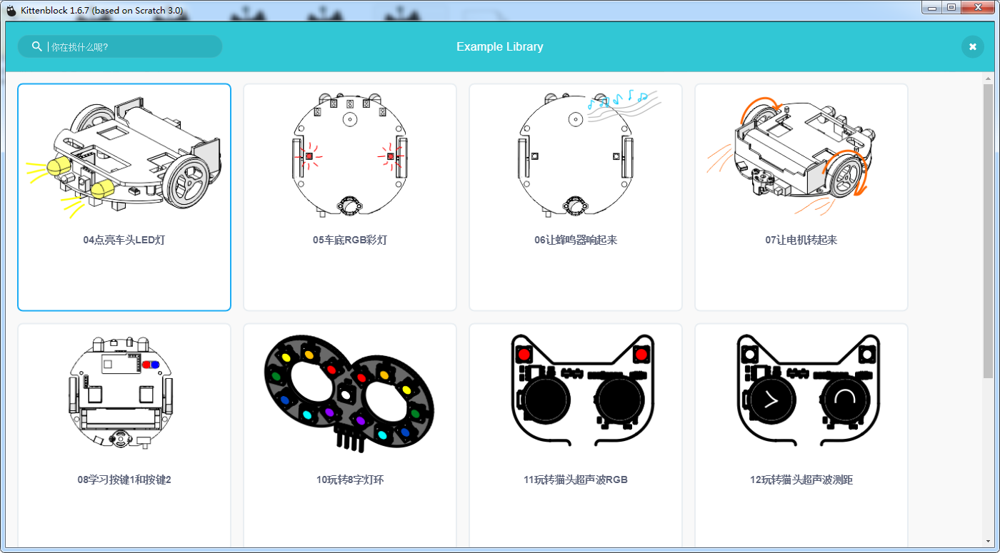

加载一个默认的示例程序后，中间图像话代码区会出现图形化的方块。

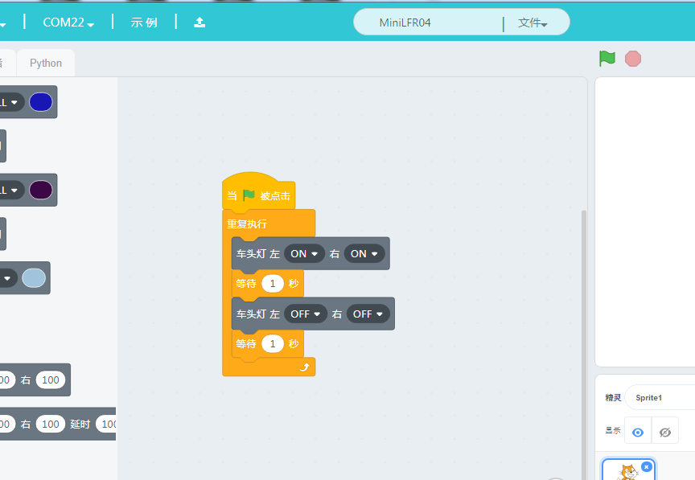

### 5. 运行

在舞台上方有个绿色的小旗帜可以让程序开始运行

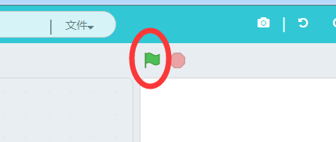

点击绿色旗帜后可以看到正在运行的代码被黄色光晕笼罩着。

