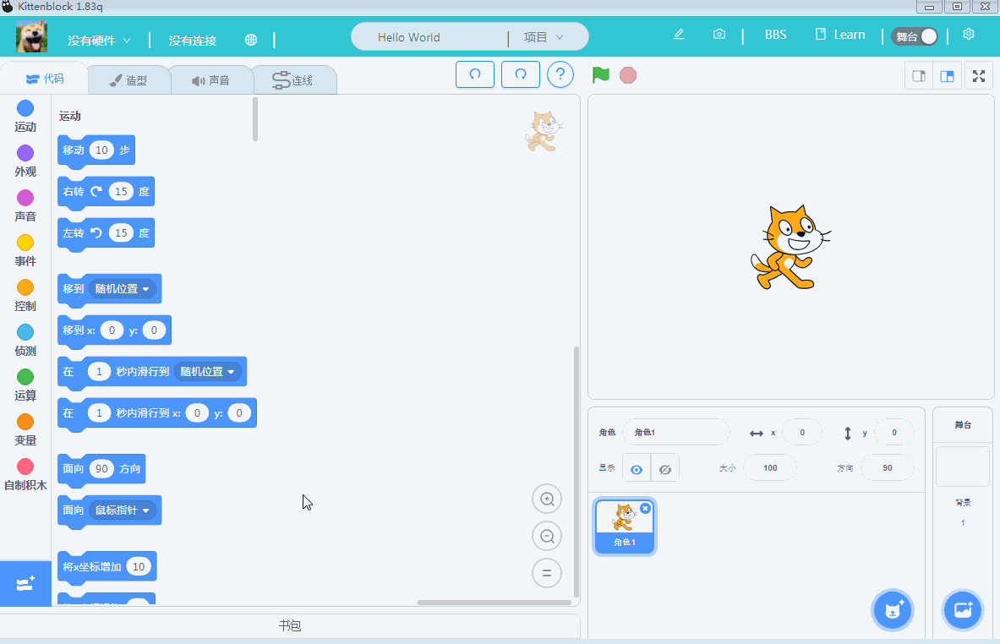
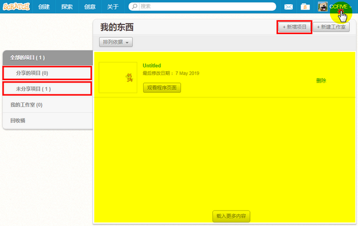
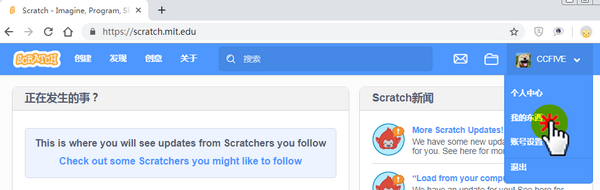
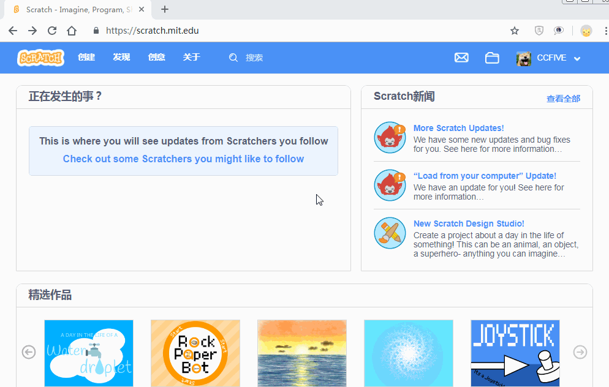
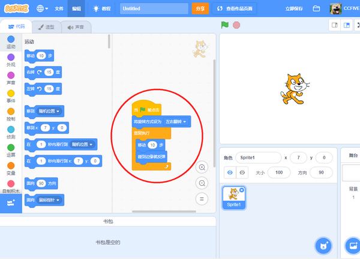
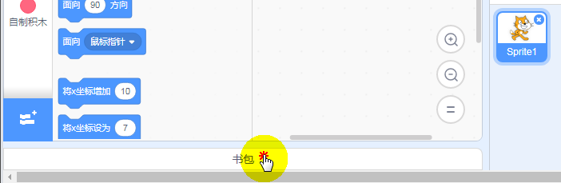
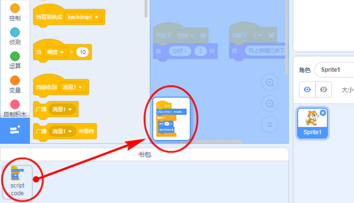
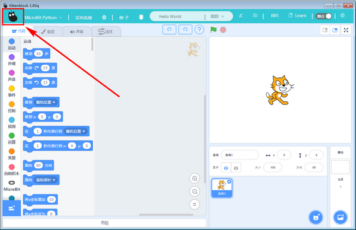
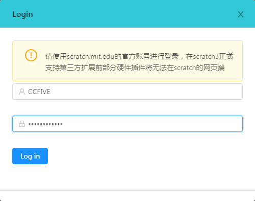
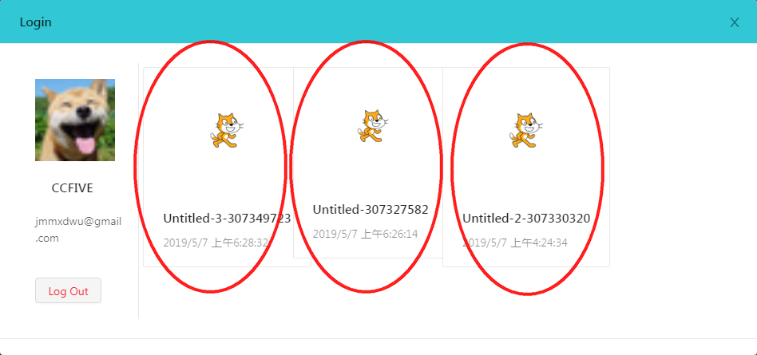

# 书包功能（图形块程序之间的复制）

标题：打通Scratch账号体系，新增书包功能（图形块程序之间的复制） 

Kittenblock作为最贴近Scratch的国内图形化编程软件，功能上几乎是保持与Scratch3.0同步更新。前阵子官方Scratch更新了书包功能。今天就特意讲解下，在Scratch下和在Kittenblock下如何使用书包功能

## 书包功能简介

书包功能是MIT Scratch官方团队开发的功能。Kittenblock现在就立即打通

平时我们编程，难免会遇到程序之间，有一部分程序是复用的。对于代码编程，很简单我们可以直接复制粘贴到另外的代码上。但是对于Scratch来说，它就不图形块代码复制粘贴到另外一个程序里面。

所以MIT推出了这个书包功能。

所谓的书包功能就是，当你需要复制这段程序代码积木块，你可以“塞”到书包里，等你打开另外的程序是，再把需要的代码从书包里面取出来。

小喵已经将Kittenblock的书包与Scratch的书包打通了。

Scratch下的书包：

Kittenblock下的书包：

## 书包功能的优点

- 解决部分相同代码不需要重复拖拽的，提高编程效率。

- 把你常用的代码块放到书包里面，方便调试。

- 此书包为云端书包，随时随地打开你的程序。

## 书包功能的缺点

只能保存程序块，不能保存整个程序。因为保存程序Scratch有一个专门的页面可以保存个人程序（可以自由选择公开或者不公开）

## 书包功能使用方法
   
### 注册Scratch账号

使用书包功能，首先需要注册账号，并且登录账号，因为书包功能涉及到云端。

Scratch官方注册地址：

https://scratch.mit.edu/

注册过程很简单，没什么需要注意的。

### 新建个人项目

### 常规编程

像往常那样进行Scratch编程

### 把积木块塞到书包里面

点开底部的“书包”栏目

### 将程序堆拖拽到书包上

### 成功存放在书包上

重新点开书包栏，可以看到积木堆已经成功保存在书包上

### 在其他程序中使用书包

重新新建程序，再打开书包栏目，发现积木堆依然存在，这时候可以把它拖拽出来进行复用。

## 总结

所以通过书包功能，就可以实现程序块在不同程序之间传递。

## 在Kittenblock中使用书包功能

Kittenblock确保你已经更新到最新版本，截止2019年5月7号，软件最新版本为1.8.3q

windows绿色版本下载地址：https://www.kittenbot.cn/newsinfo/969079.html

### 登录

打开软件，点击左上角图标

登录的账号就是你的Scrach官网注册的账号

### 登录成功

成功登录后，就可以看到，你保存在Scratch云端的程序。

对应在线官网的这里的程序

### 使用

在Kittenblock中的书包功能与Scratch中的书包功能使用方法上是一样的

成功加载

你还在等什么，赶紧来试一试你的书包把~