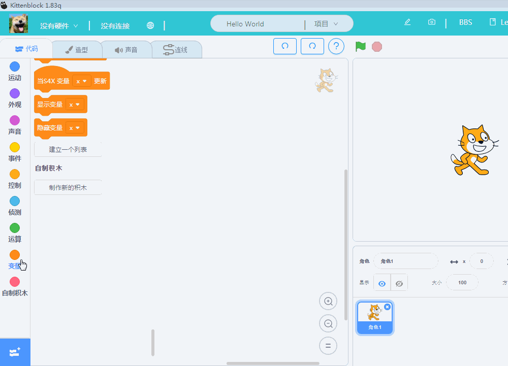
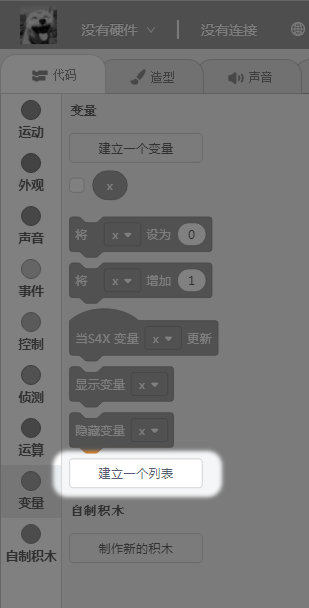
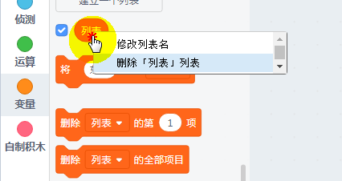
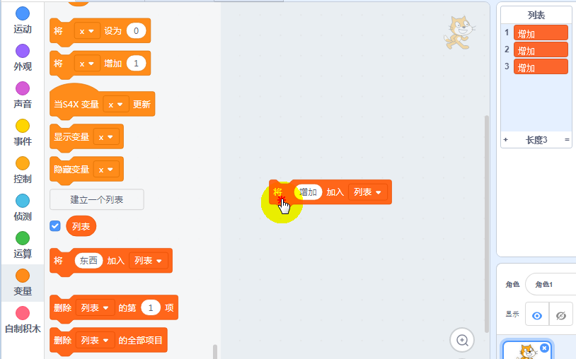
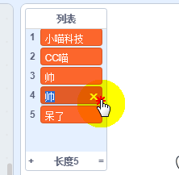
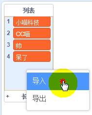
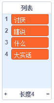

# 列表导入导出功能

Kittenblock作为最贴近Scratch的国内图形化编程软件，功能上几乎是保持与Scratch3.0同步更新。前阵子官方Scratch更新了列表导入导出功能。今天就特意讲解下，在Kittenblock下如何列表导入导出

## 列表功能操作

列表实际就是我们平时代码编程中的数组差不多意思。一般高级一点点的编程就会用到了。有了列表就可以存放多个对象，编程操作起来也是比较方便。

### 新建列表

### 删除列表

### 列表增加项

也就是把你所需要的相，加入到列表中，每次都会自动加入到列表的最后那里

### 删除列表项

可以制定删除，也可以全部删除，

或者直接操作列表，点击列表的相，叉叉删除

### 列表的插入与替换

### 列表的常规判断

### 列表的导出

导出为txt格式，打开结果如下：

### 列表导入

新建一个txt文档，如图所示

在软件中已经建立好列表后，**右键**选择导入

成功导入后，结果如下：

