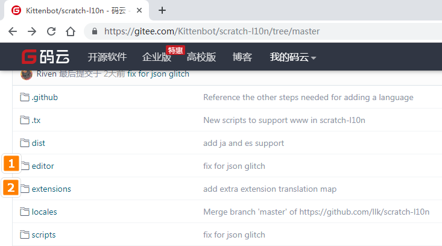
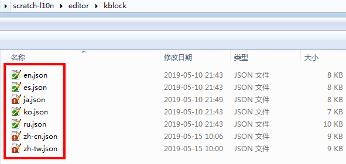

# 软件中界面翻译与插件翻译

Kittenblock作为市面上一款基于Scratch3.0，支持多种人工智能插件与Python，打通喵家硬件和市面上各种热门硬件的软硬结合。

全球各地越来越多人成为了Kittenblock的软件用户。所以小喵这边也努力做好这个软件的界面与插件的翻译。因为软件工程师比较少，所以我们还没有完全做出一个很好的翻译系统，嗯，现在依旧是人肉翻译，在不久的将来，我们会努力做好软件的翻译系统，方便全球各地的爱好者加入Kittenblock的翻译中。

今天教大家如何进行翻译~

## Kittenblock界面翻译

访问对应翻译的地址：

https://gitee.com/Kittenbot/scratch-l10n/tree/master

有两个文件夹里的内容需要进行翻译，如图

1、指的是Kittenblock的界面以及一些常规的插件

2、重点插件

### 文件下载方式

可以有两种方式下载。

1. 以Git方式，克隆这样的文件夹在你的电脑上（如果你会git那种方式，推荐这种，因为修改后，你可以直接推到项目上，这样最简单快捷）

2. 直接下载ZIP，然后解压到电脑上（普通人做法，最后把对应修改好的文件交给我）

### 文件已经下载

以editor/kblock为例，文件大概如下：

软件是以en.json（英文界面）为标准，进而对应翻译其它语言。例如zh-tw.json为繁体中文。如果你是繁体翻译者，你对应修改zh-tw.json文件即可。

