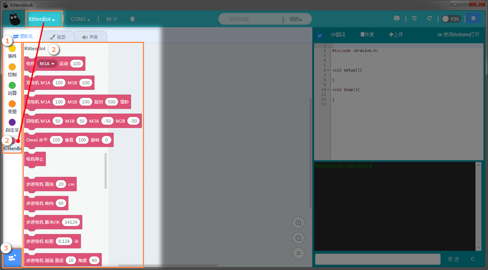
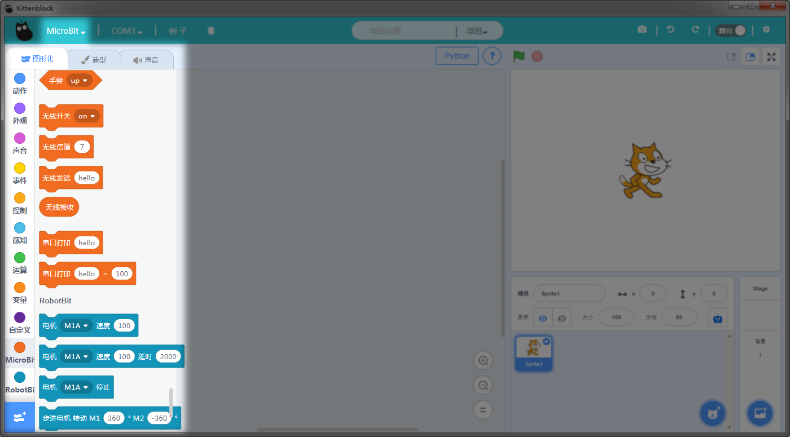
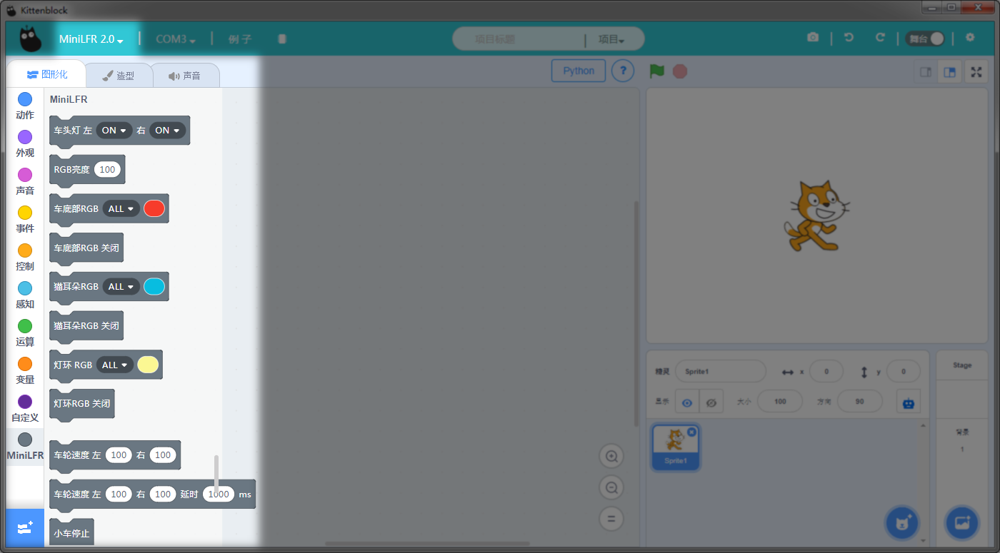
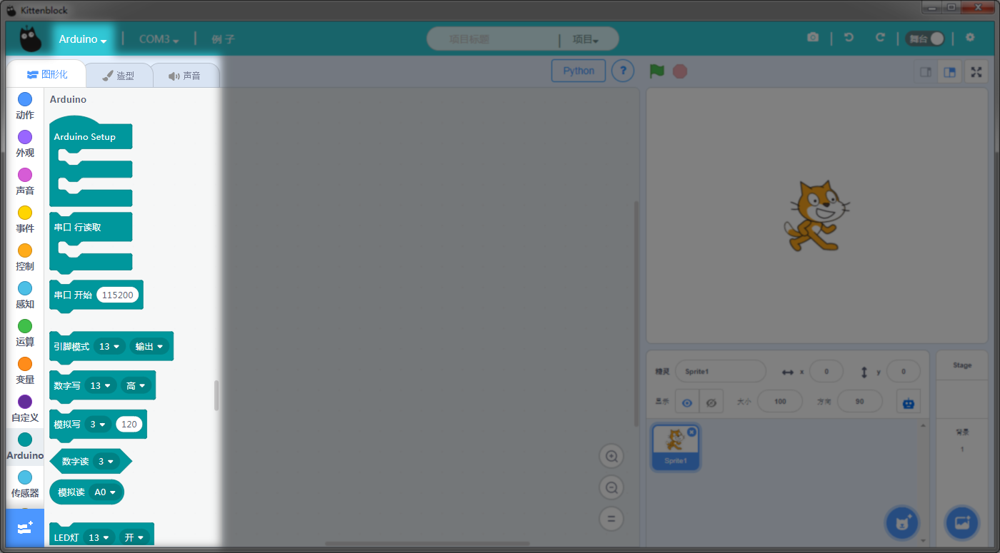
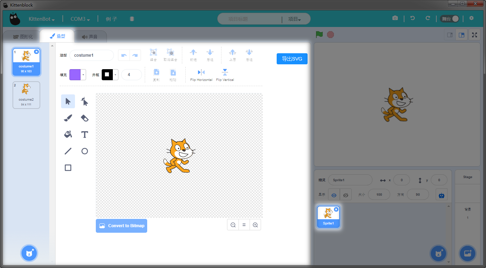
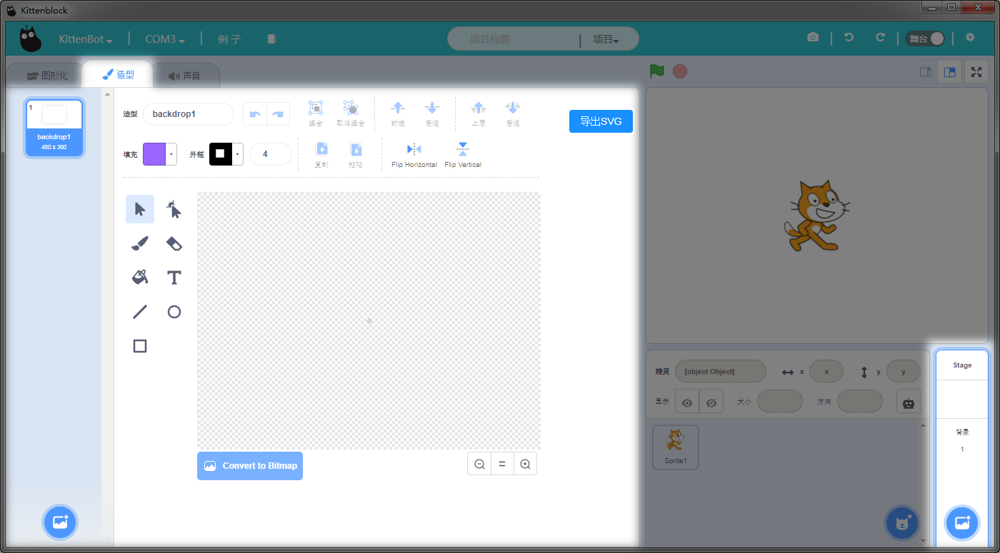
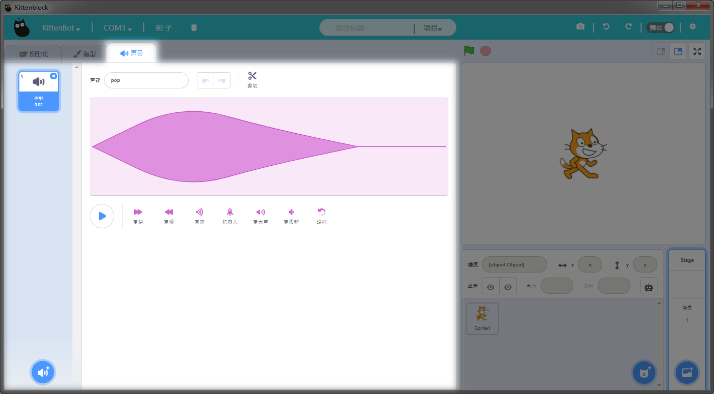

# 编程积木分栏

## 常用编程积木块

硬件编程木块（根据用户选择硬件不同，会出现不同颜色的硬件，**不同硬件之间积木块不能混用**）   

## 扩展插件
扩展插件根据选定的硬件，会有不同的扩展插件，扩展插件一般为进阶级用户和机器人使用

### Microbit积木块

   

### MiniLFR
下图为MiniLFR2.0的预览图（MiniLFR分两个版本，老版本为车子上两个按键都是红色的。新版本2.0两个按键分别是一红和一蓝，**恢复固件必须选对版本，否则会有电机转个不停的现象**）

### Arduino
下图为Arduino的积木块的预览图，剩下的硬件类型，可以自行查询，只需要学习自己所买到的硬件即可。其他硬件稍微看看即可

## 标签
目前kittenblock有4个标签栏

- 编程区
- 造型和精灵绘制
- 声音编辑
- 连线引擎
 
造型标签用于修改舞台的角色或者舞台背景。（如果你用Kittenblock只是用来学习硬件编程，一般用不到，不需了解）   
下图当选择舞台角色，显示的效果
   
   

下图当选择舞台背景，显示的效果
   
   
  
声音标签用于修改声音的效果，或者录制。（如果你用Kittenblock只是用来学习硬件编程，一般用不到，不需了解）

