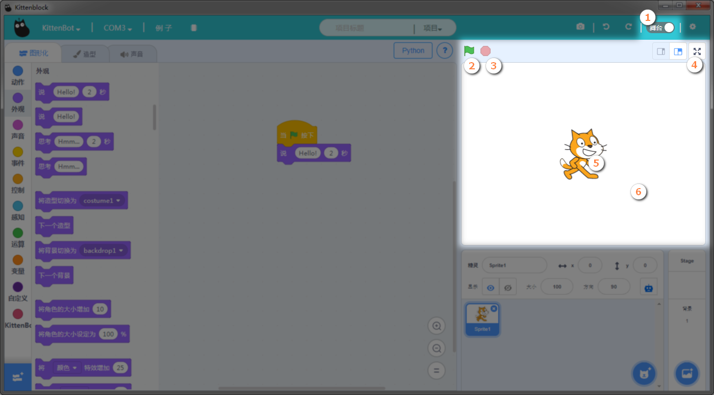
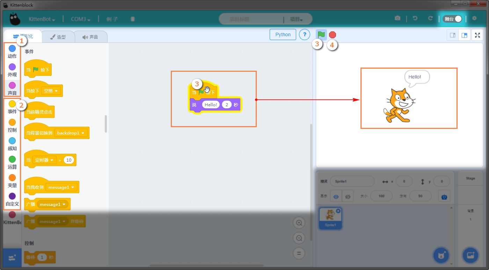
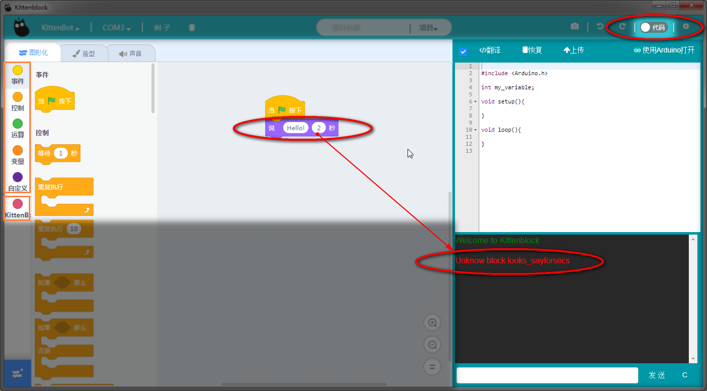
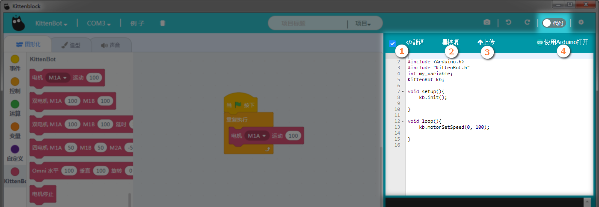
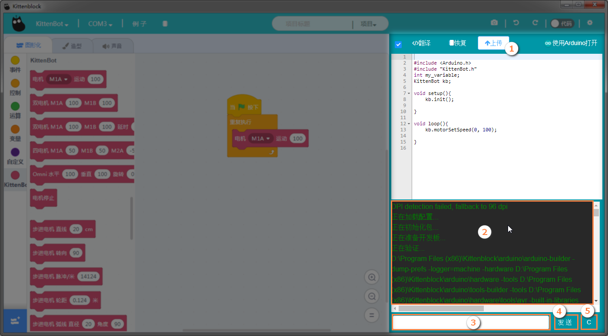

# 舞台展示区   

## 基本操作
- 切换按钮（舞台<->代码）   
- 绿旗子运行按钮——用于运行绿旗子帽子下的积木块（即积木编程区的代码）   
- 停止按钮——用于停止运行积木块   
- 舞台全屏按钮——很少用   
- Scrach的吉祥物——舞台角色，可用积木分栏区的（动作、外观、声音对其进行控制）   

舞台背景——角色背后的背景，默认一般为白色，你可以可以自己区切换。
   
   
## 舞台模式   

- 动作、外观、声音积木分栏可对橘色小猫进行控制   
- 事件、控制、感知等等，是程序逻辑的一些功能块，与（动作、外观、声音）一同构成程序。   
- 编写一个程序，绿旗子模块是必须的，把外观模块中的——说话模块拖出来，组成一个简单的程序   
- 点击绿旗子按钮，或者直接点击绿旗子积木块，即可看到橘色小猫说出话来。

### 如果想程序进行停止，单击红色的停止按钮
   
   
此时如果从舞台切换到代码模式   
这时候代码调试窗口，会有红色字提醒无法翻译此积木块，这个现象是正常的   
同时看下左侧的积木分栏，可以看到（）已经不见了   
在代码模式下，是无法使用动作、外观、声音。原因很简单，代码模式一般适用于把积木块下载到电路板上。   
动作、外观、声音用来控制电脑软件中的橘色猫，所以对电路板控制无效，所以无法翻译。   
这里需要注意下，处理方法很简单，只需要把（动作、外观、声音）相关的积木块删除掉即可。
   
   
## 代码模式
 
- 翻译——默认自动将积木块转换为代码（新手按默认模式即可，新手不用管）   
- 把勾勾去掉，将不会自动翻译，需要手动点翻译（一般如果需要在代码区自己修改c++代码，一般建议把勾勾去掉，高手模式...）  
- 恢复——将代码区恢复为**固件代码**   
- 上传——将代码区的代码上传到板子上   
- 使用Arduino打开——将代码区以ArduinoIDE的形式进行打开（新手不用管）
   
   
如图，将积木编程区中翻译成代码后   

- 点击上传   
- 代码调试窗口即有信息返回(绿色颜色的信息)   
- 串口发送内容框（新手不用管）   
- 串口发送按钮 （新手不用管）   
- 代码调试框清屏按钮（新手不用管）   

   
   
