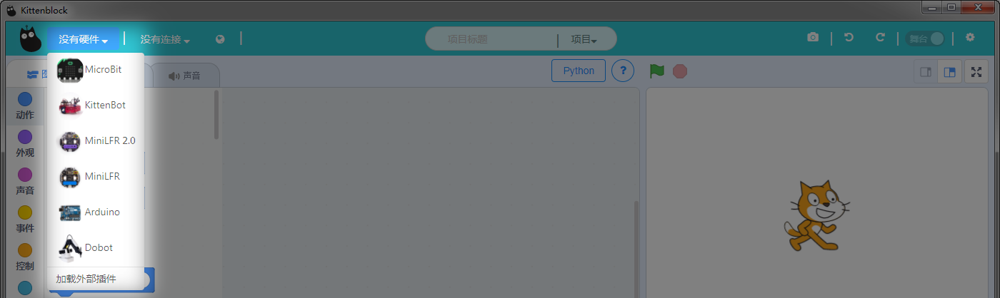
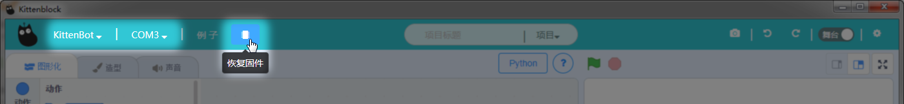
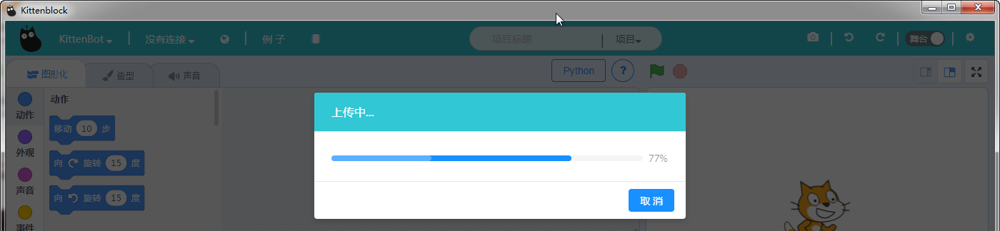
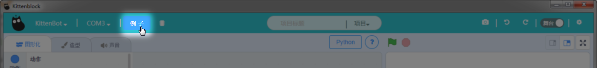
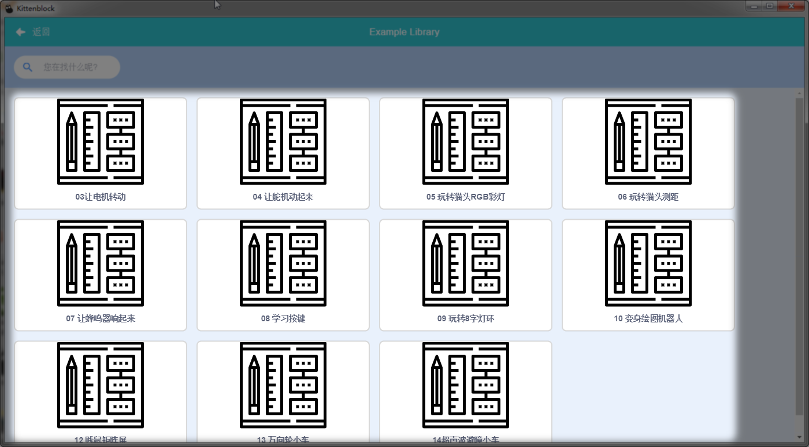
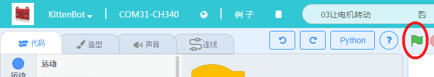

# 软件快速上手

当您拿到小喵家的机器人请务必按照以下步骤流程过一遍，它将帮您熟悉kittenblock最基础的操作。

## 硬件选择
硬件选择列表，对应选择你要编程的硬件，热门硬件有Microbit，Kittenbot，LFR2.0等等

Microbit有两个插件：MicrobitPython、MicrobitMIT。

MicrobitPython是喵家自己特意为microbit所做的积木块插件，主要特色：与Microbit连接方式是数据线。可以积木块转python，学习python利器。可以恢复固件后，在线控制Microbit与Robotbit。

MicrobitMIT是美国MIT针对microbit蓝牙所做的积木块插件，主要特色：与Microbit连接方式是蓝牙，只能在线控制。

## 通信方式选择
如果你用数据线连接串口后，点击"没有连接"，选择对应的COM连接（前提您已成功安装好驱动）

## 恢复固件
等待上传进度条完成（上传过程中串口会提示断开，这个是正常现象）

## 打开示例
例子中放置了您对应选择的硬件的一些常用示例，方便你快速上手

如图所示，这个是Kittenbot钣金小车的一些常用示例

 
当示例加载完成了，您可以通过点击让程序开始运行   

