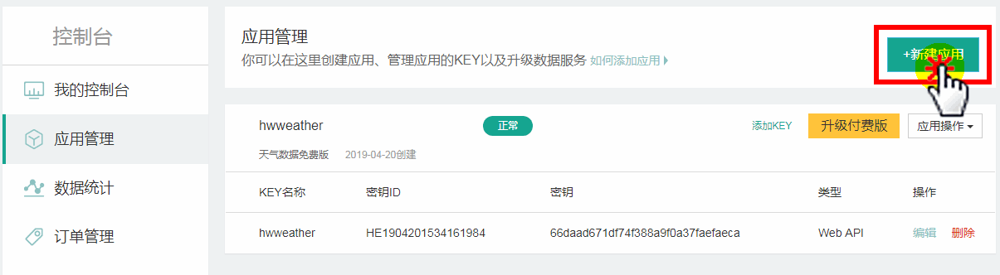
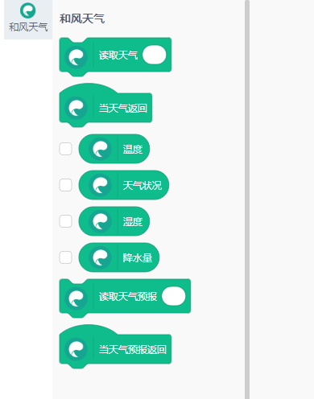
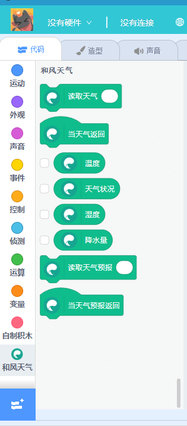
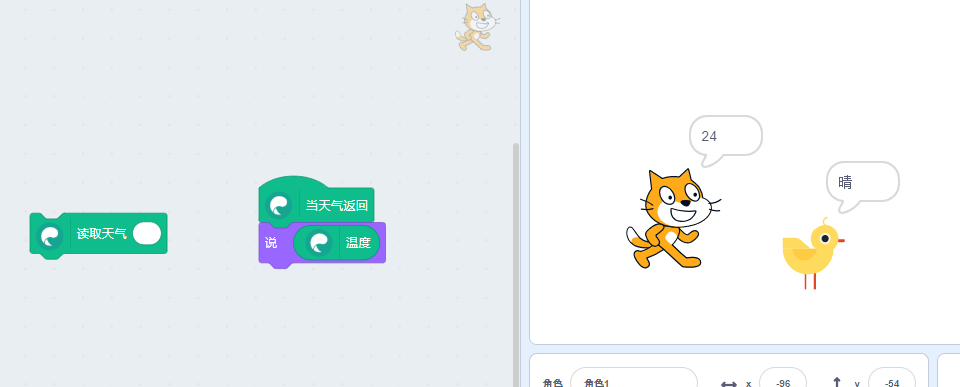

# 和风天气插件开发指南（自动化插件系统生成的应用）

这篇文档是给对开发插件感兴趣的同学们参考的，讲述如何从零构件一个scratch3/kittenblock插件

本文属于开发教程

针对人群：

1. 有意加入Scratch/Kittenblock生态圈的程序猿

2. Kittenblock的进阶用户

## 插件构思

### 构思

做任何插件前第一步就是要仔细构思你需要一个怎样的插件，具体实现手段有哪些。

我们这里需要实现一个在scratch3内返回当前天气信息和未来天气预测的插件

### 预定方案

经过百度和Google搜索了一大圈最后选定和风天气作为我们的实现方案。

具体可以参考他们的网站

https://www.heweather.com/

## 注册和风天气

具体步骤这里省略，反正我们需要的就是一个可以访问的网络api，并读取我们需要的数据。

详细可以参考和风的文档，写得非常详细

https://www.heweather.com/documents/

我们主要是需要一个开发者api key




### 构建插件模板

有了key之后我们来做插件，前往小喵家前不久上线的自动化插件系统

https://kittenbot.github.io/scratch3-extension/

插件id为`hfweather` ， 名称就叫`和风天气` ，你也可以自己定义，logo可从网站抠出来。

之后我们来看看API文档，到底支持哪些功能，哪些适合做出积木块~


功能挺全的，不过有实时天气和未来几天天气预报基本就够我们玩IOT了~

这里要注意的是我们天气读取是一个异步流程，也就是每次先需要发api请求给服务器，服务器过一会会返回数据给我们，其中返回的数据包括了我们需要的天气信息。在scratch3中异步流程可以用一个函数方块和帽子模块的组合实现，先发送请求，当返回的时候调用帽子模块。


之后我们看看文档，实况天气请求返回有哪些值可以用:

https://www.heweather.com/documents/api/s6/weather-now


选择生成我们感兴趣的对应的积木块


如法炮制我们的天气预报功能，最后整个积木预览如下：



插件模块到这里，构建就算完成了，最后导出我们需要的`index.js` 文件，这个文件可以被scratch3或任意基于scratch3的软件（如Kittenblock）加载。

### 在Kittenblock打开和风插件

在Kittenblock安装目录下的extension文件夹下，新建一个名为`s3ext-hfweather`的文件夹, 将我刚生成的`index.js` 拷贝到这个目录中。同时，我们还需要新建一个插件描述文件`extension.json`

```json
{
    "name": "和风天气",
    "type": "scratch3",
    "extensions": ["hfweather"],
    "image": "hfweather.jpg"
}
```

和一张插件的帅照（hfweather.jpg，这样照片尺寸要求建议200x300，大了小了其实都可以，这个照片上是对应插件列表中的图片）~

此时插件文件夹目录应如下：


重启kittenblock，即可在插件列表中找到我们刚刚创建的插件——和风天气




到这里为止我们的插件只完成了一半，但是也是最繁琐的一半。剩下的就是愉快的写代码时间了~

### 插件代码实现（需要有js基础）

我们可以看到在`index.js`中自动生成了每个方块的执行代码，大致如下：

```js
getweather (args, util){
  const LOC = args.LOC;

  return this.write(`M0 \n`);
}
```

我们需要重写每个方块的具体实现函数，后续我们在插件构造系统中会加入一些比较常见的实现方法，减轻大家的编码重复工作。

不管写任何代码，到这个时候希望大家仔细阅读文档，想清楚具体实现，可以的话可以编写一些测试用例去检测你的想法是不是行得通的。

和风的api是一个很通用的restful api格式模板，鉴权过程也相当简单，直接把key填在GET请求参数就行了~

这里就不卖关子了，直接上代码。 我们将上面读取实时天气的函数改造成如下，之后重启kittenblock加载插件。

```js
getweather (args, util){
  const LOC = args.LOC;
  const url = new URL("https://free-api.heweather.net/s6/weather/now?");
  url.searchParams.append('location', LOC || 'auto_ip')
  url.searchParams.append('key', APIKEY)

  return fetch(url).then(res => {
    if (res.ok) {
      res.json().then(json => {
        console.log("weather ret", json);
      });
    }
  });
}
```
*PS：这里有个小技巧，就是现在kittenblock外建立一些测试用的js代码或用例把东西都先调通再移植进来，毕竟反复的重启软件也是挺烦的。*

我们可以按`F12`打开kittenblock的devtool，查看点击该积木的返回json内容。

```json
weather ret 
{HeWeather6: Array(1)}
HeWeather6: Array(1)
0:
basic:
admin_area: "广东"
cid: "CN101280601"
cnty: "中国"
lat: "22.54700089"
location: "深圳"
lon: "114.08594513"
parent_city: "深圳"
tz: "+8.00"
__proto__: Object
now:
cloud: "91"
cond_code: "100"
cond_txt: "晴"
fl: "27"
hum: "91"
pcpn: "0.0"
pres: "1011"
tmp: "24"
vis: "16"
wind_deg: "180"
wind_dir: "南风"
wind_sc: "1"
wind_spd: "5"
__proto__: Object
status: "ok"
update:
loc: "2019-04-07 20:55"
utc: "2019-04-07 12:55"
__proto__: Object
__proto__: Object
length: 1
__proto__: Array(0)
__proto__: Object
```

知道json的结构后我们就可以将返回值暂存着，并触发帽子函数。`getweather`函数fetch部分改成如下：

```js
return fetch(url).then(res => {
    if (res.ok) {
      res.json().then(json => {
        console.log("weather ret", json);
        this.weather = json.HeWeather6[0].now;
        this.runtime.startHats('hfweather_onweather', {});
      });
    }
  });
```

这时候我们的帽子函数不做任何判断直接返回`true`就行了，之后读取温度函数直接返回刚才暂存的天气温度。远程调用帽子模块遵循MIT的定义 `插件ID_帽子函数ID`

```js
onweather (args, util){
  return true;
}

temp (args, util){
  return this.weather.tmp;
}
```


使用异步的好处就是我们可以给程序多加几个小伙伴，每个人干不同的事情~




## 插件源码资料

为了方便大家学习，和风插件的源代码放在了github仓库，希望大家多多给我们进行反馈

https://github.com/KittenBot/s3ext-hfweather


