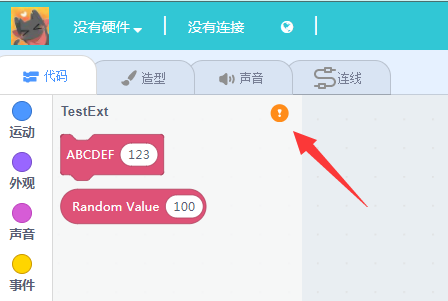
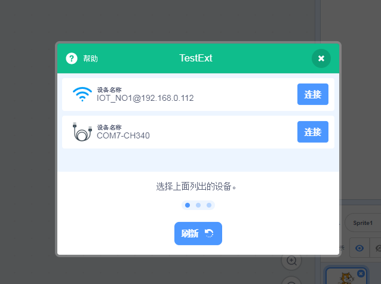
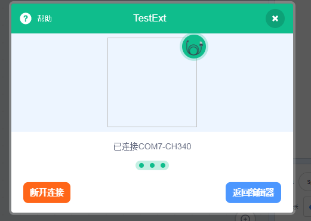

# Kittenblock插件开发指南 -- 02

这一节我们主要讲述如何在kittenblock下开发一个跟硬件设备通信的插件

## 准备工作

为了和硬件通信我们首先需要准备一个硬件主板，目前kittenblock支持串口，tcp和udp还有蓝牙的硬件通信方式。只要您的硬件设备符合这三种其一就可以了。

其实要保证你的主板上已经烧录了通信用的固件，具体通信用的固件需要您执行开发，如果实在摸不着头脑可以参考一下kittenbot和minilfr的通信固件，源代码在kittenblock安装目录下的arduino\libraries\中kittenbot和minilfr中可以找到。我们推荐使用基于字符串的通信方式，这样可以节省大量的调试时间并且大部分CNC设备都是基于这种通信方式的。

## 插件改造

我们继续以上一节做的样板插件为基础，为了让插件可以选择硬件通信接口，我们首先需要在getInfo函数中使能插件状态按钮：

	showStatusButton: true,

并且在类的构造函数中加上：

	this.comm = runtime.ioDevices.comm;
	this.session = null;

其中comm是kittenblock的通信io实体，session是通信上下文，具体在打开端口后进行实例化。

另外我们需要在类中添加以下函数，这些函数是scratch3的虚拟机引擎所要求的的回调函数，如果没有这些函数实现会导致通信流程失败。

    // method required by vm runtime
    startDeviceScan (){
        this.comm.getDeviceList().then(result => {
            this.runtime.emit(this.runtime.constructor.PERIPHERAL_LIST_UPDATE, result);
        });
    }

    connectDevice (id){
        this.comm.connect(id).then(sess => {
            this.session = sess;
            this.session.onmessage = this.onmessage;
            this.session.onclose = this.onclose;
            // notify gui connected
            this.runtime.emit(this.runtime.constructor.PERIPHERAL_CONNECTED);
        }).catch(err => {
            log.warn('connect peripheral fail', err);
        });
    }

    disconnectSession (){
        this.session.close();
    }

    getPeripheralIsConnected (){
        return Boolean(this.session);
    }

我们来看看这时候的完整代码如下，重新加载插件后可以看到插件列表上方有个小的状态图标

	const ArgumentType = Scratch.ArgumentType;
	const BlockType = Scratch.BlockType;
	const formatMessage = Scratch.formatMessage;
	const log = Scratch.log;
	
	class TestExt {
	    constructor (runtime){
	        this.runtime = runtime;
	        this.comm = runtime.ioDevices.comm;
	        this.session = null;
	        
	        this.runtime.registerPeripheralExtension('TestExt', this);
	    }
	    
	    // method required by vm runtime
	    scan (){
	        this.comm.getDeviceList().then(result => {
	            this.runtime.emit(this.runtime.constructor.PERIPHERAL_LIST_UPDATE, result);
	        });
	    }
	
	    connect (id){
	        this.comm.connect(id).then(sess => {
	            this.session = sess;
	            this.session.onmessage = this.onmessage;
	            this.session.onclose = this.onclose;
	            // notify gui connected
	            this.runtime.emit(this.runtime.constructor.PERIPHERAL_CONNECTED);
	        }).catch(err => {
	            log.warn('connect peripheral fail', err);
	        });
	    }
	
	    disconnect (){
	        this.session.close();
	    }
	
	    isConnected (){
	        return Boolean(this.session);
	    }
	
	    
	    getInfo (){
	        return {
	            id: 'TestExt',
	            name: 'TestExt',
	            color1: '#DE5277',
	            color2: '#AA3F5B',
	            color3: '#AA3F5B',
	            showStatusButton: true,
	
	            blocks: [
	                {
	                    opcode: 'test1',
	                    blockType: BlockType.COMMAND,
	                    text: 'ABCDEF [VALUE]',
	                    arguments: {
	                        VALUE: {
	                            type: ArgumentType.NUMBER,
	                            defaultValue: 123
	                        }
	                    }
	                },
	                {
	                    opcode: 'test2',
	                    blockType: BlockType.REPORTER,
	
	                    text: 'Random Value [MAX]',
	                    arguments: {
	                        MAX: {
	                            type: ArgumentType.NUMBER,
	                            defaultValue: 100
	                        }
	                    }
	                },
	            ]
	        };
	    }
	    
	    test1 (args){
	        console.log('test1', args.VALUE);
	    }
	    
	    test2 (args){
	        return Math.random()
	    }
	    
	    
	}
	
	module.exports = TestExt;
	

点击这个按钮将会打开通信选择的面板，不同硬件通信方式在图标上有不同的定义。

之后只要选择其中一个通信接口连接上去就行了。

当用户选择打开通信端口，kittenblock底层会自动调用插件的`connectDevice`方法，打开成功后会将通信实例（session）返回给插件。

插件需要对该session赋予onmessage和onclose两个方法，这两个方法针对每个插件都有可能不同。下面只是一个例子：

    onmessage (data){
        const dataStr = new TextDecoder().decode(data);
        this.lineBuffer += dataStr;
        if (this.lineBuffer.indexOf('\n') !== -1){
            const lines = this.lineBuffer.split('\n');
            this.lineBuffer = lines.pop();
            for (const l of lines){
                if (this.reporter) this.reporter(l);
            }
        }
    }

    onclose (error){
        log.warn('on close', error);
        this.session = null;
        this.runtime.emit(this.runtime.constructor.PERIPHERAL_ERROR);
    }

当然我们还需要在构造函数中加上，保证这些异步函数具有同样的上下文

	this.onmessage = this.onmessage.bind(this);
    this.onclose = this.onclose.bind(this);

## 测试用的通信固件

为了让大家快速上手，这里我写了一个超级简单的arduino通信固件程序，当收到AXXX的时候会让4号脚上的舵机转动到对应的角度。当收到字母B的时候会返回A0口上的模拟值.

大家可以新建一个arduino项目并将下面代码烧录到主板上。

	#include <Servo.h>
	
	Servo servo;
	
	void setup() {
	  Serial.begin(115200);
	  servo.attach(4);
	}
	
	char buf[32];
	int index;
	
	void loop() {
	  while(Serial.available()){
	    char c = Serial.read();
	    buf[index++] = c;
	    if (c == '\n'){
	      buf[index] = '\0';
	      if (buf[0] == 'A'){
	        int degree = atoi(buf+1);
	        servo.write(degree);
	      } else if (buf[0] == 'B'){
	        Serial.println(analogRead(A0));  
	      }
	      index = 0;
	    }
	  }
	}

## 使用硬件通信接口

这里我们以电脑上的串口为例子讲解下如何与硬件进行通信。当然前提是你的硬件上有一套通信用的固件。

我们为插件的类再加上两个新方法：

    write (data){
        if (!data.endsWith('\n')) data += '\n';
        if (this.session) this.session.write(data);
    }

    report (data){
        return new Promise(resolve => {
            this.write(data);
            this.reporter = resolve;
        });
    }

之后将之前的COMMAND类型模块改造一下：

    test1 (args){
        this.write(`A${args.VALUE}\n`);
    }

当执行这个方块的时候会在串口发送AXXX字符串，其中XXX就是方块中的变量值。

同理REPORTER模块也是这样的操作，不过我们需要让其返回一个promise并等待硬件的返回值。

    test2 (args){
        return this.report(`B\n`).then(ret => (ret));
    }

### PS：注意重新加载插件需要手动重新连接串口，目前kittenblock不知道插件重新加载是否应该端口通信接口。

### PS2： 如果你的插件有bug或者缺少回调函数导致通信底层进入不可知的专题，这时候需要重新启动kittenblock，后面我们会优化各种异常流程和bug捕捉。

### PS3：请保证发给其他人用的插件都是调试ok的代码。

## 这节完整的代码
	
const ArgumentType = Scratch.ArgumentType;
const BlockType = Scratch.BlockType;
const formatMessage = Scratch.formatMessage;
const log = Scratch.log;

class TestExt {
    constructor (runtime){
        this.runtime = runtime;
        this.comm = runtime.ioDevices.comm;
        this.session = null;
        
        this.runtime.registerPeripheralExtension('TestExt', this);
        
        // session callbacks
        this.onmessage = this.onmessage.bind(this);
        this.onclose = this.onclose.bind(this);
    }
    
    // method required by vm runtime
    scan (){
        this.comm.getDeviceList().then(result => {
            this.runtime.emit(this.runtime.constructor.PERIPHERAL_LIST_UPDATE, result);
        });
    }

    connect (id){
        this.comm.connect(id).then(sess => {
            this.session = sess;
            this.session.onmessage = this.onmessage;
            this.session.onclose = this.onclose;
            // notify gui connected
            this.runtime.emit(this.runtime.constructor.PERIPHERAL_CONNECTED);
            setTimeout(() => {
                sess.write('M0\r\n');
            }, 2000);
        }).catch(err => {
            log.warn('connect peripheral fail', err);
        });
    }

    disconnect (){
        this.session.close();
    }

    isConnected (){
        return Boolean(this.session);
    }
    
    onmessage (data){
        const dataStr = new TextDecoder().decode(data);
        this.lineBuffer += dataStr;
        if (this.lineBuffer.indexOf('\n') !== -1){
            const lines = this.lineBuffer.split('\n');
            this.lineBuffer = lines.pop();
            for (const l of lines){
                if (this.reporter) this.reporter(l);
            }
        }
    }

    onclose (error){
        console.warn('on close', error);
        this.session = null;
        this.runtime.emit(this.runtime.constructor.PERIPHERAL_ERROR);
    }

    write (data){
        console.log("write", data);
        if (this.session) this.session.write(data);
    }

    report (data){
        return new Promise(resolve => {
            this.write(data);
            this.reporter = resolve;
        });
    }
    
    
    getInfo (){
        return {
            id: 'TestExt',
            name: 'TestExt',
            color1: '#DE5277',
            color2: '#AA3F5B',
            color3: '#AA3F5B',
            showStatusButton: true,

            blocks: [
                {
                    opcode: 'test1',
                    blockType: BlockType.COMMAND,
                    text: 'ABCDEF [VALUE]',
                    arguments: {
                        VALUE: {
                            type: ArgumentType.NUMBER,
                            defaultValue: 123
                        }
                    }
                },
                {
                    opcode: 'test2',
                    blockType: BlockType.REPORTER,

                    text: 'Random Value [MAX]',
                    arguments: {
                        MAX: {
                            type: ArgumentType.NUMBER,
                            defaultValue: 100
                        }
                    }
                },
            ]
        };
    }
    
    test1 (args){
        this.write(`A${args.VALUE}\n`);
    }
    
    test2 (args){
        return this.report(`B\n`).then(ret => (ret));
    }
    
    
}

module.exports = TestExt;

下一节我们将讲述如何将方块翻译成c++、python等等不同的代码并编译下载。