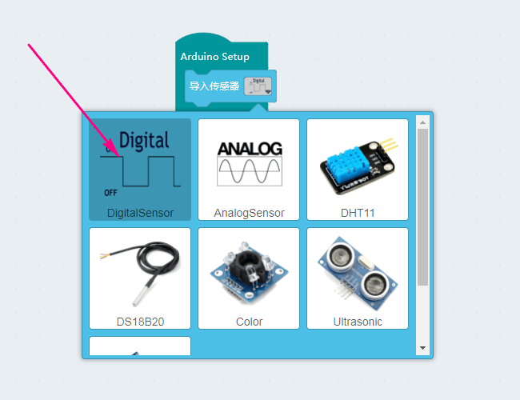
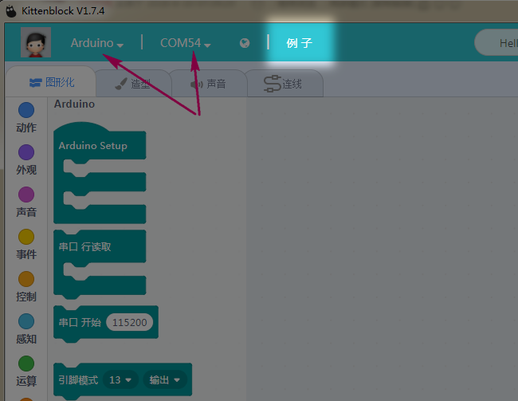
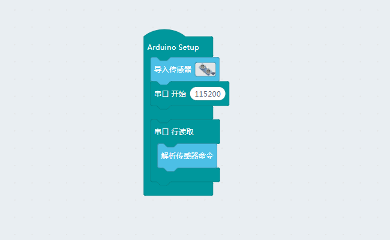
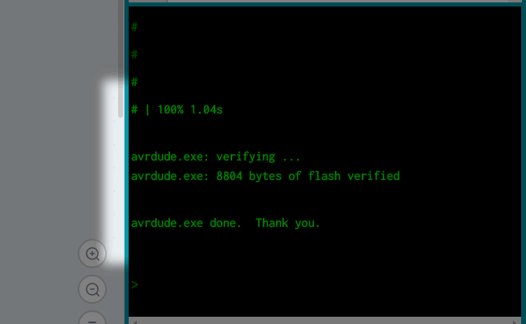
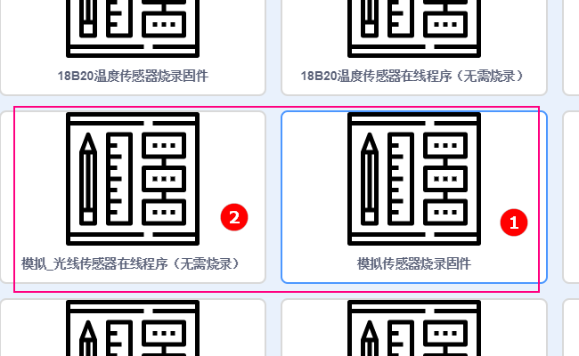
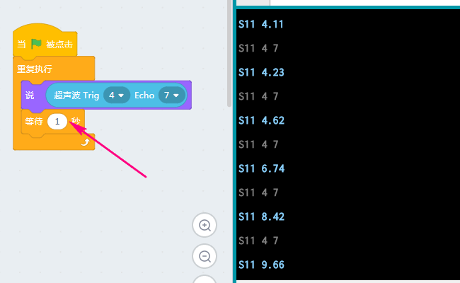

# Arduino快速上手  
  
## 操作步骤  
  
1.首先拖入程序主体积木块  

    
  

2.在Setup下拖入使用到的器件作为初始化   
如使用到按键，人体热释电传感器等这类数字传感器   
   

 
  
  

3.以传感器为例，需要首先判断使用的传感器为数字还是模拟，或者是更高级带协议的传感器，再在循环中选择用数字还是模拟传感器并在下拉单中选择对应器件  
  
  
  
**相对于执行器和显示器来说都需要用到导入器件的积木块来初始化**   
  
## 示例使用
  
**为了方便大家在Kittenblock中对Arduino使用或学习，小喵家专门为大家准备了丰富的示例**  
当你连接上了Arudino并选择好串口，你就可以点击图中例子，根据需求使用这些例子哦~
  
    

  
  
## 在线调试  
  
**这个在线调试的功能是Kittenblock的特点之一，在一定程度上节省了开发和学习者的时间**  
   
1.要想实现在线调试的功能，就需要先将固件烧录进去，以超声波为例，我们在导入传感器中找到并选择超声波并如下图放置  

    

由于程序是会覆盖的，如果只导入超声波的固件，那么就只能给超声波做在线调试，为此我们可以将数字，模拟传感器的固件都烧进去，一劳永逸  
 
    

2.我们点击上传，这个界面由**舞台和代码区自由切换**  

    
 
由于**解析传感器命令的积木块**，下载成功之后我们可以在调试窗口看到如下字符   

   
  
3.还是以超声为例，我们搭建好如下图所示积木块后，点击小棋子调试窗口就能返回数据了既实现了在线调试的功能  

   
  
4.当然，这只是作为前期器件调试用，真正的开发，就直接将固件和所要运行的程序一起烧进去，一边运行程序一边可以使用调试方式看到返回值  
 
 
 
**注:**  
 
1.如果你对于在线调试还不够明白，你可以在例子中找到这两个例子，将①下载到板子，而后连接好模拟传感器如光线传感器并点开②的程序无需下载直接点击带小棋子的积木块就能明白了   
   

  
2.**只有传感器能够在线调试**

3.无源蜂鸣器接线要使用模拟IO口即A0-A5  

  
  
4.串口调试时，打印数据最好要带延时，否则打印太快观测效果差,若将来使用到蓝牙返回数据到串口接受显示的时候也容易乱码  

   
  
5.使用LCD时，如果是iic的lcd屏，地址使用默认0x3F，另外光标位置左上角为0，0     

 