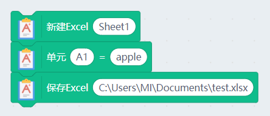
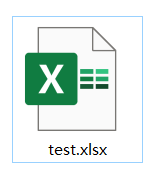
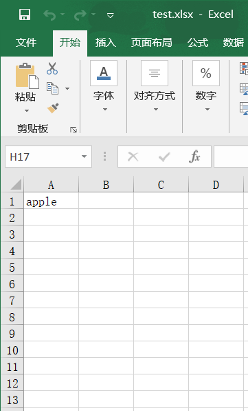

# 数据处理插件在Kittenblock中使用

## 简介

数据处理在科学实验中是很重要的一环，我们不仅仅可以将数据保存在Scratch的列表中，还能借助Kittenblock中的数据处理插件中——excel功能，将数据保存在Excel表格中，让数据保存处理更方便。

## 加载数据处理插件

选择扩展插件按钮

插件成功加载

## 例子1——创建文件写入数据保存

- 新建一张工作表
- 将数据“apple”保存到单元格A1中
- 保存excel文件（路径自定义）

## 实验结果

在C:\Users\MI\Documents路径下，可发现由Kittenblock创建的excel文件

双击打开，表格内容如下，可以发现，数据已经写入到对应的单元格中。

## 例子2——打开现有文件读取单元格数据

“打开Excel”中粘贴你的excel文档的路径

点击积木块，小喵就会读出excel中的单元格中的值

