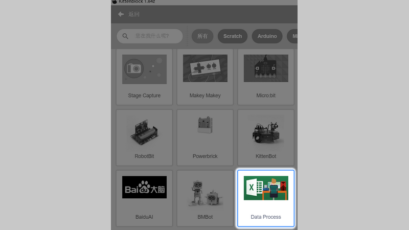
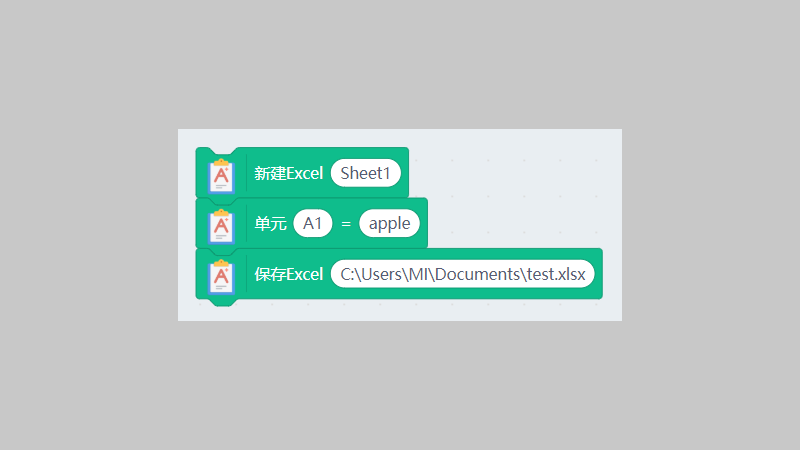
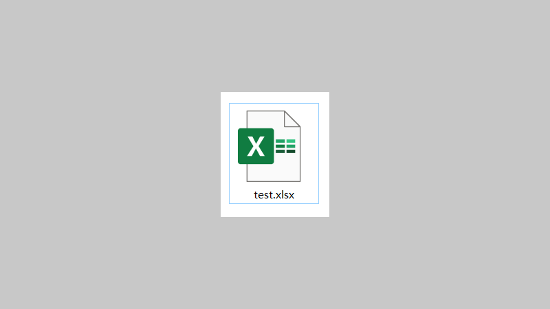
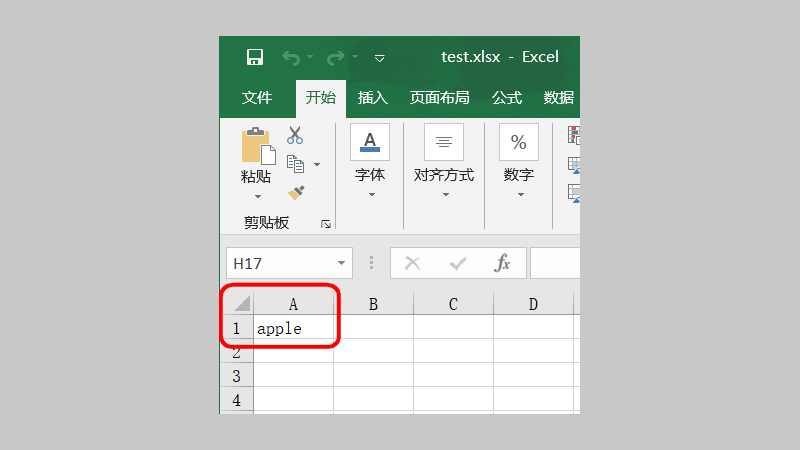
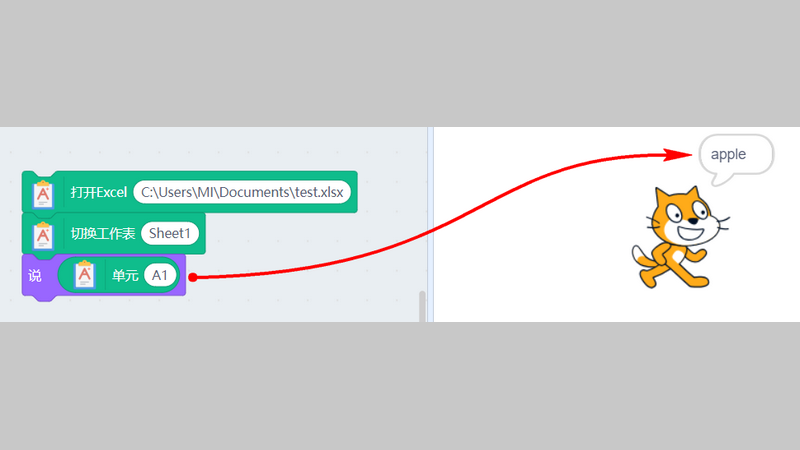

# 数据处理插件在Kittenblock中使用

## 简介

数据处理在科学实验中是很重要的一环，我们不仅仅可以将数据保存在Scratch的列表中，还能借助Kittenblock中的数据处理插件中——excel功能，将数据保存在Excel表格中，让数据保存处理更方便。

## 软件要求

- Kittenblock要求在**1.8.4z**以上（打开软件左上角显示即为软件版本号）
- 电脑安装的办公软件要求为**office2007以上（含2007）**，wps用不了
- 由于调用Excel所需权限比较高，请确保Kittenblock已经启用管理员模式
（  选择Kittenblock图标，右键——属性——兼容性——设置 管理员权限运行，把勾勾勾上，确认保存  ，重启软件）

## 加载数据处理插件

选择扩展插件按钮

插件成功加载

****

## 例子1——创建文件写入数据保存

- 新建一张工作表
- 将数据“apple”保存到单元格A1中（A1为第A列，第一行的单元格）
- 保存excel文件（请输入正确的路径）

## 实验结果

在C:\Users\MI\Documents路径下，可发现由Kittenblock自动创建的excel文件

双击打开，表格内容如下，可以发现，数据已经写入到对应的单元格中。（A1为第A列，第一行的单元格）

## 例子2——打开现有文件读取单元格数据

在“打开Excel”积木块中，粘贴你的excel文档的路径（请确保你的路径正确，且路径下有此excel文件）

点击积木块，小喵就会读出excel中的单元格中的值

****