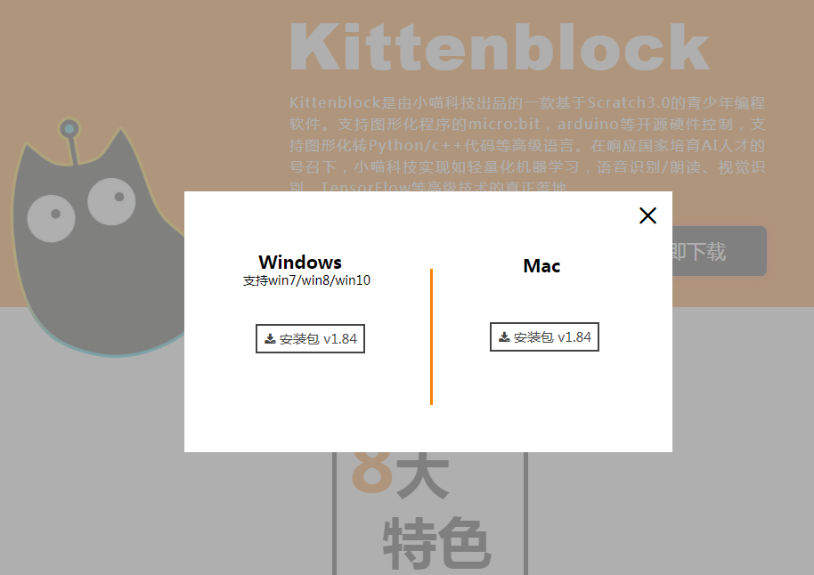
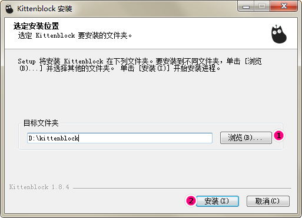
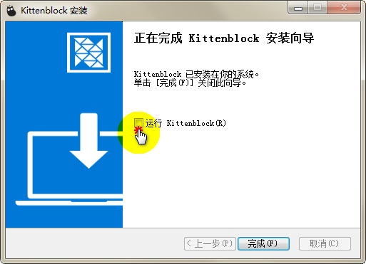
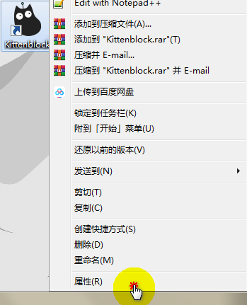
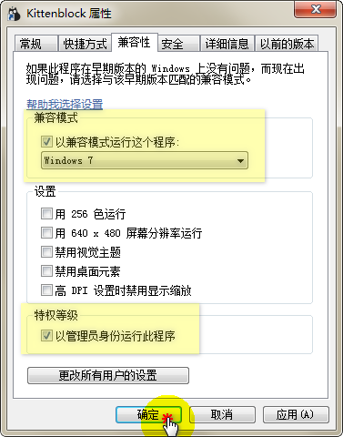
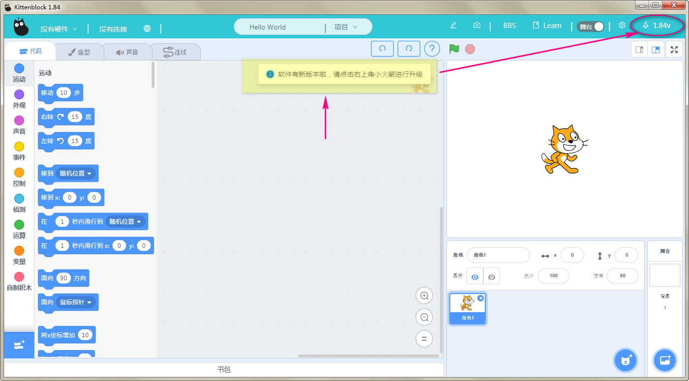
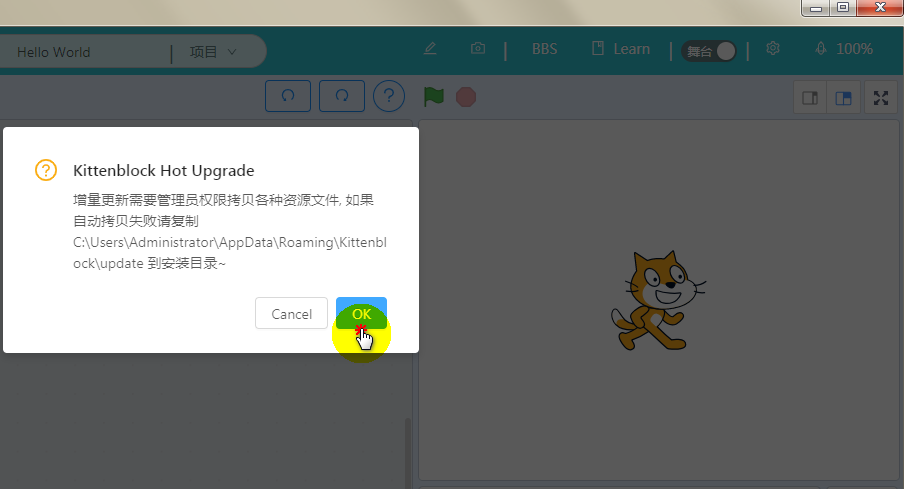
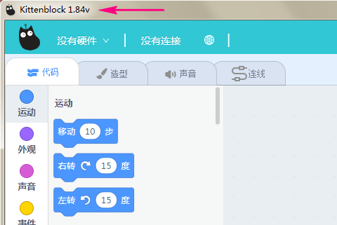

# Kittenblock安装

## 软件下载

前往官网下载实时最新版本： https://www.kittenbot.cn/kittenblock

 

根据自己的系统单击按钮下载

!> kittenblock不支持xp系统

## 软件安装

单击下载好的安装包。不建议安装在C盘，更改目录后单击*安装*

 

安装过程若有杀毒软件提示，请统统选择信任或肯定项。由于安装完需要一些设置，安装完成后先将运行kittenblock框的√去掉，再点完成。

 

可见桌面生成了kittenblock的图标，右键->属性

 

兼容性项目下按图示设置好，确定既可。之后我们就可以双击kittenblock打开软件了 

 

## 进入软件

一般来由于软件不断维护，更新各种功能，所以官网下载的不一定是最新，此时打开软件请注意提示，右上角箭头指向的小火箭+版本号(此版本号为你需要更新的最新版本而非目前版本)。我们点击这个小火箭即可。 

 

等待进度到100%，在弹出框点选OK即可，等待软件重启

 

左上角的标号为目前版本号 

