# Kittenblock快速开始 

## 快速开始视屏   

<!-- 

<iframe src="https://player.bilibili.com/player.html?aid=7234706&cid=11828175&page=1" scrolling="no" frameborder="no" framespacing="0" allowfullscreen="true" style="width: 640px; height: 460px; max-width: 100%"> </iframe>

   -->

## 主界面简介

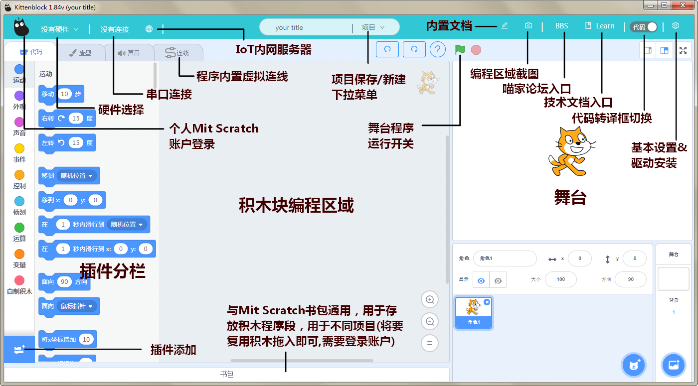

## 开始第一个纯Scratch程序

对应积木块的颜色在左侧的分栏下找到图示积木块并组合成如下后点击右上角小旗子，运行你的程序  

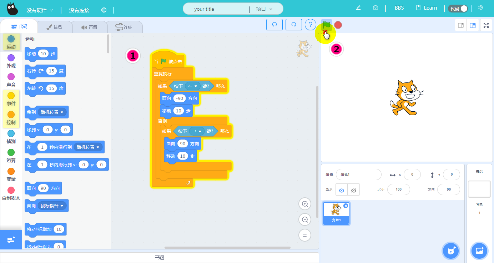   

现象是分别按下键盘的←和→可以控制舞台小猫往两个方向移动  

**通过这个简单的程序，我们已经入门了最基本的程序搭建思路，和在线运行程序的方法** 

## 结合硬件编程准备事项 

我们使用最简单microbit来做实验，首先当然是选择硬件 

- 这里我们使用USB连接，选择serial（串行）即可。 
 
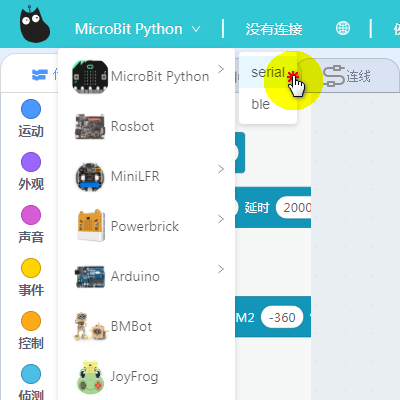     

- 这个地方的串口，如果你是第一次使用microbit，不要急，搜不到设备是正常的  

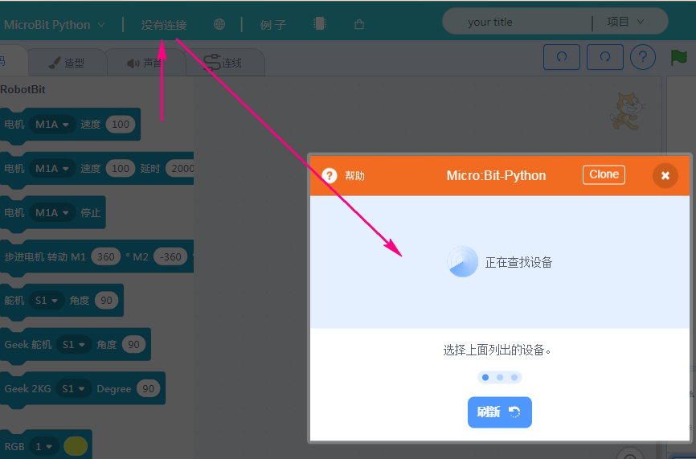   

- 为此我们需要首先下载串口驱动  

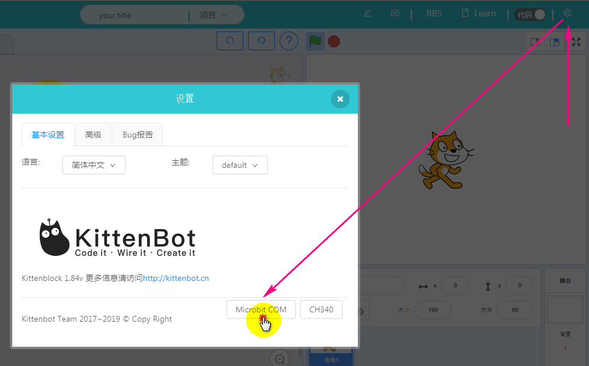    

*如果这一步你的串口安装驱动安装失败了，请注意，你是否按照*[软件安装指引](./install.html/#id2)设置好管理员权限

- 顺利的话你已经可以连上串口了  

  

## 开始第一个结合硬件的程序  

### 首先介绍的是使用在线的方式编程并控制硬件 

- 为了能够在线运行程序，这里必须保证microbit内部有一个能够与电脑通讯的程序。只需要如图点击恢复固件就可以轻松下载这个固件到microbit了

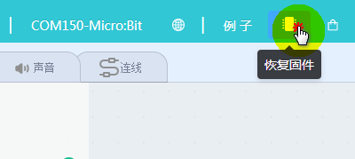   

- 当进度条过完，软件出现如下提示并且*microbit上滚动一串UART的字符*既已经通讯程序下载成功 

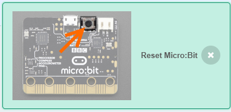  

- 但此时你的串口虽然显示是连上的，但请先断开它，并重新连接一次。当重新连上时，可以发现microbit滚动的UART字样已变为了❤，这样就已经准备就绪了

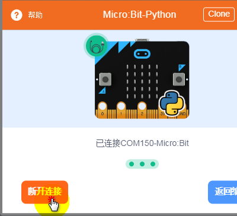  

- 来测试一下在线运行的效果吧，拖几个积木块出来点击看看microbit点阵屏的反应吧，如果看到变化了，那么说明你已经成功了！

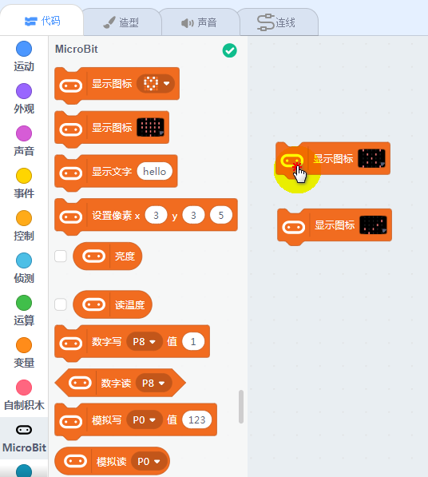   

- 我们来搭建一个最简单的硬件和舞台交互程序，点下小旗子，使用你手中的microbit控制舞台的小精灵吧！  

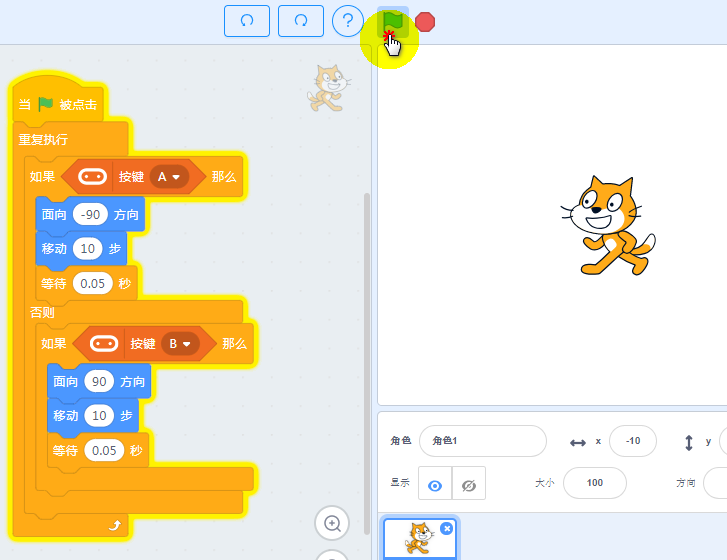   

**这一部分我们主要了解了为何需要连接串口以及如何在线使用硬件**

###  硬件编程的下载及离线运行 

这一部分又和上一部分提到的在线运行方式有较大差异，归结几个差异点需要注意的  

1. 在线程序属于Scratch，支持中文变量，以及多线程运行(既多个重复执行语句同时运行)。离线程序则不支持中文变量，不支持多线程 
2. 在线运行中，舞台和角色相关积木块可以与硬件分栏积木块混用，但离线程序不允许舞台相关积木块出现，否则代码转译会报错 
3. 程序的搭建我们使用的是积木块，但实际烧录进去的是代码，确保功能的完整性，请参照转译代码区的完整性。 

- 说了这么多，我们应该来操作一下，首先我将作出错误示，搭建如下程序块  

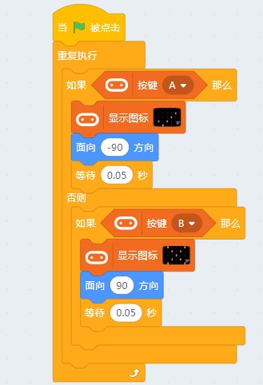   

- 程序的下载烧录的实际是代码，所以我们需要首先调出代码框，并且我们看到的只有一片空白和底下控制台的红色文字

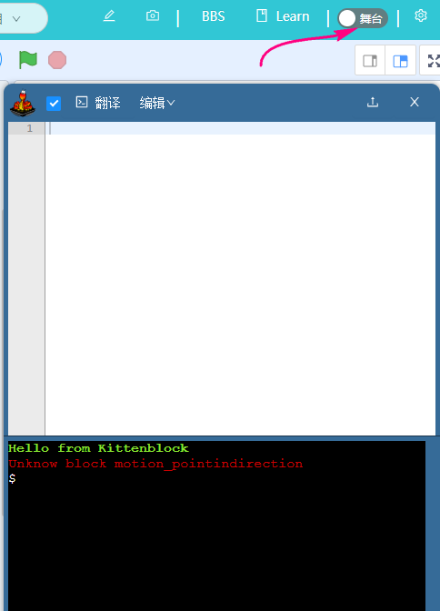   

- 分析这个红色文字，意为`不明白motion_pointindirection的积木块`，这是当然，因为这是舞台相关的积木块，它的混用会造成所有代码转译不成功

   

- 最后我们执行正确操作，去掉这些报错积木块，可以看到代码成功转译出来，之后点击上传程序即可 

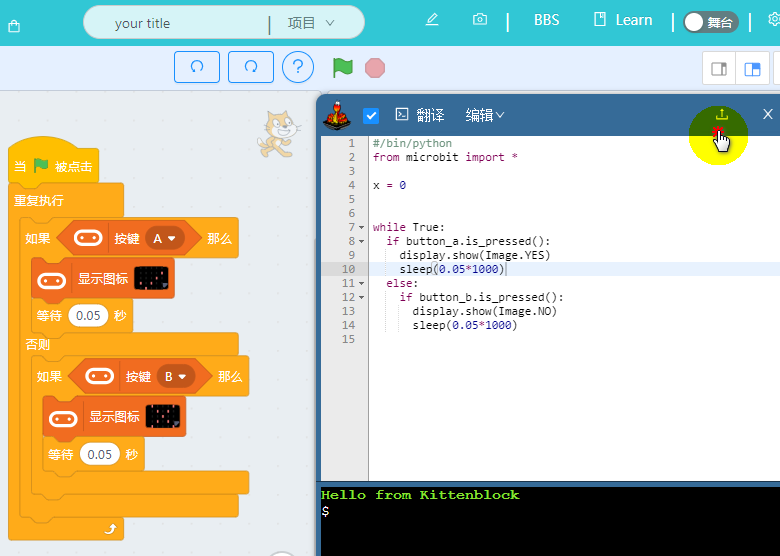  

- 分别按下microbit按键A和B，可以看到点阵屏的两个不同图案  

**这部分我们主要理解并区分了在线程序和离线程序的差异，多尝试搭建不同的程序下载试试看吧,也可以参考下官方提供的例子**  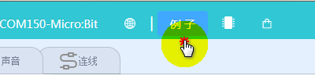

