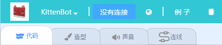
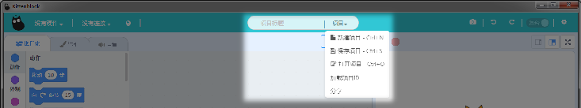
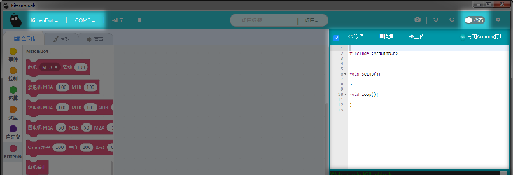

# 工具栏详解

## 账号登录

登录账号的好处：
- 可以使用小喵家的IOT服务
- 可以使用小喵家各种高级智能服务
- 可以将您的项目分享到小喵家的社区
- 可以将您的项目同步到手机app
- 参加社区各种活动，并得到折扣优惠券

### 账号注册

目前Kittenblock跟[小喵家BBS](http://kittenbot.cn/bbs)账号已经打通，大家可以使用论坛账号进行登录。

左上角的黑猫图标为账户登录按钮（对于IoT功能或者人工智能功能需要您进行账户登录，推荐登录）
   

## 通信端口
所有的机器人都需要跟电脑通信才能正常工作。

如果没有插上机器人或者主控板，连接显示一般显示为这样

  

如果一旦插上主控板或者机器人，点选“没有连接”就会出现COM口（你的不一定是COM3，COM几是由个人系统进行分配的）

  

你可以选择USB书数据线连接、wifi连接、或者蓝牙连接（根据你的机器人套件的连接方式对应选择）

  

## 网络与IoT配置

这个是网络与IOT，一般连上了PC端连上机器人wifi模块后，一些选项卡才处于可选中的状态
  

## 项目打开、保存与分享

常见的新建保存打开项目，用于打开或者保存编写好的程序，程序的格式扩展名为.sb3（Scratch3.0的简称）  
加载MIT项目ID是指，打开Scratch官网https://scratch.mit.edu/   
上面有很多好玩的项目，如果您想把项目下载下来，这时候你只需把对应项目网页端的最后的ID复制到Kittenblock这个“加载项目ID”中，Kittenblock就会帮您自动将网页端的Scratch以源文件的形式进行下载下来，供您进行再次创作   

## 其他选项

从左到右分别是

1. 截图按钮——用于积木块编程区的截图格式以png进行保存。为了配合一些老师出书所需高清的矢量图，**Shift+截图按钮**，可以保存为.svg矢量图  

1. 后退按钮——ctrl+z  

1. 重做按钮——ctrl+shift+z   

### 代码模式

1. 舞台与代码切换按钮——用于切换Scratch小猫舞台与硬件编程相关的的代码区 
  
切记只有在右边选中了编程硬件后，才能从舞台切换到编程模式

  

## 设置按钮
软件的一些常规设置与常规信息  

重做到右三个标签栏分别为

- 基本设置——设置语言（中文，英文，繁体）  
- 套件设置——针对特定套件的一些偏门设置
- bug反馈——已经集成自动将用户.sb3文件自自动化提交

### 驱动安装

- Microbit串口驱动安装——这个驱动不影响Microbit下载程序，安装后可用串口通讯
- Arduino类主控板串口驱动安装（如Kittenbot、LFR2.0、Arduino等等
- 

