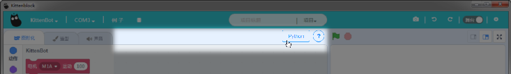
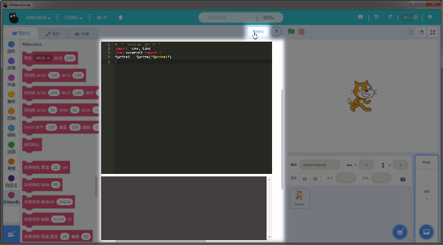
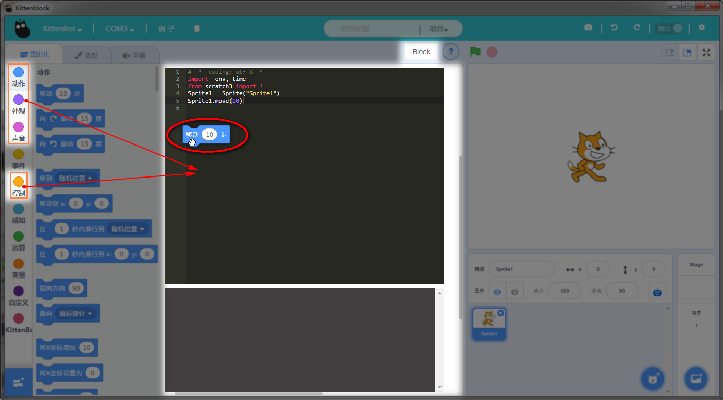
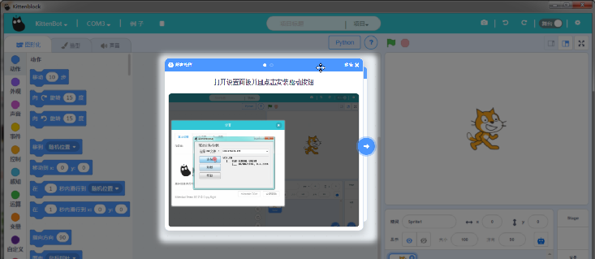

# 舞台python与帮助区

## 切换到舞台Python模式

python按钮是用来将图形块工作区切换到python编程工作区。python的编程对象就是舞台的小喵。 

- 小喵独创的拖拽积木块转换python代码   
- 通过拖拽可以快速提醒对应操作的python控制指令。   
- 当然我们后面也会把python控制的API更新出来，方便大家查看
- 

   
   
**？**图标里面集合了一些常用的操作帮助gif，可以点进去看看。不过遇到问题建议大家直接去我们论坛kittenbot.cn 在搜索框中搜索问题关键字，这样解决问题比较快

