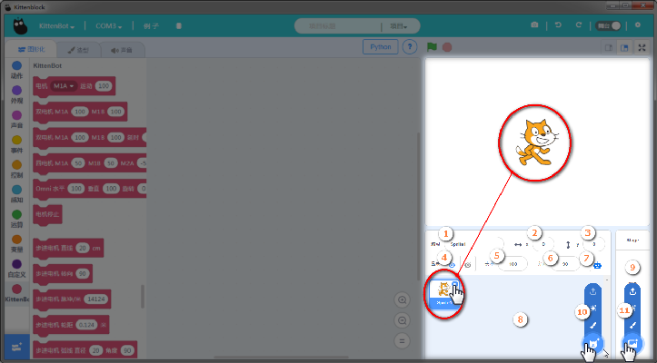
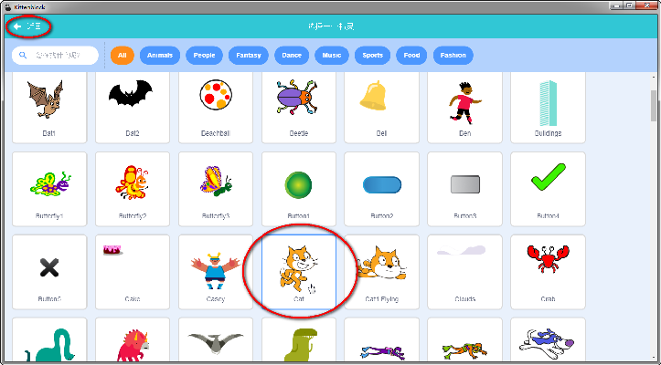

# 角色与舞台参数编辑区（新手不用管)   
1. 精灵（舞台的角色）名称   
1. 当前精灵x轴坐标   
1. 当前精灵y轴坐标   
1. 显示或者隐藏按钮   
1. 精灵大小（默认100%）   
1. 当前精灵的方向   
1. 精灵与wifi或者串口对接   
1. 精灵集合区（加入的精灵全部会显示在此）   
1. 舞台集合区（加入的全部舞台背景会显示在此）   
1. 添加精灵按钮   
1. 添加舞台背景按钮   

